# Scalable OpenTelemetry Observability Stack
## Architecture Document

**Version:** 2.0  
**Date:** January 2026  
**Status:** Approved for Implementation  
**Author:** Platform Engineering Team

---

## Document Information

### Purpose

This document defines the architecture for a self-hosted, scalable observability platform built on OpenTelemetry. It serves as the authoritative reference for:

- Understanding the current observability infrastructure
- Evaluating when and why to scale
- Planning infrastructure investments
- Guiding implementation decisions
- Troubleshooting operational issues

### Audience

| Audience | Sections of Interest |
|----------|---------------------|
| **Engineering Leadership** | Executive Summary, Current State, Cost Analysis |
| **Platform Engineers** | All sections, especially Architecture & Implementation |
| **DevOps/SRE Teams** | Deployment, Operations, Troubleshooting |
| **Application Developers** | Integration guides, SDK configuration |

### Revision History

| Version | Date | Author | Changes |
|---------|------|--------|---------|
| 1.0 | Jan 2026 | Platform Team | Initial proposal |
| 1.5 | Jan 2026 | Platform Team | Added scaling, infrastructure, troubleshooting |
| 2.0 | Jan 2026 | Platform Team | Restructured as formal architecture document with clear narrative flow |

---

## Table of Contents

### Part I: Context & Analysis
1. [Executive Summary](#executive-summary) — Why self-hosted observability
2. [Current State Analysis](#current-state-analysis) — What we have today
3. [Problem Statement](#problem-statement) — When and why to scale
4. [Solution Overview](#solution-overview) — High-level approach

### Part II: Architecture
5. [Target Architecture](#target-architecture) — Scalable design
6. [Component Deep Dive](#component-deep-dive) — Layer-by-layer details
7. [Scaling Strategies](#scaling-strategies) — Multi-node design
8. [Deployment Options](#deployment-options) — Docker, K8s, Ansible

### Part III: Implementation
9. [Single-Node Optimization](#single-node-optimization) — Maximize before scaling
10. [On-Premises Scaling](#on-premises-scaling) — Docker Swarm, bare metal
11. [Cloud Scaling](#cloud-scaling) — AWS, GCP, Azure

### Part IV: Operations
12. [Infrastructure Requirements](#infrastructure--resource-requirements) — Sizing & capacity
13. [Security Considerations](#security-considerations) — Auth, TLS, secrets
14. [Cost Optimization](#cost-optimization) — Reduce expenses
15. [Challenges & Troubleshooting](#challenges--troubleshooting) — Common issues & fixes

### Part V: Roadmap & Reference
16. [Implementation Phases](#implementation-phases) — Step-by-step plan
17. [Summary](#summary) — Key decisions & trade-offs
18. [Appendices](#appendix-a-alternative-architectures) — Quick reference

---

# Part I: Context & Analysis

## Executive Summary

### The Challenge

Modern distributed systems generate massive volumes of telemetry data—traces, metrics, and logs—that are essential for maintaining reliability and debugging issues. Commercial observability solutions (Datadog, New Relic, Splunk) provide excellent capabilities but at significant cost: **$2,000-$200,000+ per month** depending on scale.

### Our Solution

This architecture document describes a **self-hosted observability platform** built entirely on open-source components, centered around **OpenTelemetry** as the unified telemetry standard. The platform provides:

- **Unified telemetry collection** via OpenTelemetry Collector
- **Distributed tracing** via Jaeger/Tempo
- **Metrics storage & querying** via Prometheus/Mimir/VictoriaMetrics
- **Log aggregation** via Loki
- **Visualization & alerting** via Grafana

### Key Benefits

| Benefit | Impact |
|---------|--------|
| **Cost Savings** | 60-90% reduction vs. commercial solutions |
| **Data Ownership** | Full control over sensitive telemetry data |
| **Flexibility** | Customize retention, sampling, and processing |
| **No Vendor Lock-in** | OpenTelemetry is vendor-neutral |
| **Scalability** | From single-node to enterprise scale |

### Recommendation

We recommend a **phased approach**:

1. **Phase 1 (Complete):** Single-node deployment with reliability improvements
2. **Phase 2:** Add message queuing for resilience
3. **Phase 3:** Kubernetes deployment for horizontal scaling
4. **Phase 4:** Multi-region for high availability

---

## Current State Analysis

### What We Have Today

The current implementation is a **single-node Docker Compose deployment** running on a single server. All observability components run as containers on one host.

```mermaid
flowchart TB
    subgraph Current["📊 Current Single-Node Architecture"]
        subgraph Apps["Applications"]
            A1[App 1] & A2[App 2] & A3[App N]
        end
        
        subgraph Node["Single Host"]
            OC[OTel Collector<br/>with Persistent Queue]
            
            subgraph Backends["Storage Backends"]
                J[("Jaeger<br/>Badger DB")]
                P[("Prometheus<br/>TSDB")]
                L[("Loki<br/>Filesystem")]
            end
            
            G[Grafana]
        end
        
        Apps -->|OTLP| OC
        OC --> J & P & L
        J & P & L --> G
    end
    
    style Node fill:#e3f2fd,stroke:#1976d2
    style OC fill:#ff9800,stroke:#e65100
```

### Current Capabilities

| Capability | Status | Details |
|------------|--------|---------|
| Trace Collection | ✅ Operational | Via OTel Collector → Jaeger |
| Metrics Collection | ✅ Operational | Via OTel Collector → Prometheus |
| Log Aggregation | ✅ Operational | Via OTel Collector → Loki |
| Dashboards | ✅ Operational | Grafana with auto-provisioned dashboards |
| Alerting | ✅ Operational | 31 alert rules configured |
| Data Persistence | ✅ Operational | Docker volumes with Badger/TSDB |
| Backup/Restore | ✅ Operational | Automated scripts |

### Current Performance Limits

| Metric | Current Capacity | Typical Usage |
|--------|------------------|---------------|
| Traces | Up to 50K spans/sec | 5-10K spans/sec |
| Metrics | Up to 1M active series | 100-300K series |
| Logs | Up to 50K lines/sec | 5-10K lines/sec |
| Retention | 30 days (configurable) | 30 days |
| Storage | ~50 GB/day at moderate load | ~20 GB/day |

### Strengths of Current Architecture

| Strength | Description |
|----------|-------------|
| **Simplicity** | Single `docker compose up` deploys everything |
| **Low Cost** | Runs on a single $50-150/month VPS |
| **Easy Maintenance** | One node to monitor and update |
| **Quick Recovery** | Simple backup/restore process |
| **Full Featured** | All three pillars of observability |
| **Production Ready** | Persistent queues, health checks, auto-restart |

### Weaknesses & Limitations

| Weakness | Impact | Risk Level |
|----------|--------|------------|
| **Single Point of Failure** | Node failure = complete outage | 🔴 High |
| **Vertical Scaling Only** | Limited by single-node resources | 🟡 Medium |
| **No Geographic Redundancy** | Cannot survive datacenter failure | 🟡 Medium |
| **Shared Resources** | Components compete for CPU/memory | 🟡 Medium |
| **Limited Throughput** | Caps at ~50K events/sec | 🟢 Low (for most) |
| **Manual Scaling** | Cannot auto-scale with load | 🟢 Low |

---

## Problem Statement

### When Single-Node Is Not Enough

The current single-node architecture serves well for small-to-medium deployments. However, organizations face scaling challenges in the following scenarios:

```mermaid
flowchart LR
    subgraph Triggers["⚠️ Scaling Triggers"]
        T1["📈 Volume<br/>> 50K events/sec"]
        T2["⏱️ Availability<br/>99.9%+ SLA required"]
        T3["🌍 Geography<br/>Multi-region apps"]
        T4["🔒 Compliance<br/>Data residency rules"]
        T5["👥 Growth<br/>> 50 applications"]
    end
    
    T1 & T2 & T3 & T4 & T5 --> Decision{Scale?}
    
    Decision -->|Yes| Scale[Implement<br/>Scalable Architecture]
    Decision -->|No| Optimize[Optimize<br/>Single-Node]
    
    style Triggers fill:#fff3e0,stroke:#ff9800
    style Scale fill:#c8e6c9,stroke:#4caf50
    style Optimize fill:#e3f2fd,stroke:#2196f3
```

### Specific Problems to Solve

#### 1. Availability Risk

**Problem:** Single-node failure causes complete observability blackout.

**Impact:**
- Cannot debug production issues during outage
- No historical data during recovery
- Potential data loss if failure is catastrophic

**Current Mitigation:** Persistent queues buffer data, auto-restart recovers from crashes.

**Gap:** No protection against hardware failure, OS crashes, or datacenter issues.

#### 2. Throughput Ceiling

**Problem:** Single node cannot process beyond ~50K events/second.

**Impact:**
- Data dropping during traffic spikes
- Increased latency in data availability
- Incomplete traces and metrics gaps

**Current Mitigation:** Sampling reduces volume at the cost of data loss.

**Gap:** Cannot handle sustained high throughput without aggressive sampling.

#### 3. Resource Contention

**Problem:** All components share CPU, memory, and disk I/O.

**Impact:**
- Prometheus high memory usage affects Jaeger query performance
- Loki ingestion spikes slow down Grafana dashboards
- Unpredictable performance characteristics

**Current Mitigation:** Resource limits prevent complete system failure.

**Gap:** Cannot guarantee performance SLAs for any component.

#### 4. Operational Limitations

**Problem:** Upgrades, maintenance, and backups require downtime.

**Impact:**
- Data gaps during maintenance windows
- Risk during version upgrades
- Cannot perform rolling updates

**Current Mitigation:** Graceful shutdown preserves in-flight data.

**Gap:** No way to upgrade without brief interruption.

### Decision Framework

Use this decision tree to determine if you need to scale:


---

## Solution Overview

### Architectural Principles

The scalable architecture is designed around these core principles:

| Principle | Description |
|-----------|-------------|
| **Loose Coupling** | Components can be upgraded, scaled, and restarted independently |
| **Horizontal Scalability** | Add nodes to increase capacity, not bigger machines |
| **Graceful Degradation** | Partial failures don't cause complete outages |
| **Data Durability** | No data loss during failures, upgrades, or scaling |
| **Operational Simplicity** | Prefer simpler solutions over complex optimizations |
| **Cost Efficiency** | Use resources efficiently, scale only when needed |

### Evolution Path

The architecture evolves through stages, allowing incremental investment:


### Target Architecture Preview

The fully scaled architecture separates concerns into distinct layers:


### Key Architectural Decisions

| Decision | Choice | Rationale |
|----------|--------|-----------|
| **Telemetry Standard** | OpenTelemetry | Vendor-neutral, industry standard, broad SDK support |
| **Message Queue** | Kafka (large) / Redis (small) | Durability, replay capability, back-pressure handling |
| **Trace Storage** | Tempo (scale) / Jaeger (simple) | Native object storage, cost-effective at scale |
| **Metrics Storage** | Mimir / VictoriaMetrics | Prometheus-compatible, horizontally scalable |
| **Log Storage** | Loki | Low-cost, integrates well with Grafana |
| **Object Storage** | S3 / MinIO | Durable, cheap, scalable long-term storage |

---

# Part II: Architecture

## Target Architecture

This section details the fully scalable architecture for production deployments handling 50K+ events/second with high availability requirements.

### Architectural Layers

The scalable architecture consists of five distinct layers, each independently scalable:

```mermaid
flowchart TB
    subgraph Layer1["Layer 1: Ingestion"]
        direction LR
        LB["🔄 Load Balancer<br/>HAProxy / NGINX / Cloud LB"]
        G1["Gateway 1"] & G2["Gateway 2"] & G3["Gateway N"]
        LB --> G1 & G2 & G3
    end
    
    subgraph Layer2["Layer 2: Buffering"]
        K[("📨 Message Queue<br/>Kafka / Redis Streams")]
    end
    
    subgraph Layer3["Layer 3: Processing"]
        direction LR
        TP["Trace<br/>Processors"] & MP["Metric<br/>Processors"] & LP["Log<br/>Processors"]
    end
    
    subgraph Layer4["Layer 4: Storage"]
        direction LR
        Tempo[("🔍 Tempo<br/>Traces")]
        Mimir[("📊 Mimir<br/>Metrics")]
        Loki[("📝 Loki<br/>Logs")]
        S3[("☁️ Object Storage<br/>S3 / MinIO / GCS")]
    end
    
    subgraph Layer5["Layer 5: Visualization"]
        Grafana["📈 Grafana HA"]
        DB[("PostgreSQL<br/>Shared State")]
    end
    
    Apps["📱 Applications"] --> Layer1
    G1 & G2 & G3 --> K
    K --> TP & MP & LP
    TP --> Tempo
    MP --> Mimir
    LP --> Loki
    Tempo & Mimir & Loki --> S3
    Tempo & Mimir & Loki --> Grafana
    Grafana --> DB
    
    style Layer1 fill:#e8f5e9,stroke:#4caf50
    style Layer2 fill:#fff3e0,stroke:#ff9800
    style Layer3 fill:#e3f2fd,stroke:#2196f3
    style Layer4 fill:#fce4ec,stroke:#e91e63
    style Layer5 fill:#f3e5f5,stroke:#9c27b0
```

### Layer Descriptions

| Layer | Purpose | Scaling Strategy | Key Technologies |
|-------|---------|------------------|------------------|
| **Ingestion** | Receive telemetry from applications | Horizontal (add gateways) | OTel Collector, HAProxy |
| **Buffering** | Decouple ingestion from processing | Partition-based | Kafka, Redis Streams |
| **Processing** | Transform, sample, enrich data | Horizontal (add consumers) | OTel Collector |
| **Storage** | Persist and query telemetry | Horizontal + Object storage | Tempo, Mimir, Loki |
| **Visualization** | Dashboards, alerts, exploration | Horizontal (stateless) | Grafana |

### Why This Architecture?

| Design Choice | Problem Solved |
|---------------|----------------|
| **Load Balancer** | Distributes load, enables zero-downtime deployments |
| **Gateway Pool** | No single point of failure for ingestion |
| **Message Queue** | Absorbs spikes, enables replay, decouples components |
| **Separate Processors** | Independent scaling per telemetry type |
| **Object Storage** | Cost-effective long-term retention |
| **Stateless Grafana** | Scale visualization independently |

### Data Flow


---

# Part III: Implementation

## Single-Node Optimization

Before scaling horizontally, maximize the reliability of your single-node setup. These improvements are **already implemented** in the current deployment and provide significant resilience gains with minimal complexity.

### Implemented Improvements Summary

| Improvement | Status | Benefit |
|-------------|--------|---------|
| ✅ Persistent queues | Implemented | No data loss on restart |
| ✅ Resource limits | Implemented | Prevents OOM crashes |
| ✅ Health checks + auto-restart | Implemented | Self-healing |
| ✅ Backup automation | Implemented | Disaster recovery |
| ✅ Retry policies | Implemented | Handles transient failures |
| ✅ Self-monitoring + alerts | Implemented | Proactive issue detection |
| ✅ Graceful shutdown | Implemented | Zero data loss on deploy |

---

### 1. Persistent Queues (Prevent Data Loss)

**Problem**: If OTel Collector restarts, in-flight data in memory queues is lost.

**Solution**: The `file_storage` extension persists queues to disk.

```yaml
# otel-collector-config.yaml
extensions:
  file_storage:
    directory: /var/lib/otelcol/storage
    timeout: 10s
    compaction:
      on_start: true
      on_rebound: true

exporters:
  otlp/jaeger:
    sending_queue:
      storage: file_storage    # ← Persist to disk
```

**Result**: Data survives collector restarts. Queue replays on startup.

---

### 2. Resource Limits (Prevent OOM)

**Problem**: Unbounded memory usage can crash containers.

**Solution**: Explicit resource limits in Docker Compose.

```yaml
# docker-compose.yml
services:
  otel-collector:
    deploy:
      resources:
        limits:
          cpus: '2'
          memory: 2G
```

**OTel Collector memory limiter**:
```yaml
processors:
  memory_limiter:
    limit_mib: 1600        # 80% of container limit
    spike_limit_mib: 400
```

---

### 3. Health Checks & Auto-Restart

**Problem**: Services can become unhealthy without crashing.

**Solution**: Comprehensive health checks with automatic restart.

```yaml
services:
  otel-collector:
    restart: unless-stopped
    healthcheck:
      test: ["CMD", "wget", "--spider", "-q", "http://localhost:13133/health"]
      interval: 10s
      retries: 5
      start_period: 30s
    depends_on:
      prometheus:
        condition: service_healthy
      jaeger:
        condition: service_healthy
      loki:
        condition: service_healthy
```

---

### 4. Graceful Shutdown (Zero Data Loss on Deploy)

**Problem**: Abrupt container stops can lose in-flight data.

**Solution**: Configure proper shutdown handling.

```yaml
# docker-compose.yml - Graceful shutdown

services:
  otel-collector:
    stop_grace_period: 30s  # Wait for queues to flush
    # ...

  prometheus:
    stop_grace_period: 30s
    command:
      - '--config.file=/etc/prometheus/prometheus.yml'
      - '--storage.tsdb.path=/prometheus'
      - '--web.enable-lifecycle'  # Enable graceful shutdown endpoint
    # ...

  loki:
    stop_grace_period: 30s
    # ...
```

**Deployment script** (`scripts/deploy.sh`):
```bash
#!/bin/bash
# Zero-downtime deployment script

set -e

echo "Starting graceful deployment..."

# 1. Stop accepting new connections (if using external LB)
# curl -X POST http://lb/drain

# 2. Wait for in-flight requests to complete
echo "Waiting for queues to drain..."
sleep 10

# 3. Gracefully stop services
echo "Stopping services gracefully..."
docker compose stop --timeout 30

# 4. Pull new images
echo "Pulling latest images..."
docker compose pull

# 5. Start services
echo "Starting services..."
docker compose up -d

# 6. Wait for health checks
echo "Waiting for services to be healthy..."
sleep 15

# 7. Verify health
./scripts/status.sh

echo "Deployment complete!"
```

---

### 5. Automated Backups

**Problem**: Data loss from disk failure, corruption, or accidental deletion.

**Solution**: Scheduled backup script for all volumes.

```bash
#!/bin/bash
# scripts/backup.sh - Automated backup script

set -e

BACKUP_DIR="${BACKUP_DIR:-/backups/otel-stack}"
TIMESTAMP=$(date +%Y%m%d_%H%M%S)
BACKUP_PATH="${BACKUP_DIR}/${TIMESTAMP}"
RETENTION_DAYS="${RETENTION_DAYS:-7}"

mkdir -p "$BACKUP_PATH"

echo "Starting backup to ${BACKUP_PATH}..."

# Backup each volume
for volume in prometheus-data grafana-data loki-data jaeger-data otel-collector-storage; do
    echo "Backing up ${volume}..."
    docker run --rm \
        -v "${volume}:/source:ro" \
        -v "${BACKUP_PATH}:/backup" \
        alpine tar czf "/backup/${volume}.tar.gz" -C /source .
done

# Backup configurations
echo "Backing up configurations..."
tar czf "${BACKUP_PATH}/configs.tar.gz" \
    docker-compose.yml \
    otel-collector-config.yaml \
    prometheus/ \
    loki/ \
    grafana/

# Calculate backup size
BACKUP_SIZE=$(du -sh "$BACKUP_PATH" | cut -f1)
echo "Backup complete: ${BACKUP_PATH} (${BACKUP_SIZE})"

# Clean old backups
echo "Cleaning backups older than ${RETENTION_DAYS} days..."
find "$BACKUP_DIR" -maxdepth 1 -type d -mtime +${RETENTION_DAYS} -exec rm -rf {} \;

echo "Backup finished successfully!"
```

**Cron job** (`/etc/cron.d/otel-backup`):
```cron
# Daily backup at 2 AM
0 2 * * * root /opt/otel-stack/scripts/backup.sh >> /var/log/otel-backup.log 2>&1
```

**Restore script** (`scripts/restore.sh`):
```bash
#!/bin/bash
# scripts/restore.sh - Restore from backup

set -e

BACKUP_PATH="$1"

if [ -z "$BACKUP_PATH" ]; then
    echo "Usage: $0 <backup_path>"
    echo "Example: $0 /backups/otel-stack/20260122_020000"
    exit 1
fi

echo "WARNING: This will overwrite current data!"
read -p "Are you sure? (yes/no): " confirm
[ "$confirm" = "yes" ] || exit 1

echo "Stopping services..."
docker compose down

echo "Restoring volumes..."
for volume in prometheus-data grafana-data loki-data jaeger-data otel-collector-storage; do
    if [ -f "${BACKUP_PATH}/${volume}.tar.gz" ]; then
        echo "Restoring ${volume}..."
        docker volume rm "${volume}" 2>/dev/null || true
        docker volume create "${volume}"
        docker run --rm \
            -v "${volume}:/dest" \
            -v "${BACKUP_PATH}:/backup:ro" \
            alpine tar xzf "/backup/${volume}.tar.gz" -C /dest
    fi
done

echo "Starting services..."
docker compose up -d

echo "Restore complete!"
```

---

### 6. Self-Monitoring & Alerting

**Problem**: Issues go unnoticed until users complain.

**Solution**: Monitor the monitoring stack itself with alerts.

**Prometheus alerts** (`prometheus/alerts/otel-stack-alerts.yml`):
```yaml
groups:
  - name: otel-stack-reliability
    rules:
      # Collector alerts
      - alert: OTelCollectorDown
        expr: up{job="otel-collector"} == 0
        for: 1m
        labels:
          severity: critical
        annotations:
          summary: "OTel Collector is down"
          
      - alert: OTelCollectorHighMemory
        expr: otelcol_process_memory_rss / 1024 / 1024 > 1600
        for: 5m
        labels:
          severity: warning
        annotations:
          summary: "OTel Collector memory usage > 1.6GB"
          
      - alert: OTelCollectorQueueFilling
        expr: otelcol_exporter_queue_size > 5000
        for: 5m
        labels:
          severity: warning
        annotations:
          summary: "OTel Collector export queue is filling up"
          
      - alert: OTelCollectorDroppedData
        expr: rate(otelcol_processor_dropped_spans[5m]) > 0
        for: 1m
        labels:
          severity: critical
        annotations:
          summary: "OTel Collector is dropping spans"

      - alert: OTelCollectorExportFailures
        expr: rate(otelcol_exporter_send_failed_spans[5m]) > 0
        for: 5m
        labels:
          severity: warning
        annotations:
          summary: "OTel Collector failing to export spans"

      # Storage alerts
      - alert: PrometheusHighMemory
        expr: process_resident_memory_bytes{job="prometheus"} / 1024 / 1024 / 1024 > 3
        for: 5m
        labels:
          severity: warning
        annotations:
          summary: "Prometheus memory usage > 3GB"

      - alert: LokiIngestionErrors
        expr: rate(loki_distributor_ingester_append_failures_total[5m]) > 0
        for: 5m
        labels:
          severity: warning
        annotations:
          summary: "Loki ingestion failures detected"

      - alert: JaegerStorageFull
        expr: jaeger_badger_lsm_size_bytes / 1024 / 1024 / 1024 > 50
        for: 5m
        labels:
          severity: warning
        annotations:
          summary: "Jaeger storage > 50GB"

      # Disk alerts
      - alert: HighDiskUsage
        expr: (node_filesystem_size_bytes - node_filesystem_free_bytes) / node_filesystem_size_bytes > 0.85
        for: 5m
        labels:
          severity: warning
        annotations:
          summary: "Disk usage > 85%"

      - alert: CriticalDiskUsage
        expr: (node_filesystem_size_bytes - node_filesystem_free_bytes) / node_filesystem_size_bytes > 0.95
        for: 1m
        labels:
          severity: critical
        annotations:
          summary: "Disk usage > 95%"
```

**Update Prometheus config** (`prometheus/prometheus.yml`):
```yaml
# Add alerting rules
rule_files:
  - /etc/prometheus/alerts/*.yml

# Optional: Add Alertmanager
alerting:
  alertmanagers:
    - static_configs:
        - targets:
          # - alertmanager:9093
```

---

### 7. Enhanced Retry Policies

**Problem**: Transient network issues cause data loss.

**Solution**: Comprehensive retry configuration with exponential backoff.

```yaml
# otel-collector-config.yaml - Enhanced retry policies

exporters:
  otlp/jaeger:
    endpoint: jaeger:4317
    tls:
      insecure: true
    timeout: 30s
    retry_on_failure:
      enabled: true
      initial_interval: 1s      # Start with 1s
      randomization_factor: 0.5 # Add jitter
      multiplier: 2             # Double each retry
      max_interval: 60s         # Cap at 60s
      max_elapsed_time: 300s    # Give up after 5 min
    sending_queue:
      enabled: true
      num_consumers: 10
      queue_size: 10000
      storage: file_storage

  prometheus:
    endpoint: "0.0.0.0:8889"
    # Prometheus exporter doesn't need retry (it's pull-based)

  loki:
    endpoint: http://loki:3100/loki/api/v1/push
    timeout: 30s
    retry_on_failure:
      enabled: true
      initial_interval: 1s
      randomization_factor: 0.5
      multiplier: 2
      max_interval: 60s
      max_elapsed_time: 300s
    sending_queue:
      enabled: true
      num_consumers: 10
      queue_size: 10000
      storage: file_storage
```

---

### 8. Connection Pooling & Keep-Alive

**Problem**: Connection overhead and dropped connections.

**Solution**: Configure persistent connections.

```yaml
# otel-collector-config.yaml - Connection optimization

exporters:
  otlp/jaeger:
    endpoint: jaeger:4317
    tls:
      insecure: true
    keepalive:
      time: 30s
      timeout: 10s
      permit_without_stream: true
    balancer_name: round_robin  # For multiple backends
```

---

### 9. Rate Limiting (Protect Backends)

**Problem**: Traffic spikes can overwhelm storage backends.

**Solution**: Add rate limiting in the collector.

```yaml
# otel-collector-config.yaml - Rate limiting via Tail Sampling

processors:
  # Existing processors...
  
  # Tail sampling - intelligent sampling that keeps important traces
  # Note: probabilistic_sampler is deprecated, use tail_sampling instead
  tail_sampling:
    decision_wait: 10s              # Wait for trace to complete
    num_traces: 50000               # Max traces in memory
    expected_new_traces_per_sec: 1000
    policies:
      # Policy 1: Always keep errors (highest priority)
      - name: keep-errors
        type: status_code
        status_code:
          status_codes: [ERROR]
      
      # Policy 2: Always keep slow traces (> 500ms)
      - name: keep-slow-traces
        type: latency
        latency:
          threshold_ms: 500
      
      # Policy 3: Keep traces with exceptions
      - name: keep-exceptions
        type: string_attribute
        string_attribute:
          key: exception.type
          values: [".*"]
          enabled_regex_matching: true
      
      # Policy 4: Sample everything else at 10%
      - name: sample-remaining
        type: probabilistic
        probabilistic:
          sampling_percentage: 10
```

**Sampling Strategy Recommendations:**

| Traffic Level | Sampling % | Keep Errors | Keep Slow (>500ms) |
|---------------|------------|-------------|-------------------|
| Low (<1K/sec) | 100% | All | All |
| Medium (1-10K/sec) | 20-50% | All | All |
| High (>10K/sec) | 5-20% | All | All |

---

### 10. Startup Dependencies & Ordering

**Problem**: Services fail if dependencies aren't ready.

**Solution**: Proper dependency ordering with health checks.

> **Note**: The values below match the current `docker-compose.yml` implementation.

```yaml
# docker-compose.yml - Proper startup ordering (implemented)

services:
  jaeger:
    # No dependencies, starts first
    healthcheck:
      test: ["CMD", "wget", "--spider", "-q", "http://localhost:16686"]
      interval: 10s
      timeout: 5s
      retries: 5
      start_period: 15s

  prometheus:
    healthcheck:
      test: ["CMD", "wget", "--spider", "-q", "http://localhost:9090/-/healthy"]
      interval: 10s
      timeout: 5s
      retries: 5
      start_period: 15s

  loki:
    healthcheck:
      test: ["CMD", "wget", "--spider", "-q", "http://localhost:3100/ready"]
      interval: 10s
      timeout: 5s
      retries: 5
      start_period: 30s

  otel-collector:
    depends_on:
      jaeger:
        condition: service_healthy
      prometheus:
        condition: service_healthy
      loki:
        condition: service_healthy
    healthcheck:
      test: ["CMD", "wget", "--spider", "-q", "http://localhost:13133/health"]
      interval: 10s
      timeout: 5s
      retries: 5
      start_period: 10s

  grafana:
    depends_on:
      prometheus:
        condition: service_healthy
      jaeger:
        condition: service_healthy
      loki:
        condition: service_healthy
    healthcheck:
      test: ["CMD", "wget", "--spider", "-q", "http://localhost:3000/api/health"]
      interval: 10s
      timeout: 5s
      retries: 5
      start_period: 30s
```

**Startup Order:**
1. **Jaeger, Prometheus, Loki** - Start in parallel (no dependencies)
2. **OTel Collector** - Waits for all backends to be healthy
3. **Grafana** - Waits for data sources to be healthy

---

### Single-Node Reliability Checklist

**Status as of v1.2 (all items implemented in current setup):**

```
✅ Persistent queues enabled (file_storage extension)
✅ Resource limits set for all containers
✅ Health checks configured with start_period
✅ Auto-restart enabled (restart: unless-stopped)
✅ Graceful shutdown configured (stop_grace_period)
✅ Backup script created and scheduled
✅ Restore script tested
✅ Self-monitoring alerts configured (31 rules)
✅ Retry policies with exponential backoff
✅ Dependency ordering with health conditions
✅ Deploy script for zero-downtime updates
✅ Docker container log rotation configured
✅ Disk space monitoring enabled
✅ Connection keep-alive configured
```

See the main [README.md](../README.md) for full operational documentation.

---

### Single-Node Capacity Limits

With these improvements, a single-node setup can reliably handle:

| Scenario | CPU | RAM | Disk | Use Case |
|----------|-----|-----|------|----------|
| **Minimum** | 4 cores | 8 GB | 20 GB | Development, light testing |
| **Recommended** | 8 cores | 16 GB | 50 GB | Small production, <10 apps |
| **Production** | 12+ cores | 24+ GB | 100+ GB | Medium production, 10-50 apps |

**Throughput Capacity:**

| Metric | Light Load | Moderate Load | Heavy Load |
|--------|------------|---------------|------------|
| Spans/second | <1,000 | 1,000-10,000 | 10,000-50,000 |
| Metric series | <100,000 | 100,000-500,000 | 500,000-1,000,000 |
| Log lines/second | <1,000 | 1,000-10,000 | 10,000-50,000 |
| Connected apps | 1-5 | 5-20 | 20-50 |

**When to scale beyond single-node:**
- Sustained > 50K events/sec
- Need for HA (zero downtime requirement)
- Multiple data centers
- Compliance requirements (geographic separation)

---

## Scaling Strategies

### Scalable Architecture Overview

```mermaid
flowchart TB
    subgraph Apps["📱 Applications Layer"]
        direction LR
        A1[App 1] & A2[App 2] & A3[App N]
    end

    subgraph Ingestion["⚡ Ingestion Layer"]
        LB[Load Balancer<br/>HAProxy / NGINX / Cloud LB]
        subgraph Gateways["OTel Collector Gateways"]
            G1[Gateway 1]
            G2[Gateway 2]
            G3[Gateway N]
        end
        LB --> G1 & G2 & G3
    end

    subgraph Queue["📨 Message Queue Layer"]
        subgraph Kafka["Apache Kafka"]
            T1[traces-topic<br/>partitioned]
            T2[metrics-topic<br/>partitioned]
            T3[logs-topic<br/>partitioned]
        end
    end

    subgraph Processing["⚙️ Processing Layer"]
        direction LR
        P1[Trace<br/>Processors]
        P2[Metric<br/>Processors]
        P3[Log<br/>Processors]
    end

    subgraph Storage["💾 Storage Layer"]
        subgraph Backends["Storage Backends"]
            direction LR
            Tempo[("🔍 Tempo<br/>Traces")]
            Mimir[("📊 Mimir<br/>Metrics")]
            Loki[("📝 Loki<br/>Logs")]
        end
        S3[("☁️ Object Storage<br/>S3 / MinIO / GCS")]
    end

    subgraph Viz["📈 Visualization Layer"]
        direction LR
        GR1[Grafana 1] & GR2[Grafana 2]
        DB[(PostgreSQL<br/>Shared State)]
        GR1 & GR2 --> DB
    end

    Users[👥 Users]

    Apps -->|OTLP| LB
    G1 & G2 & G3 --> T1 & T2 & T3
    T1 --> P1
    T2 --> P2
    T3 --> P3
    P1 --> Tempo
    P2 --> Mimir
    P3 --> Loki
    Tempo & Mimir & Loki --> S3
    Backends --> Viz
    Viz --> Users

    style LB fill:#2196f3,stroke:#1565c0,color:#fff
    style Kafka fill:#231f20,stroke:#231f20,color:#fff
    style Tempo fill:#00bcd4,stroke:#006064,color:#000
    style Mimir fill:#e91e63,stroke:#880e4f,color:#fff
    style Loki fill:#9c27b0,stroke:#4a148c,color:#fff
    style S3 fill:#ff9800,stroke:#e65100,color:#000
```

**Key Benefits:**
- ✅ **No Single Points of Failure** - Every layer is redundant
- ✅ **Horizontal Scaling** - Add instances as load grows
- ✅ **Decoupled Components** - Upgrade/restart without data loss
- ✅ **Cost Effective** - Object storage for long-term data

---

## Component Deep Dive

### 1. Ingestion Layer

#### Load Balancer
- **Purpose**: Distribute incoming telemetry across collector instances
- **Options**:
  - **Kubernetes**: Use Service (ClusterIP) + Ingress
  - **Docker/VPS**: HAProxy, NGINX, Traefik
  - **Cloud**: AWS ALB/NLB, GCP LB, Azure LB

#### OTel Collector Gateway Pool
- **Role**: Receive, validate, and route telemetry to Kafka
- **Scaling**: Horizontal (add more instances as load increases)
- **Configuration**:
  ```yaml
  # Gateway collector - minimal processing, fast routing
  receivers:
    otlp:
      protocols:
        grpc:
          endpoint: 0.0.0.0:4317
        http:
          endpoint: 0.0.0.0:4318

  processors:
    memory_limiter:
      limit_mib: 1024
    batch:
      timeout: 1s
      send_batch_size: 10000

  exporters:
    kafka/traces:
      brokers: [kafka:9092]
      topic: otlp-traces
      encoding: otlp_proto
    kafka/metrics:
      brokers: [kafka:9092]
      topic: otlp-metrics
      encoding: otlp_proto
    kafka/logs:
      brokers: [kafka:9092]
      topic: otlp-logs
      encoding: otlp_proto

  service:
    pipelines:
      traces:
        receivers: [otlp]
        processors: [memory_limiter, batch]
        exporters: [kafka/traces]
      metrics:
        receivers: [otlp]
        processors: [memory_limiter, batch]
        exporters: [kafka/metrics]
      logs:
        receivers: [otlp]
        processors: [memory_limiter, batch]
        exporters: [kafka/logs]
  ```

### 2. Message Queue Layer (Kafka)

#### Why Kafka?
| Benefit | Description |
|---------|-------------|
| **Buffering** | Absorbs traffic spikes without data loss |
| **Decoupling** | Backends can be upgraded/restarted without losing data |
| **Replay** | Re-process historical data if needed |
| **Back-pressure** | Natural flow control when backends are slow |
| **Partitioning** | Parallel processing across consumers |
| **Durability** | Data persisted to disk, survives broker restarts |

#### Topic Design
```
otlp-traces     (partitions: 12, replication: 3, retention: 24h)
otlp-metrics    (partitions: 12, replication: 3, retention: 24h)
otlp-logs       (partitions: 12, replication: 3, retention: 24h)
```

#### Kafka Cluster Sizing
| Scale | Brokers | Partitions/Topic | Throughput |
|-------|---------|------------------|------------|
| Small | 3 | 6 | ~100K events/sec |
| Medium | 5 | 12 | ~500K events/sec |
| Large | 9+ | 24+ | 1M+ events/sec |

#### Alternative: Redis Streams (Simpler)
For smaller deployments, Redis Streams can replace Kafka:
- Simpler to operate
- Lower resource requirements
- Good for < 100K events/sec
- Less durable than Kafka

### 3. Processing Layer

#### OTel Collector Processing Pool
- **Role**: Consume from Kafka, apply transformations, export to storage
- **Scaling**: Scale consumers independently per telemetry type
- **Stateless**: Can be scaled up/down freely

```yaml
# Processing collector - consumes from Kafka
receivers:
  kafka/traces:
    brokers: [kafka:9092]
    topic: otlp-traces
    encoding: otlp_proto
    group_id: trace-processors

processors:
  memory_limiter:
    limit_mib: 2048
  batch:
    timeout: 5s
  tail_sampling:  # Only for traces
    decision_wait: 10s
    policies:
      - name: errors
        type: status_code
        status_code: {status_codes: [ERROR]}
      - name: slow-traces
        type: latency
        latency: {threshold_ms: 1000}
      - name: probabilistic
        type: probabilistic
        probabilistic: {sampling_percentage: 10}

exporters:
  otlp/tempo:
    endpoint: tempo-distributor:4317
    tls:
      insecure: true

service:
  pipelines:
    traces:
      receivers: [kafka/traces]
      processors: [memory_limiter, tail_sampling, batch]
      exporters: [otlp/tempo]
```

### 4. Storage Layer

#### Traces: Grafana Tempo

**Why Tempo over Jaeger?**
- Native object storage support (S3, GCS, Azure)
- Simpler architecture (no external database)
- Better Grafana integration
- Cost-effective at scale

**Architecture**:

```mermaid
flowchart TB
    subgraph Tempo["🔍 Tempo Cluster"]
        D[Distributor<br/>stateless]
        I[Ingester<br/>stateful]
        Q[Querier<br/>stateless]
        C[Compactor<br/>stateless]
        
        D -->|Write Path| I
        I --> C
        C --> S3
        Q -->|Read Path| S3
    end
    
    S3[("☁️ Object Storage<br/>S3 / MinIO / GCS")]
    
    Input[OTel Collector] -->|Traces| D
    Q --> Output[Grafana]
    
    style D fill:#26a69a,stroke:#00796b,color:#fff
    style I fill:#42a5f5,stroke:#1565c0,color:#fff
    style Q fill:#66bb6a,stroke:#388e3c,color:#fff
    style C fill:#ffa726,stroke:#ef6c00,color:#000
    style S3 fill:#78909c,stroke:#455a64,color:#fff
```

#### Metrics: Grafana Mimir (or VictoriaMetrics)

**Why Mimir?**
- Horizontally scalable Prometheus
- Multi-tenant support
- Long-term storage in object storage
- 100% Prometheus compatible

**Alternative: VictoriaMetrics**
- Simpler to operate
- Better single-node performance
- Good for medium scale
- Supports clustering

#### Logs: Grafana Loki (Microservices Mode)

**Loki Deployment Modes**:
| Mode | Use Case | Scale |
|------|----------|-------|
| Monolithic | Development | < 100GB/day |
| Simple Scalable | Small-Medium | 100GB-1TB/day |
| Microservices | Large | > 1TB/day |

### 5. Prometheus Remote Write (Scaling Metrics)

For scaling beyond single Prometheus, use remote_write to send metrics to scalable backends:

**Prometheus Configuration:**
```yaml
# prometheus/prometheus.yml
global:
  scrape_interval: 15s

remote_write:
  # Option 1: VictoriaMetrics (recommended for on-prem)
  - url: "http://victoriametrics:8428/api/v1/write"
    queue_config:
      max_samples_per_send: 10000
      batch_send_deadline: 5s
      capacity: 100000
      max_shards: 30

  # Option 2: Mimir (for Kubernetes/cloud scale)
  - url: "http://mimir-distributor:8080/api/v1/push"
    headers:
      X-Scope-OrgID: tenant-1

  # Option 3: AWS Managed Prometheus
  - url: "https://aps-workspaces.us-west-2.amazonaws.com/workspaces/ws-xxx/api/v1/remote_write"
    sigv4:
      region: us-west-2

  # Option 4: Grafana Cloud
  - url: "https://prometheus-prod-01-us-west-0.grafana.net/api/prom/push"
    basic_auth:
      username: ${GRAFANA_CLOUD_USER}
      password: ${GRAFANA_CLOUD_API_KEY}
```

**OTel Collector Remote Write:**
```yaml
# otel-collector-config.yaml
exporters:
  prometheusremotewrite:
    endpoint: http://victoriametrics:8428/api/v1/write
    tls:
      insecure: true
    resource_to_telemetry_conversion:
      enabled: true
    external_labels:
      cluster: ${CLUSTER_NAME:-default}
      environment: ${DEPLOYMENT_ENV:-development}

service:
  pipelines:
    metrics:
      receivers: [otlp, prometheus]
      processors: [memory_limiter, batch, resource]
      exporters: [prometheusremotewrite]  # Instead of prometheus exporter
```

### 6. Object Storage

All storage backends use object storage for durability:

| Provider | Service | Notes |
|----------|---------|-------|
| AWS | S3 | Most common |
| GCP | GCS | Good performance |
| Azure | Blob Storage | Enterprise |
| Self-hosted | MinIO | S3-compatible |

---

## Deployment Options

### Option 1: Docker Compose (Development/Small)

```
deploy/
├── docker-compose/
│   ├── single-node/         # Current setup (dev)
│   ├── scalable/            # Multi-container scalable
│   └── docker-compose.yml
```

**Best for**: Development, testing, small production (< 50K events/sec)

### Option 2: Kubernetes (Production)

```
deploy/
├── kubernetes/
│   ├── helm/
│   │   └── otel-stack/      # Umbrella Helm chart
│   ├── kustomize/
│   │   ├── base/
│   │   └── overlays/
│   │       ├── development/
│   │       ├── staging/
│   │       └── production/
│   └── manifests/           # Raw YAML (simple)
```

**Helm Chart Dependencies**:
```yaml
# Chart.yaml
dependencies:
  - name: opentelemetry-collector
    repository: https://open-telemetry.github.io/opentelemetry-helm-charts
  - name: kafka
    repository: https://charts.bitnami.com/bitnami
  - name: tempo
    repository: https://grafana.github.io/helm-charts
  - name: mimir-distributed
    repository: https://grafana.github.io/helm-charts
  - name: loki
    repository: https://grafana.github.io/helm-charts
  - name: grafana
    repository: https://grafana.github.io/helm-charts
```

### Option 3: Multi-VPS with Ansible

```
deploy/
├── ansible/
│   ├── inventory/
│   │   ├── development.yml
│   │   ├── staging.yml
│   │   └── production.yml
│   ├── playbooks/
│   │   ├── site.yml
│   │   ├── collectors.yml
│   │   ├── kafka.yml
│   │   ├── storage.yml
│   │   └── grafana.yml
│   └── roles/
│       ├── common/
│       ├── docker/
│       ├── otel-collector/
│       ├── kafka/
│       ├── tempo/
│       ├── mimir/
│       ├── loki/
│       └── grafana/
```

**Inventory Example**:
```yaml
# inventory/production.yml
all:
  children:
    collectors:
      hosts:
        collector-1: {ansible_host: 10.0.1.10}
        collector-2: {ansible_host: 10.0.1.11}
        collector-3: {ansible_host: 10.0.1.12}
    kafka:
      hosts:
        kafka-1: {ansible_host: 10.0.2.10}
        kafka-2: {ansible_host: 10.0.2.11}
        kafka-3: {ansible_host: 10.0.2.12}
    storage:
      hosts:
        storage-1: {ansible_host: 10.0.3.10}
        storage-2: {ansible_host: 10.0.3.11}
    grafana:
      hosts:
        grafana-1: {ansible_host: 10.0.4.10}
        grafana-2: {ansible_host: 10.0.4.11}
```

---

## On-Premises Scaling

This section covers scaling strategies when running on your own hardware or private data center.

### Architecture Options

#### Option 1: Multi-Node Docker Swarm

Docker Swarm provides native clustering for Docker environments.

```mermaid
flowchart TB
    subgraph Swarm["🐳 Docker Swarm Cluster"]
        subgraph Managers["Manager Nodes"]
            direction LR
            M1[Manager 1<br/>+ Worker]
            M2[Manager 2<br/>+ Worker]
            M3[Manager 3<br/>+ Worker]
        end
        
        subgraph Services["Replicated Services"]
            OC["⚡ otel-collector<br/>3 replicas"]
            PR["📊 prometheus<br/>1 replica + remote_write"]
            LK["📝 loki<br/>1 replica"]
            JG["🔍 jaeger/tempo<br/>1 per node"]
            GF["📈 grafana<br/>2 replicas"]
        end
        
        Managers --> Services
    end
    
    Apps[Applications] -->|OTLP| OC
    OC --> PR & LK & JG
    PR & LK & JG --> GF
    
    style M1 fill:#2196f3,stroke:#1565c0,color:#fff
    style M2 fill:#2196f3,stroke:#1565c0,color:#fff
    style M3 fill:#2196f3,stroke:#1565c0,color:#fff
    style OC fill:#ff9800,stroke:#e65100,color:#000
```

**Docker Swarm Stack File** (`docker-compose.swarm.yml`):
```yaml
version: "3.8"

services:
  otel-collector:
    image: otel/opentelemetry-collector-contrib:0.91.0
    deploy:
      mode: replicated
      replicas: 3
      placement:
        constraints:
          - node.role == worker
      resources:
        limits:
          cpus: '2'
          memory: 2G
      update_config:
        parallelism: 1
        delay: 30s
        failure_action: rollback
      rollback_config:
        parallelism: 1
    configs:
      - source: otel-config
        target: /etc/otel-collector-config.yaml
    ports:
      - target: 4317
        published: 4317
        mode: ingress  # Load balanced across replicas
      - target: 4318
        published: 4318
        mode: ingress
    networks:
      - observability

  grafana:
    image: grafana/grafana:10.2.0
    deploy:
      mode: replicated
      replicas: 2
      placement:
        preferences:
          - spread: node.id
    volumes:
      - grafana-data:/var/lib/grafana
    networks:
      - observability

configs:
  otel-config:
    file: ./otel-collector-config.yaml

networks:
  observability:
    driver: overlay
    attachable: true

volumes:
  grafana-data:
    driver: local
```

**Deploy to Swarm:**
```bash
# Initialize swarm (on first manager)
docker swarm init --advertise-addr <MANAGER_IP>

# Join workers (on other nodes)
docker swarm join --token <TOKEN> <MANAGER_IP>:2377

# Deploy stack
docker stack deploy -c docker-compose.swarm.yml otel-stack

# Scale services
docker service scale otel-stack_otel-collector=5
```

#### Option 2: Kubernetes (On-Prem)

For on-premises Kubernetes, use one of these distributions:

| Distribution | Best For | Complexity |
|--------------|----------|------------|
| **k3s** | Edge, small clusters | Low |
| **RKE2** | Production, air-gapped | Medium |
| **Kubeadm** | Custom setups | High |
| **OpenShift** | Enterprise, security | High |

**Minimal k3s Setup:**
```bash
# Install k3s on master
curl -sfL https://get.k3s.io | sh -

# Get token for workers
cat /var/lib/rancher/k3s/server/node-token

# Join workers
curl -sfL https://get.k3s.io | K3S_URL=https://<MASTER_IP>:6443 \
  K3S_TOKEN=<TOKEN> sh -

# Deploy OTel stack with Helm
helm repo add open-telemetry https://open-telemetry.github.io/opentelemetry-helm-charts
helm repo add grafana https://grafana.github.io/helm-charts

helm install otel-collector open-telemetry/opentelemetry-collector \
  --set mode=deployment \
  --set replicaCount=3
```

#### Option 3: Bare Metal with Systemd

For maximum control without containerization overhead.

**OTel Collector Systemd Service** (`/etc/systemd/system/otel-collector.service`):
```ini
[Unit]
Description=OpenTelemetry Collector
After=network-online.target
Wants=network-online.target

[Service]
Type=simple
User=otel
Group=otel
ExecStart=/usr/local/bin/otelcol-contrib --config=/etc/otel-collector/config.yaml
Restart=always
RestartSec=5
LimitNOFILE=65536
Environment="GOMAXPROCS=4"

# Resource limits
MemoryMax=2G
CPUQuota=200%

[Install]
WantedBy=multi-user.target
```

### Load Balancing (On-Prem)

#### HAProxy Configuration

```haproxy
# /etc/haproxy/haproxy.cfg
global
    daemon
    maxconn 4096

defaults
    mode tcp
    timeout connect 5s
    timeout client 30s
    timeout server 30s

# OTLP gRPC load balancing
frontend otlp_grpc
    bind *:4317
    default_backend otel_collectors_grpc

backend otel_collectors_grpc
    balance roundrobin
    option httpchk GET /health
    http-check expect status 200
    server collector1 10.0.1.10:4317 check port 13133
    server collector2 10.0.1.11:4317 check port 13133
    server collector3 10.0.1.12:4317 check port 13133

# OTLP HTTP load balancing
frontend otlp_http
    bind *:4318
    default_backend otel_collectors_http

backend otel_collectors_http
    balance roundrobin
    option httpchk GET /health
    http-check expect status 200
    server collector1 10.0.1.10:4318 check port 13133
    server collector2 10.0.1.11:4318 check port 13133
    server collector3 10.0.1.12:4318 check port 13133

# Stats UI
listen stats
    bind *:8404
    stats enable
    stats uri /stats
```

#### NGINX Load Balancing

```nginx
# /etc/nginx/conf.d/otel-lb.conf
upstream otel_grpc {
    least_conn;
    server 10.0.1.10:4317 weight=1 max_fails=3 fail_timeout=30s;
    server 10.0.1.11:4317 weight=1 max_fails=3 fail_timeout=30s;
    server 10.0.1.12:4317 weight=1 max_fails=3 fail_timeout=30s;
    keepalive 100;
}

upstream otel_http {
    least_conn;
    server 10.0.1.10:4318 weight=1 max_fails=3 fail_timeout=30s;
    server 10.0.1.11:4318 weight=1 max_fails=3 fail_timeout=30s;
    server 10.0.1.12:4318 weight=1 max_fails=3 fail_timeout=30s;
    keepalive 100;
}

server {
    listen 4317 http2;
    
    location / {
        grpc_pass grpc://otel_grpc;
        grpc_connect_timeout 5s;
        grpc_read_timeout 60s;
        grpc_send_timeout 60s;
    }
}

server {
    listen 4318;
    
    location / {
        proxy_pass http://otel_http;
        proxy_http_version 1.1;
        proxy_set_header Connection "";
        proxy_connect_timeout 5s;
        proxy_read_timeout 60s;
    }
}
```

### Service Discovery (On-Prem)

#### Option 1: Consul

```yaml
# otel-collector-config.yaml with Consul service discovery
receivers:
  otlp:
    protocols:
      grpc:
        endpoint: 0.0.0.0:4317

exporters:
  # Discover Jaeger instances via Consul
  otlp/jaeger:
    endpoint: jaeger.service.consul:4317
    tls:
      insecure: true
    
  # Discover Loki via Consul  
  loki:
    endpoint: http://loki.service.consul:3100/loki/api/v1/push
```

**Register services with Consul:**
```json
{
  "service": {
    "name": "otel-collector",
    "tags": ["observability", "otlp"],
    "port": 4317,
    "check": {
      "http": "http://localhost:13133/health",
      "interval": "10s"
    }
  }
}
```

#### Option 2: DNS-Based (Simple)

Use DNS round-robin for simple setups:

```bash
# /etc/hosts or internal DNS
10.0.1.10  otel-collector.internal
10.0.1.11  otel-collector.internal
10.0.1.12  otel-collector.internal
```

### Storage: VictoriaMetrics (On-Prem Recommended)

VictoriaMetrics is simpler than Mimir for on-prem deployments:

```yaml
# docker-compose.victoria.yml
services:
  victoriametrics:
    image: victoriametrics/victoria-metrics:v1.93.0
    ports:
      - "8428:8428"
    volumes:
      - vm-data:/victoria-metrics-data
    command:
      - "-storageDataPath=/victoria-metrics-data"
      - "-retentionPeriod=90d"
      - "-selfScrapeInterval=10s"

  # Configure OTel Collector to send metrics
  otel-collector:
    # ... other config
    environment:
      - METRICS_ENDPOINT=http://victoriametrics:8428

volumes:
  vm-data:
```

**OTel Collector with VictoriaMetrics:**
```yaml
exporters:
  prometheusremotewrite:
    endpoint: http://victoriametrics:8428/api/v1/write
    tls:
      insecure: true
    external_labels:
      cluster: on-prem-prod
```

### NFS Shared Storage (On-Prem)

For shared configuration and dashboards:

```yaml
# docker-compose with NFS
volumes:
  grafana-dashboards:
    driver: local
    driver_opts:
      type: nfs
      o: addr=nfs-server.internal,rw,soft,nolock
      device: ":/exports/grafana/dashboards"
```

---

## Cloud Scaling

This section covers cloud-specific scaling strategies for AWS, GCP, and Azure.

### AWS Architecture

```mermaid
flowchart TB
    subgraph AWS["☁️ AWS Cloud"]
        subgraph LB["Load Balancing"]
            ALB[Application Load Balancer<br/>or NLB for gRPC]
        end
        
        subgraph Compute["EKS / ECS / EC2"]
            OC1[OTel Collector]
            OC2[OTel Collector]
            OC3[OTel Collector]
        end
        
        subgraph Queue["Message Queue"]
            MSK[Amazon MSK<br/>or Kinesis]
        end
        
        subgraph Storage["Storage & Analytics"]
            XR[("🔍 X-Ray<br/>or Tempo")]
            AMP[("📊 AMP<br/>or Mimir")]
            CW[("📝 CloudWatch<br/>or Loki")]
            S3[("💾 Amazon S3")]
        end
        
        ALB --> OC1 & OC2 & OC3
        OC1 & OC2 & OC3 --> MSK
        MSK --> XR & AMP & CW
        XR & AMP & CW --> S3
    end
    
    Apps[📱 Applications] --> ALB
    
    style ALB fill:#ff9900,stroke:#cc7a00,color:#000
    style MSK fill:#ff4f8b,stroke:#cc3f6f,color:#fff
    style S3 fill:#569a31,stroke:#3d6b22,color:#fff
    style XR fill:#8c4fff,stroke:#6b3cc7,color:#fff
    style AMP fill:#e91e63,stroke:#880e4f,color:#fff
```

#### AWS EKS Deployment

**Terraform for EKS + OTel:**
```hcl
# terraform/aws/main.tf
module "eks" {
  source  = "terraform-aws-modules/eks/aws"
  version = "~> 19.0"

  cluster_name    = "otel-cluster"
  cluster_version = "1.28"

  vpc_id     = module.vpc.vpc_id
  subnet_ids = module.vpc.private_subnets

  eks_managed_node_groups = {
    otel_collectors = {
      min_size     = 3
      max_size     = 10
      desired_size = 3

      instance_types = ["m6i.large"]
      capacity_type  = "ON_DEMAND"
      
      labels = {
        role = "otel-collector"
      }
    }
    
    storage = {
      min_size     = 3
      max_size     = 6
      desired_size = 3
      
      instance_types = ["r6i.xlarge"]
      capacity_type  = "ON_DEMAND"
      
      labels = {
        role = "storage"
      }
    }
  }
}

# S3 bucket for long-term storage
resource "aws_s3_bucket" "otel_storage" {
  bucket = "otel-observability-data"
}

resource "aws_s3_bucket_lifecycle_configuration" "otel_storage" {
  bucket = aws_s3_bucket.otel_storage.id

  rule {
    id     = "transition-to-glacier"
    status = "Enabled"

    transition {
      days          = 90
      storage_class = "GLACIER"
    }

    expiration {
      days = 365
    }
  }
}
```

**AWS Managed Services Option:**
```yaml
# otel-collector-config.yaml for AWS managed services
exporters:
  # AWS X-Ray for traces
  awsxray:
    region: us-west-2
    
  # Amazon Managed Prometheus (AMP)
  prometheusremotewrite:
    endpoint: https://aps-workspaces.us-west-2.amazonaws.com/workspaces/ws-xxx/api/v1/remote_write
    auth:
      authenticator: sigv4auth
      
  # CloudWatch Logs
  awscloudwatchlogs:
    region: us-west-2
    log_group_name: /otel/logs
    log_stream_name: app-logs

extensions:
  sigv4auth:
    region: us-west-2
    service: aps
```

### GCP Architecture

```mermaid
flowchart TB
    subgraph GCP["☁️ Google Cloud Platform"]
        subgraph LB["Load Balancing"]
            GLB[Cloud Load Balancer<br/>TCP / HTTP]
        end
        
        subgraph GKE["GKE Autopilot / Standard"]
            OC1[OTel Collector]
            OC2[OTel Collector]
            OC3[OTel Collector]
        end
        
        subgraph Services["Cloud Services"]
            CT[("🔍 Cloud Trace")]
            CM[("📊 Cloud Monitoring")]
            CL[("📝 Cloud Logging")]
            GCS[("💾 Cloud Storage")]
        end
        
        GLB --> OC1 & OC2 & OC3
        OC1 & OC2 & OC3 --> CT & CM & CL
        CT & CM & CL --> GCS
    end
    
    Apps[📱 Applications] --> GLB
    
    style GLB fill:#4285f4,stroke:#2a5db0,color:#fff
    style CT fill:#34a853,stroke:#267d3d,color:#fff
    style CM fill:#ea4335,stroke:#b5342a,color:#fff
    style CL fill:#fbbc04,stroke:#c99703,color:#000
    style GCS fill:#4285f4,stroke:#2a5db0,color:#fff
```

**GKE + OTel Terraform:**
```hcl
# terraform/gcp/main.tf
resource "google_container_cluster" "otel" {
  name     = "otel-cluster"
  location = "us-central1"

  # Enable Autopilot for simplified management
  enable_autopilot = true

  # Or use standard mode with node pools
  # initial_node_count = 3
}

# GCS bucket for storage backends
resource "google_storage_bucket" "otel_storage" {
  name     = "otel-observability-data"
  location = "US"

  lifecycle_rule {
    condition {
      age = 90
    }
    action {
      type          = "SetStorageClass"
      storage_class = "NEARLINE"
    }
  }

  lifecycle_rule {
    condition {
      age = 365
    }
    action {
      type = "Delete"
    }
  }
}
```

**GCP Managed Services Option:**
```yaml
# otel-collector-config.yaml for GCP
exporters:
  # Google Cloud Trace
  googlecloud:
    project: my-project-id
    
  # Google Cloud Monitoring (metrics)
  googlecloud:
    project: my-project-id
    metric:
      prefix: custom.googleapis.com/otel
      
  # Google Cloud Logging
  googlecloud:
    project: my-project-id
    log:
      default_log_name: otel-logs
```

### Azure Architecture

```mermaid
flowchart TB
    subgraph Azure["☁️ Microsoft Azure"]
        subgraph LB["Load Balancing"]
            ALB[Azure Load Balancer<br/>or App Gateway]
        end
        
        subgraph AKS["Azure Kubernetes Service"]
            OC1[OTel Collector]
            OC2[OTel Collector]
            OC3[OTel Collector]
        end
        
        subgraph Services["Azure Services"]
            AI[("🔍 App Insights")]
            AM[("📊 Azure Monitor")]
            LA[("📝 Log Analytics")]
            BLOB[("💾 Blob Storage")]
        end
        
        ALB --> OC1 & OC2 & OC3
        OC1 & OC2 & OC3 --> AI & AM & LA
        AI & AM & LA --> BLOB
    end
    
    Apps[📱 Applications] --> ALB
    
    style ALB fill:#0078d4,stroke:#005a9e,color:#fff
    style AI fill:#68217a,stroke:#4e1a5e,color:#fff
    style AM fill:#0078d4,stroke:#005a9e,color:#fff
    style LA fill:#00bcf2,stroke:#0095bf,color:#000
    style BLOB fill:#0078d4,stroke:#005a9e,color:#fff
```

**Azure Managed Services Option:**
```yaml
# otel-collector-config.yaml for Azure
exporters:
  # Azure Monitor (includes App Insights)
  azuremonitor:
    connection_string: ${APPLICATIONINSIGHTS_CONNECTION_STRING}
    
  # Azure Blob Storage (for Tempo/Loki backends)
  # Configure storage backends to use Azure Blob
```

### Multi-Cloud / Hybrid Strategy

For organizations spanning multiple clouds or hybrid setups:

```mermaid
flowchart TB
    subgraph AWS["☁️ AWS Region"]
        AWS_GW[OTel Gateway]
        AWS_Apps[Apps]
        AWS_Apps --> AWS_GW
    end
    
    subgraph GCP["☁️ GCP Region"]
        GCP_GW[OTel Gateway]
        GCP_Apps[Apps]
        GCP_Apps --> GCP_GW
    end
    
    subgraph OnPrem["🏢 On-Prem DC"]
        OP_GW[OTel Gateway]
        OP_Apps[Apps]
        OP_Apps --> OP_GW
    end
    
    subgraph Central["🎯 Central Observability Platform"]
        direction LR
        Tempo[("🔍 Tempo")]
        Mimir[("📊 Mimir")]
        Loki[("📝 Loki")]
        GrafanaCloud[Grafana Cloud<br/>or Self-hosted]
        Tempo & Mimir & Loki --> GrafanaCloud
    end
    
    AWS_GW -->|OTLP + TLS| Central
    GCP_GW -->|OTLP + TLS| Central
    OP_GW -->|OTLP + TLS| Central
    
    style AWS fill:#ff9900,stroke:#cc7a00,color:#000
    style GCP fill:#4285f4,stroke:#2a5db0,color:#fff
    style OnPrem fill:#607d8b,stroke:#455a64,color:#fff
    style Central fill:#00bfa5,stroke:#00897b,color:#000
```

**OTel Collector for Edge/Regional:**
```yaml
# Regional collector - forward to central
exporters:
  otlphttp:
    endpoint: https://central-otel.example.com:4318
    headers:
      X-Region: ${REGION}
      Authorization: Bearer ${OTEL_AUTH_TOKEN}
    compression: gzip
    retry_on_failure:
      enabled: true
      max_elapsed_time: 300s
```

### Cloud Cost Optimization

| Strategy | AWS | GCP | Azure |
|----------|-----|-----|-------|
| **Spot/Preemptible for collectors** | 60-90% savings | 60-91% savings | Up to 90% savings |
| **Reserved capacity for storage** | 30-60% savings | 30-57% savings | Up to 72% savings |
| **S3/GCS lifecycle policies** | Archive old data | Nearline/Archive | Cool/Archive tiers |
| **Right-size instances** | Use Compute Optimizer | Use Recommender | Use Advisor |

### Cloud Provider Comparison

| Feature | AWS | GCP | Azure |
|---------|-----|-----|-------|
| **Managed Prometheus** | AMP | Cloud Monitoring | Azure Monitor |
| **Managed Tracing** | X-Ray | Cloud Trace | App Insights |
| **Managed Logging** | CloudWatch | Cloud Logging | Log Analytics |
| **Kafka Alternative** | MSK / Kinesis | Pub/Sub | Event Hubs |
| **Object Storage** | S3 | GCS | Blob Storage |
| **Kubernetes** | EKS | GKE | AKS |
| **Terraform Support** | Excellent | Excellent | Good |

### Kubernetes Auto-Scaling

**Horizontal Pod Autoscaler for OTel Collectors:**
```yaml
apiVersion: autoscaling/v2
kind: HorizontalPodAutoscaler
metadata:
  name: otel-collector-hpa
spec:
  scaleTargetRef:
    apiVersion: apps/v1
    kind: Deployment
    name: otel-collector
  minReplicas: 3
  maxReplicas: 20
  metrics:
    # Scale based on memory usage
    - type: Resource
      resource:
        name: memory
        target:
          type: Utilization
          averageUtilization: 70
    # Scale based on CPU
    - type: Resource
      resource:
        name: cpu
        target:
          type: Utilization
          averageUtilization: 70
    # Scale based on queue size (custom metric)
    - type: Pods
      pods:
        metric:
          name: otelcol_exporter_queue_size
        target:
          type: AverageValue
          averageValue: "5000"
  behavior:
    scaleDown:
      stabilizationWindowSeconds: 300
      policies:
        - type: Percent
          value: 10
          periodSeconds: 60
    scaleUp:
      stabilizationWindowSeconds: 0
      policies:
        - type: Percent
          value: 100
          periodSeconds: 15
```

**KEDA (Kubernetes Event-Driven Autoscaling):**
```yaml
apiVersion: keda.sh/v1alpha1
kind: ScaledObject
metadata:
  name: otel-collector-scaler
spec:
  scaleTargetRef:
    name: otel-collector
  minReplicaCount: 3
  maxReplicaCount: 50
  triggers:
    # Scale based on Kafka consumer lag
    - type: kafka
      metadata:
        bootstrapServers: kafka:9092
        consumerGroup: otel-processors
        topic: otlp-traces
        lagThreshold: "10000"
```

---

## Fault Tolerance & Error Handling

### Ingestion Layer
| Failure | Handling |
|---------|----------|
| Collector crash | Load balancer routes to healthy instances |
| Collector overload | Memory limiter drops data, alerts fired |
| Network partition | Kafka buffers, retry on reconnect |

### Kafka Layer
| Failure | Handling |
|---------|----------|
| Broker failure | Replication ensures no data loss |
| Consumer lag | Auto-scaling based on lag metrics |
| Disk full | Retention policy deletes old data |

### Storage Layer
| Failure | Handling |
|---------|----------|
| Ingester crash | WAL replay on restart |
| Query timeout | Circuit breaker, cached responses |
| Object storage unavailable | Local cache, retry with backoff |

### Alerting
```yaml
# Example Prometheus alerts
groups:
  - name: otel-stack
    rules:
      - alert: CollectorHighMemory
        expr: otelcol_process_memory_rss > 1e9
        for: 5m
        labels:
          severity: warning
          
      - alert: KafkaConsumerLag
        expr: kafka_consumer_group_lag > 100000
        for: 10m
        labels:
          severity: critical
          
      - alert: TempoIngesterUnhealthy
        expr: tempo_ingester_live_traces == 0
        for: 5m
        labels:
          severity: critical
```

---

## Scaling Guidelines

### When to Scale What

| Symptom | Solution |
|---------|----------|
| High collector CPU | Add more collector instances |
| Kafka consumer lag growing | Add more processing collectors |
| Slow queries | Add more queriers, increase cache |
| Storage growing fast | Adjust retention, add compactors |

### Capacity Planning

| Scale | Events/sec | Collectors | Kafka Brokers | Storage Nodes |
|-------|------------|------------|---------------|---------------|
| Small | < 50K | 2-3 | 3 | 2-3 |
| Medium | 50K-500K | 5-10 | 5 | 5-10 |
| Large | 500K-2M | 20+ | 9+ | 20+ |
| Enterprise | 2M+ | 50+ | 15+ | 50+ |

---

## Migration Path

### Phase 1: Add Kafka (Low Risk)
```
Current → Add Kafka → Collectors write to Kafka
                   → New processors read from Kafka
```

### Phase 2: Migrate Storage (Medium Risk)
```
Jaeger → Tempo (parallel run, then cutover)
Prometheus → Mimir (federation first, then full migration)
Loki single → Loki microservices
```

### Phase 3: Add HA (Low Risk)
```
Single Grafana → HA Grafana with shared DB
Add load balancers
Add monitoring and alerting
```

---

## Proposed Repository Structure

```
opensource-otel-setup/
├── README.md                    # Quick start, links to deployment guides
├── Makefile                     # Common commands
├── docs/
│   ├── getting-started.md      # Simple single-node setup
│   ├── architecture.md         # This document
│   ├── scaling.md              # When and how to scale
│   ├── integrations/           # Language-specific guides
│   │   ├── dotnet.md
│   │   ├── nodejs.md
│   │   ├── python.md
│   │   └── go.md
│   └── operations/
│       ├── monitoring.md       # Monitor the monitors
│       ├── backup-restore.md
│       └── troubleshooting.md
│
├── deploy/
│   ├── docker-compose/
│   │   ├── single-node/        # Current simple setup
│   │   │   ├── docker-compose.yml
│   │   │   └── configs/
│   │   └── scalable/           # Kafka + multiple collectors
│   │       ├── docker-compose.yml
│   │       └── configs/
│   │
│   ├── kubernetes/
│   │   ├── helm/
│   │   │   └── otel-stack/     # Umbrella chart
│   │   ├── kustomize/
│   │   │   ├── base/
│   │   │   └── overlays/
│   │   └── quickstart/         # Simple manifests
│   │
│   └── ansible/
│       ├── inventory/
│       ├── playbooks/
│       └── roles/
│
├── configs/
│   ├── otel-collector/
│   │   ├── gateway.yaml        # Ingestion config
│   │   └── processor.yaml      # Processing config
│   ├── kafka/
│   ├── tempo/
│   ├── mimir/
│   ├── loki/
│   └── grafana/
│
├── dashboards/                  # Grafana dashboards
│   ├── otel-collector.json
│   ├── kafka.json
│   ├── tempo.json
│   ├── mimir.json
│   └── loki.json
│
├── alerts/                      # Prometheus/Grafana alerts
│   ├── collector-alerts.yml
│   ├── kafka-alerts.yml
│   └── storage-alerts.yml
│
└── examples/
    ├── applications/           # Sample instrumented apps
    │   ├── dotnet/
    │   ├── nodejs/
    │   ├── python/
    │   └── go/
    └── load-testing/           # Performance testing
```

---

## Challenges & Troubleshooting

Self-hosting an observability platform comes with unique challenges. This section covers common problems, their symptoms, root causes, and solutions.

### Common Challenges Overview

```mermaid
flowchart TB
    subgraph Challenges["⚠️ Common Self-Hosting Challenges"]
        direction TB
        C1["💾 Storage<br/>Growth & Costs"]
        C2["🔥 Resource<br/>Exhaustion"]
        C3["📊 Cardinality<br/>Explosion"]
        C4["🔄 Data Loss<br/>& Gaps"]
        C5["⏱️ Query<br/>Performance"]
        C6["🔗 Integration<br/>Issues"]
    end
    
    C1 --> S1[Retention policies<br/>Sampling<br/>Compression]
    C2 --> S2[Resource limits<br/>Autoscaling<br/>Backpressure]
    C3 --> S3[Label hygiene<br/>Aggregation<br/>Dropping]
    C4 --> S4[Persistent queues<br/>HA setup<br/>Monitoring]
    C5 --> S5[Caching<br/>Query optimization<br/>Indexing]
    C6 --> S6[SDK versions<br/>Protocol matching<br/>Testing]
    
    style C1 fill:#ff9800,stroke:#e65100
    style C2 fill:#f44336,stroke:#c62828
    style C3 fill:#9c27b0,stroke:#6a1b9a
    style C4 fill:#2196f3,stroke:#1565c0
    style C5 fill:#4caf50,stroke:#2e7d32
    style C6 fill:#607d8b,stroke:#455a64
```

---

### 1. Storage Growth & Costs

#### Problem: Disk Space Running Out

**Symptoms:**
- Alerts for high disk usage
- Services failing to write data
- Queries returning incomplete results

**Diagnostic Commands:**
```bash
# Check disk usage by volume
docker system df -v

# Check specific volume sizes
du -sh /var/lib/docker/volumes/*

# Prometheus TSDB size
curl -s http://localhost:9090/api/v1/status/tsdb | jq '.data.headStats'

# Loki storage size
curl -s http://localhost:3100/metrics | grep loki_ingester_memory_chunks
```

**Solutions:**

| Solution | Impact | Implementation |
|----------|--------|----------------|
| Reduce retention | High | Set `TRACES_RETENTION=168h` (7 days) |
| Enable sampling | High | Configure tail_sampling at 10-20% |
| Compress data | Medium | Enable WAL compression in Prometheus |
| Add storage | Low | Expand volumes or add nodes |

**Prometheus Retention Fix:**
```yaml
# docker-compose.yml
prometheus:
  command:
    - '--storage.tsdb.retention.time=15d'  # Reduce from 30d
    - '--storage.tsdb.retention.size=45GB' # Cap total size
```

**Loki Retention Fix:**
```yaml
# loki-config.yaml
limits_config:
  retention_period: 168h  # 7 days
  
compactor:
  retention_enabled: true
  retention_delete_delay: 2h
```

---

### 2. Resource Exhaustion (OOM, CPU Throttling)

#### Problem: OTel Collector OOM Killed

**Symptoms:**
- Container restarts with exit code 137
- `dmesg` shows OOM killer messages
- Gaps in telemetry data

**Diagnostic Commands:**
```bash
# Check container restarts
docker ps -a --filter "name=otel" --format "table {{.Names}}\t{{.Status}}"

# Check memory usage
docker stats --no-stream

# Check OOM events
dmesg | grep -i "out of memory"

# OTel Collector internal metrics
curl -s http://localhost:8888/metrics | grep otelcol_process
```

**Solutions:**

```yaml
# otel-collector-config.yaml - Memory limiter (CRITICAL)
processors:
  memory_limiter:
    check_interval: 1s
    limit_mib: 1600      # 80% of container limit
    spike_limit_mib: 400
    
service:
  pipelines:
    traces:
      processors: [memory_limiter, batch]  # memory_limiter MUST be first!
```

```yaml
# docker-compose.yml - Increase limits if needed
otel-collector:
  deploy:
    resources:
      limits:
        memory: 4G  # Increase from 2G
      reservations:
        memory: 1G
```

#### Problem: Prometheus High Memory

**Symptoms:**
- Prometheus using 90%+ of allocated memory
- Slow queries
- TSDB head chunks growing

**Solutions:**
```yaml
# prometheus.yml - Reduce scrape frequency
global:
  scrape_interval: 30s      # Increase from 15s
  evaluation_interval: 30s

# Limit samples per scrape
scrape_configs:
  - job_name: 'app'
    sample_limit: 5000       # Drop scrapes exceeding this
    scrape_interval: 60s     # Less frequent for high-cardinality targets
```

---

### 3. Cardinality Explosion

#### Problem: Metrics Cardinality Too High

**Symptoms:**
- Prometheus memory usage spiking
- `prometheus_tsdb_head_series` growing rapidly
- Queries timing out

**Diagnostic Queries:**
```promql
# Top 10 metrics by cardinality
topk(10, count by (__name__)({__name__=~".+"}))

# Labels with highest cardinality
count by (job) (up)

# Total active series
prometheus_tsdb_head_series
```

**Common Causes & Fixes:**

| Cause | Example | Fix |
|-------|---------|-----|
| Unique IDs in labels | `request_id="abc123"` | Remove or hash |
| Timestamps in labels | `timestamp="2024-01..."` | Remove |
| Unbounded user IDs | `user_id="..."` | Aggregate or sample |
| Pod names in non-K8s | `pod="pod-xyz-123"` | Use service name |

**OTel Collector Fix - Drop High-Cardinality Labels:**
```yaml
processors:
  attributes:
    actions:
      - key: request_id
        action: delete
      - key: trace_id
        action: delete
      - key: user_id
        action: hash  # Hash instead of delete if needed
        
  filter/metrics:
    metrics:
      exclude:
        match_type: regexp
        metric_names:
          - ".*_bucket"  # Drop histogram buckets if not needed
```

---

### 4. Data Loss & Gaps

#### Problem: Missing Telemetry Data

**Symptoms:**
- Gaps in Grafana dashboards
- "No data" for certain time ranges
- Traces missing spans

**Diagnostic Steps:**

```bash
# 1. Check collector is receiving data
curl -s http://localhost:8888/metrics | grep otelcol_receiver_accepted

# 2. Check export success
curl -s http://localhost:8888/metrics | grep otelcol_exporter_sent

# 3. Check for failures
curl -s http://localhost:8888/metrics | grep -E "(dropped|failed)"

# 4. Check queue size
curl -s http://localhost:8888/metrics | grep queue_size
```

**Common Causes & Solutions:**

| Cause | Symptom | Solution |
|-------|---------|----------|
| Backend down | Export failures spike | Enable persistent queues |
| Network timeout | Intermittent failures | Increase timeout, add retries |
| Rate limiting | Dropped spans | Add backpressure handling |
| Clock skew | Data in wrong time range | Sync NTP across hosts |

**Enable Persistent Queues:**
```yaml
# otel-collector-config.yaml
extensions:
  file_storage:
    directory: /var/lib/otelcol/storage
    timeout: 10s

exporters:
  otlp/jaeger:
    sending_queue:
      enabled: true
      storage: file_storage  # Survives restarts
      queue_size: 10000
    retry_on_failure:
      enabled: true
      max_elapsed_time: 300s  # Retry for 5 minutes
```

---

### 5. Query Performance Issues

#### Problem: Slow Grafana Dashboards

**Symptoms:**
- Dashboards taking > 10s to load
- Query timeouts
- "Too many samples" errors

**Diagnostic Queries:**
```promql
# Check query duration
prometheus_engine_query_duration_seconds

# Check samples processed
prometheus_engine_query_samples_total
```

**Solutions:**

| Issue | Solution |
|-------|----------|
| Large time range | Use recording rules for aggregations |
| Too many series | Add label filters to queries |
| Complex regex | Use exact matches instead |
| Missing indexes | Enable Loki bloom filters |

**Recording Rules for Common Queries:**
```yaml
# prometheus/rules/recording-rules.yml
groups:
  - name: aggregations
    interval: 1m
    rules:
      # Pre-calculate request rate by service
      - record: job:http_requests:rate5m
        expr: sum by (job) (rate(http_requests_total[5m]))
      
      # Pre-calculate error rate
      - record: job:http_errors:rate5m
        expr: sum by (job) (rate(http_requests_total{status=~"5.."}[5m]))
      
      # Pre-calculate p99 latency
      - record: job:http_latency:p99
        expr: histogram_quantile(0.99, sum by (job, le) (rate(http_request_duration_seconds_bucket[5m])))
```

**Loki Query Optimization:**
```logql
# BAD: Scans all logs
{job="app"} |= "error"

# GOOD: Filter by label first, then content
{job="app", level="error"} |= "connection refused"

# GOOD: Use line_format at the end
{job="app"} | json | level="error" | line_format "{{.message}}"
```

---

### 6. Integration & Compatibility Issues

#### Problem: SDK Not Sending Data

**Symptoms:**
- No traces/metrics from specific application
- Works locally, fails in production
- Partial data (traces but no metrics)

**Troubleshooting Checklist:**

```bash
# 1. Verify endpoint is reachable
curl -v http://otel-collector:4318/v1/traces

# 2. Check collector logs
docker logs otel-collector 2>&1 | grep -i error

# 3. Test with debug exporter
# Add to otel-collector-config.yaml:
# exporters:
#   debug:
#     verbosity: detailed
```

**Common SDK Issues:**

| Issue | Symptom | Solution |
|-------|---------|----------|
| Wrong endpoint | Connection refused | Use `http://host:4318` not `https` |
| gRPC vs HTTP | Protocol error | Match protocol to port (4317=gRPC, 4318=HTTP) |
| Missing env vars | No data | Set `OTEL_EXPORTER_OTLP_ENDPOINT` |
| Firewall blocking | Timeout | Allow ports 4317, 4318 |
| TLS mismatch | Certificate error | Set `OTEL_EXPORTER_OTLP_INSECURE=true` for dev |

**Environment Variables Checklist:**
```bash
# Required for most SDKs
export OTEL_SERVICE_NAME="my-service"
export OTEL_EXPORTER_OTLP_ENDPOINT="http://otel-collector:4318"
export OTEL_EXPORTER_OTLP_PROTOCOL="http/protobuf"

# Optional but recommended
export OTEL_RESOURCE_ATTRIBUTES="deployment.environment=production"
export OTEL_TRACES_SAMPLER="parentbased_traceidratio"
export OTEL_TRACES_SAMPLER_ARG="0.1"  # 10% sampling
```

---

### 7. Networking & Connectivity

#### Problem: Services Can't Reach Collector

**Symptoms:**
- "Connection refused" errors
- DNS resolution failures
- Intermittent connectivity

**Diagnostic Commands:**
```bash
# Check if collector is listening
docker exec otel-collector netstat -tlnp

# Test DNS resolution
docker exec my-app nslookup otel-collector

# Test connectivity
docker exec my-app curl -v http://otel-collector:4318/v1/traces

# Check Docker network
docker network inspect observability
```

**Solutions:**

```yaml
# docker-compose.yml - Ensure all services on same network
services:
  my-app:
    networks:
      - observability  # Must match collector's network
      
  otel-collector:
    networks:
      - observability
    ports:
      - "4317:4317"  # gRPC
      - "4318:4318"  # HTTP
      
networks:
  observability:
    driver: bridge
    name: observability
```

**For Kubernetes:**
```yaml
# Use service DNS
# Format: <service>.<namespace>.svc.cluster.local
endpoint: http://otel-collector.observability.svc.cluster.local:4318
```

---

### 8. Upgrade & Migration Issues

#### Problem: Data Loss During Upgrade

**Symptoms:**
- Missing data after version upgrade
- Incompatible storage format
- Configuration no longer valid

**Safe Upgrade Procedure:**

```bash
#!/bin/bash
# scripts/safe-upgrade.sh

set -e

echo "1. Creating backup..."
./scripts/backup.sh

echo "2. Pulling new images..."
docker compose pull

echo "3. Stopping services gracefully..."
docker compose stop --timeout 60

echo "4. Starting services one by one..."
docker compose up -d jaeger prometheus loki

echo "5. Waiting for backends to be healthy..."
sleep 30

echo "6. Starting collector..."
docker compose up -d otel-collector

echo "7. Verifying health..."
./scripts/status.sh

echo "8. Starting Grafana..."
docker compose up -d grafana

echo "Upgrade complete!"
```

**Rollback Procedure:**
```bash
#!/bin/bash
# scripts/rollback.sh

BACKUP_PATH=$1

if [ -z "$BACKUP_PATH" ]; then
    echo "Usage: $0 <backup_path>"
    exit 1
fi

echo "Rolling back to $BACKUP_PATH..."

docker compose down

./scripts/restore.sh "$BACKUP_PATH"

docker compose up -d

echo "Rollback complete!"
```

---

### 9. Alerting & Monitoring Failures

#### Problem: Alerts Not Firing

**Symptoms:**
- Conditions met but no alerts
- Alerts always firing (false positives)
- Alert notifications not received

**Diagnostic Steps:**
```bash
# Check Prometheus alert rules
curl -s http://localhost:9090/api/v1/rules | jq '.data.groups[].rules[] | select(.type=="alerting")'

# Check alert state
curl -s http://localhost:9090/api/v1/alerts | jq '.data.alerts[]'

# Verify Alertmanager is receiving
curl -s http://localhost:9093/api/v2/alerts
```

**Common Fixes:**
```yaml
# prometheus.yml - Ensure rule files are loaded
rule_files:
  - /etc/prometheus/alerts/*.yml

# Verify alertmanager config
alerting:
  alertmanagers:
    - static_configs:
        - targets:
          - alertmanager:9093
```

---

### 10. Common Error Messages & Solutions

| Error Message | Cause | Solution |
|---------------|-------|----------|
| `connection refused :4317` | Collector not running or wrong port | Check container status, verify ports |
| `context deadline exceeded` | Timeout, backend slow | Increase timeout, check backend health |
| `too many open files` | File descriptor limit | Increase `ulimit -n` to 65536 |
| `no space left on device` | Disk full | Increase storage, reduce retention |
| `out of memory` | OOM | Increase memory limit, add memory_limiter |
| `max series limit exceeded` | Cardinality too high | Drop labels, increase limit |
| `stream limit exceeded` | Too many Loki streams | Reduce unique label combinations |
| `query timed out` | Complex query | Use recording rules, reduce time range |
| `certificate verify failed` | TLS mismatch | Use `insecure: true` for dev |
| `permission denied` | Volume permissions | Check file ownership, use correct UID |

---

### Troubleshooting Decision Tree


---

### Health Check Script

```bash
#!/bin/bash
# scripts/health-check.sh - Comprehensive health check

set -e

echo "=== OTel Stack Health Check ==="
echo ""

# Colors
RED='\033[0;31m'
GREEN='\033[0;32m'
YELLOW='\033[1;33m'
NC='\033[0m'

check_service() {
    local name=$1
    local url=$2
    local expected=$3
    
    if curl -sf "$url" > /dev/null 2>&1; then
        echo -e "${GREEN}✓${NC} $name is healthy"
        return 0
    else
        echo -e "${RED}✗${NC} $name is unhealthy ($url)"
        return 1
    fi
}

echo "Checking services..."
echo ""

check_service "OTel Collector" "http://localhost:13133/health" "200"
check_service "Prometheus" "http://localhost:9090/-/healthy" "200"
check_service "Jaeger" "http://localhost:16686" "200"
check_service "Loki" "http://localhost:3100/ready" "200"
check_service "Grafana" "http://localhost:3000/api/health" "200"

echo ""
echo "Checking metrics..."
echo ""

# Check collector throughput
SPANS=$(curl -s http://localhost:8888/metrics | grep 'otelcol_receiver_accepted_spans' | grep -v '#' | awk '{sum+=$2} END {print sum}')
echo "Total spans received: ${SPANS:-0}"

METRICS=$(curl -s http://localhost:8888/metrics | grep 'otelcol_receiver_accepted_metric_points' | grep -v '#' | awk '{sum+=$2} END {print sum}')
echo "Total metrics received: ${METRICS:-0}"

# Check for errors
DROPPED=$(curl -s http://localhost:8888/metrics | grep 'otelcol_processor_dropped' | grep -v '#' | awk '{sum+=$2} END {print sum}')
if [ "${DROPPED:-0}" -gt 0 ]; then
    echo -e "${YELLOW}⚠${NC} Dropped data points: $DROPPED"
fi

FAILED=$(curl -s http://localhost:8888/metrics | grep 'otelcol_exporter_send_failed' | grep -v '#' | awk '{sum+=$2} END {print sum}')
if [ "${FAILED:-0}" -gt 0 ]; then
    echo -e "${YELLOW}⚠${NC} Failed exports: $FAILED"
fi

echo ""
echo "=== Health Check Complete ==="
```

---

### Monitoring the Monitoring Stack

Essential alerts for self-monitoring:

```yaml
# prometheus/alerts/self-monitoring.yml
groups:
  - name: observability-stack-health
    rules:
      - alert: CollectorDown
        expr: up{job="otel-collector"} == 0
        for: 1m
        labels:
          severity: critical
        annotations:
          summary: "OTel Collector is down"
          runbook: "Check container logs, restart if needed"
          
      - alert: CollectorDroppingData
        expr: rate(otelcol_processor_dropped_spans[5m]) > 0
        for: 5m
        labels:
          severity: warning
        annotations:
          summary: "Collector is dropping spans"
          runbook: "Check memory limits, reduce sampling rate"
          
      - alert: HighQueueSize
        expr: otelcol_exporter_queue_size > 8000
        for: 5m
        labels:
          severity: warning
        annotations:
          summary: "Export queue is filling up"
          runbook: "Check backend health, increase queue consumers"
          
      - alert: StorageSpaceLow
        expr: (node_filesystem_avail_bytes{mountpoint="/"} / node_filesystem_size_bytes{mountpoint="/"}) < 0.15
        for: 10m
        labels:
          severity: critical
        annotations:
          summary: "Less than 15% disk space remaining"
          runbook: "Reduce retention, add storage, or enable sampling"
          
      - alert: PrometheusHighCardinality
        expr: prometheus_tsdb_head_series > 1000000
        for: 10m
        labels:
          severity: warning
        annotations:
          summary: "Prometheus has > 1M active series"
          runbook: "Identify high-cardinality metrics, add relabeling rules"
```

---

## Implementation Phases

### Phase 1: Foundation ✅ COMPLETE
- [x] Single-node Docker Compose
- [x] OTel Collector with persistent queues
- [x] Jaeger (Badger storage), Prometheus, Loki
- [x] Grafana with auto-provisioned dashboards
- [x] Comprehensive alerting (31 rules)
- [x] Backup/restore scripts
- [x] Zero-downtime deployment script
- [x] Resource limits and health checks
- [x] Docker log rotation
- [x] Full operational documentation

### Phase 2: Scalable Docker Compose
- [ ] Add Kafka (single broker for dev, 3 for prod)
- [ ] Split collectors into gateway + processor
- [ ] Add Redis for caching
- [ ] Document scaling procedures

### Phase 3: Kubernetes Deployment
- [ ] Create Helm umbrella chart
- [ ] Create Kustomize overlays
- [ ] Add HPA configurations
- [ ] Add PodDisruptionBudgets
- [ ] Add NetworkPolicies

### Phase 4: Advanced Storage
- [ ] Replace Jaeger with Tempo
- [ ] Add Mimir or VictoriaMetrics
- [ ] Configure Loki microservices mode
- [ ] Add MinIO for local S3

### Phase 5: Multi-VPS Ansible
- [ ] Create Ansible roles
- [ ] Add inventory templates
- [ ] Add TLS/mTLS configuration
- [ ] Add Consul/etcd for service discovery

---

## Summary

### Architecture Decisions

| Decision | Choice | Rationale |
|----------|--------|-----------|
| Message Queue | Kafka | Industry standard, proven scale, replay capability |
| Traces | Tempo | Native S3, simpler than Jaeger at scale |
| Metrics | Mimir | Prometheus-compatible, horizontal scale |
| Logs | Loki | Integrates with Grafana, cost-effective |
| Object Storage | S3/MinIO | Durable, cheap, scalable |

### Key Benefits

1. **No Single Points of Failure** - Every layer is redundant
2. **Horizontal Scaling** - Add instances as load grows
3. **Decoupled Components** - Upgrade/restart without data loss
4. **Cost Effective** - Object storage for long-term data
5. **Operationally Simple** - Standard tools, good observability

### Trade-offs

| Benefit | Cost |
|---------|------|
| High availability | More infrastructure |
| Horizontal scale | Operational complexity |
| Data durability | Storage costs |
| Query performance | Memory/cache requirements |

---

## Next Steps

1. **Review and approve this proposal**
2. **Prioritize deployment targets** (K8s vs VPS vs both)
3. **Start with Phase 2** - Add Kafka to existing setup
4. **Create Helm charts** for K8s deployment
5. **Document everything** as we build

---

## Security Considerations

### Authentication & Authorization

#### OTel Collector Authentication

```yaml
# otel-collector-config.yaml - With authentication
extensions:
  bearertoken:
    token: ${OTEL_AUTH_TOKEN}

receivers:
  otlp:
    protocols:
      grpc:
        endpoint: 0.0.0.0:4317
        auth:
          authenticator: bearertoken
      http:
        endpoint: 0.0.0.0:4318
        auth:
          authenticator: bearertoken
```

#### API Key Authentication (simpler)

```yaml
# For HTTP endpoints, use headers
receivers:
  otlp:
    protocols:
      http:
        endpoint: 0.0.0.0:4318
        # Clients must send: Authorization: Api-Key <token>
```

### TLS/mTLS Configuration

#### Enable TLS for OTLP Endpoints

```yaml
# otel-collector-config.yaml - TLS enabled
receivers:
  otlp:
    protocols:
      grpc:
        endpoint: 0.0.0.0:4317
        tls:
          cert_file: /certs/server.crt
          key_file: /certs/server.key
          # For mTLS (mutual TLS):
          # client_ca_file: /certs/ca.crt
      http:
        endpoint: 0.0.0.0:4318
        tls:
          cert_file: /certs/server.crt
          key_file: /certs/server.key
```

#### Generate Self-Signed Certificates (Development)

```bash
# Generate CA
openssl genrsa -out ca.key 4096
openssl req -new -x509 -days 365 -key ca.key -out ca.crt -subj "/CN=OTel CA"

# Generate server certificate
openssl genrsa -out server.key 2048
openssl req -new -key server.key -out server.csr -subj "/CN=otel-collector"
openssl x509 -req -days 365 -in server.csr -CA ca.crt -CAkey ca.key -CAcreateserial -out server.crt
```

### Network Security

#### Restrict CORS (Production)

```yaml
# otel-collector-config.yaml - Restricted CORS
receivers:
  otlp:
    protocols:
      http:
        cors:
          allowed_origins:
            - "https://myapp.example.com"
            - "https://admin.example.com"
          allowed_headers:
            - "Content-Type"
            - "Authorization"
          max_age: 600
```

#### Kubernetes Network Policies

```yaml
# Restrict collector ingress to app namespaces only
apiVersion: networking.k8s.io/v1
kind: NetworkPolicy
metadata:
  name: otel-collector-ingress
spec:
  podSelector:
    matchLabels:
      app: otel-collector
  ingress:
    - from:
        - namespaceSelector:
            matchLabels:
              otel-enabled: "true"
      ports:
        - port: 4317
        - port: 4318
```

### Secret Management

| Environment | Recommendation |
|-------------|----------------|
| Development | `.env` file (gitignored) |
| Docker | Docker secrets or environment variables |
| Kubernetes | Kubernetes Secrets + external-secrets operator |
| Production | HashiCorp Vault, AWS Secrets Manager, etc. |

### Security Checklist

```
□ TLS enabled for external OTLP endpoints
□ Authentication required for write endpoints
□ CORS restricted to known origins
□ Grafana default password changed
□ Network policies restrict access
□ Secrets not in version control
□ Log sensitive data redaction configured
□ Regular security updates scheduled
```

---

## Cost Optimization

### Storage Cost Strategies

#### 1. Retention Tuning

| Data Type | Dev Retention | Prod Retention | Cost Impact |
|-----------|---------------|----------------|-------------|
| Traces | 24h | 7-14 days | High (traces are large) |
| Metrics | 7d | 30-90 days | Medium |
| Logs | 24h | 7-30 days | High (logs are verbose) |

```bash
# .env - Cost-optimized retention
TRACES_RETENTION=168h    # 7 days (saves ~75% vs 30 days)
METRICS_RETENTION=15d    # 15 days
LOGS_RETENTION=168h      # 7 days
```

#### 2. Sampling Strategies

| Strategy | Data Reduction | Data Loss Risk |
|----------|----------------|----------------|
| No sampling | 0% | None |
| Probabilistic 50% | 50% | Random loss |
| Probabilistic 10% | 90% | Significant random loss |
| Tail sampling | 80-95% | **None for errors** ✓ |

**Recommendation:** Use tail-based sampling to keep all errors while reducing storage by 80%+.

#### 3. Log Optimization

```yaml
# Filter noisy logs before storage
processors:
  filter/logs:
    logs:
      exclude:
        match_type: regexp
        bodies:
          - "health check.*"
          - "GET /healthz.*"
          - "GET /readyz.*"
```

### Compute Cost Strategies

#### Right-size Resource Limits

| Service | Dev Limits | Prod Limits |
|---------|------------|-------------|
| OTel Collector | 1 CPU, 1GB | 2 CPU, 2GB |
| Prometheus | 1 CPU, 2GB | 2 CPU, 4GB |
| Jaeger | 1 CPU, 2GB | 2 CPU, 4GB |
| Loki | 0.5 CPU, 1GB | 1 CPU, 2GB |
| Grafana | 0.5 CPU, 512MB | 1 CPU, 1GB |

#### Use Spot/Preemptible Instances

For non-critical components in Kubernetes:
- Grafana (stateless, can restart)
- OTel Collector processors (queued data survives)

### Cost Monitoring

Add these Prometheus queries to track costs:

```promql
# Storage growth rate (GB/day)
rate(prometheus_tsdb_storage_blocks_bytes[24h]) * 86400 / 1e9

# Ingestion rate (events/sec)
sum(rate(otelcol_receiver_accepted_spans[5m]))

# Estimated monthly storage (GB)
prometheus_tsdb_storage_blocks_bytes / 1e9 * 30
```

### Cost Comparison

| Setup | Monthly Cost (estimated) |
|-------|--------------------------|
| Single-node (8 cores, 16GB) | $50-150 (VPS) |
| Small cluster (3 nodes) | $200-500 |
| Medium cluster (10 nodes) | $1,000-2,500 |
| Managed services (Datadog, etc.) | $2,000-10,000+ |

**Self-hosted savings:** 60-80% vs managed services at medium scale.

---

## Infrastructure & Resource Requirements

This section provides detailed infrastructure requirements for hosting a scalable observability platform at various scales.

### Scale Tiers Overview

```mermaid
flowchart LR
    subgraph Tiers["📊 Scale Tiers"]
        direction TB
        T1["🟢 Small<br/>Dev/Startup"]
        T2["🟡 Medium<br/>Growth Stage"]
        T3["🟠 Large<br/>Enterprise"]
        T4["🔴 XLarge<br/>Hyperscale"]
    end
    
    T1 -->|"50K events/sec"| T2
    T2 -->|"500K events/sec"| T3
    T3 -->|"2M+ events/sec"| T4
    
    style T1 fill:#4caf50,stroke:#2e7d32,color:#fff
    style T2 fill:#ff9800,stroke:#ef6c00,color:#000
    style T3 fill:#ff5722,stroke:#d84315,color:#fff
    style T4 fill:#f44336,stroke:#c62828,color:#fff
```

### Tier Definitions

| Tier | Events/sec | Applications | Users | Data/Day | Retention |
|------|------------|--------------|-------|----------|-----------|
| **Small** | < 10K | 1-20 | < 50 | < 50 GB | 7-14 days |
| **Medium** | 10K-100K | 20-100 | 50-200 | 50-500 GB | 14-30 days |
| **Large** | 100K-500K | 100-500 | 200-1000 | 500 GB-2 TB | 30-90 days |
| **XLarge** | 500K-2M+ | 500+ | 1000+ | 2-10+ TB | 90+ days |

---

### Small Scale (Startup/Dev Team)

**Use Case:** Startups, small dev teams, development environments

**Capacity:** Up to 10,000 events/second


#### Resource Requirements

| Component | CPU | Memory | Storage | Notes |
|-----------|-----|--------|---------|-------|
| OTel Collector | 2 cores | 2 GB | 10 GB | Persistent queue |
| Prometheus | 2 cores | 4 GB | 100 GB | 30-day retention |
| Jaeger | 2 cores | 4 GB | 100 GB | Badger storage |
| Loki | 1 core | 2 GB | 100 GB | Filesystem storage |
| Grafana | 1 core | 1 GB | 10 GB | Dashboards + plugins |
| **Total** | **8 cores** | **13 GB** | **320 GB** | - |

#### Infrastructure Options

| Option | Specs | Monthly Cost |
|--------|-------|--------------|
| **Single VPS** | 8 vCPU, 32 GB, 500 GB SSD | $50-100 |
| **Small VM (AWS)** | m6i.2xlarge | ~$280 |
| **Small VM (GCP)** | e2-standard-8 | ~$240 |
| **Bare Metal** | Intel i7/Ryzen 7 | $100-150 (colo) |

#### Throughput Estimates

| Metric | Capacity | Storage/Day |
|--------|----------|-------------|
| Traces | 5,000 spans/sec | ~20 GB |
| Metrics | 100K active series | ~5 GB |
| Logs | 5,000 lines/sec | ~25 GB |
| **Total** | **~10K events/sec** | **~50 GB/day** |

---

### Medium Scale (Growth Stage)

**Use Case:** Growing companies, multiple teams, staging + production

**Capacity:** 10,000 - 100,000 events/second

```mermaid
flowchart TB
    subgraph Medium["🟡 Medium Scale Infrastructure"]
        LB[Load Balancer]
        
        subgraph Collectors["OTel Collectors (3 nodes)"]
            OC1[Collector 1]
            OC2[Collector 2]
            OC3[Collector 3]
        end
        
        subgraph Storage["Storage Backends (3 nodes each)"]
            direction LR
            J[("Tempo")]
            P[("Mimir/VM")]
            L[("Loki")]
        end
        
        subgraph ObjectStore["Object Storage"]
            S3[(S3/MinIO<br/>5-10 TB)]
        end
        
        G[Grafana HA]
    end
    
    Apps[20-100 Apps] --> LB --> Collectors
    Collectors --> Storage --> ObjectStore
    Storage --> G
    
    style Medium fill:#fff3e0,stroke:#ff9800
```

#### Resource Requirements

| Component | Instances | CPU/Instance | Memory/Instance | Storage |
|-----------|-----------|--------------|-----------------|---------|
| OTel Collector | 3 | 4 cores | 4 GB | 50 GB each |
| Kafka/Redis | 3 | 4 cores | 8 GB | 200 GB each |
| Tempo | 3 | 4 cores | 8 GB | - |
| Mimir/VictoriaMetrics | 3 | 4 cores | 16 GB | - |
| Loki | 3 | 4 cores | 8 GB | - |
| MinIO/S3 | 3 | 2 cores | 4 GB | 2 TB each |
| Grafana | 2 | 2 cores | 4 GB | 20 GB |
| PostgreSQL (Grafana) | 1 | 2 cores | 4 GB | 50 GB |
| **Total** | **21 nodes** | **~80 cores** | **~180 GB** | **~7 TB** |

#### Infrastructure Options

| Option | Configuration | Monthly Cost |
|--------|---------------|--------------|
| **VPS Cluster** | 7x (8 vCPU, 32 GB) | $400-800 |
| **AWS EKS** | 7x m6i.2xlarge | ~$2,000 |
| **GCP GKE** | 7x e2-standard-8 | ~$1,700 |
| **On-Prem** | 3x Dell R650 | $500-800 (power+colo) |

#### Throughput Estimates

| Metric | Capacity | Storage/Day |
|--------|----------|-------------|
| Traces | 50,000 spans/sec | ~200 GB |
| Metrics | 500K active series | ~25 GB |
| Logs | 50,000 lines/sec | ~250 GB |
| **Total** | **~100K events/sec** | **~500 GB/day** |

---

### Large Scale (Enterprise)

**Use Case:** Large enterprises, multi-region, compliance requirements

**Capacity:** 100,000 - 500,000 events/second


#### Resource Requirements

| Component | Instances | CPU/Instance | Memory/Instance | Storage |
|-----------|-----------|--------------|-----------------|---------|
| OTel Gateway | 10 | 4 cores | 4 GB | 50 GB |
| OTel Processor | 10 | 8 cores | 8 GB | 100 GB |
| Kafka | 5 | 8 cores | 32 GB | 1 TB |
| Tempo | 10 | 8 cores | 16 GB | - |
| Mimir | 10 | 8 cores | 32 GB | - |
| Loki | 10 | 8 cores | 16 GB | - |
| Object Storage | 6 | 4 cores | 8 GB | 10 TB each |
| Grafana | 5 | 4 cores | 8 GB | 50 GB |
| PostgreSQL HA | 3 | 4 cores | 16 GB | 200 GB |
| **Total** | **69 nodes** | **~400 cores** | **~1 TB RAM** | **~70 TB** |

#### Infrastructure Options

| Option | Configuration | Monthly Cost |
|--------|---------------|--------------|
| **AWS EKS** | ~25x m6i.4xlarge | $8,000-12,000 |
| **GCP GKE** | ~25x n2-standard-16 | $7,000-10,000 |
| **Azure AKS** | ~25x D16s_v5 | $7,500-11,000 |
| **On-Prem** | 10x Dell R750 | $2,000-4,000 (power+colo) |

#### Throughput Estimates

| Metric | Capacity | Storage/Day |
|--------|----------|-------------|
| Traces | 250,000 spans/sec | ~1 TB |
| Metrics | 2M active series | ~100 GB |
| Logs | 250,000 lines/sec | ~1.2 TB |
| **Total** | **~500K events/sec** | **~2.5 TB/day** |

---

### XLarge Scale (Hyperscale)

**Use Case:** Tech giants, SaaS platforms, multi-cloud deployments

**Capacity:** 500,000 - 2,000,000+ events/second

```mermaid
flowchart TB
    subgraph XLarge["🔴 Hyperscale Infrastructure"]
        subgraph Edge["Edge / Regional"]
            R1[Region 1<br/>Collectors]
            R2[Region 2<br/>Collectors]
            R3[Region N<br/>Collectors]
        end
        
        subgraph Central["Central Processing"]
            K[("Kafka<br/>15+ brokers")]
            P[Processing Pool<br/>50+ nodes]
        end
        
        subgraph Distributed["Distributed Storage"]
            direction LR
            T[("Tempo<br/>30+ nodes")]
            M[("Mimir<br/>30+ nodes")]
            L[("Loki<br/>30+ nodes")]
        end
        
        subgraph MultiRegion["Multi-Region Object Storage"]
            S1[(Region 1<br/>100+ TB)]
            S2[(Region 2<br/>100+ TB)]
        end
        
        G[Grafana Enterprise<br/>HA Cluster]
    end
    
    Apps[500+ Apps<br/>Millions of requests] --> Edge
    Edge --> Central --> Distributed --> MultiRegion
    Distributed --> G
    
    style XLarge fill:#ffebee,stroke:#f44336
```

#### Resource Requirements

| Component | Instances | CPU/Instance | Memory/Instance | Storage |
|-----------|-----------|--------------|-----------------|---------|
| OTel Gateway | 30+ | 8 cores | 8 GB | 100 GB |
| OTel Processor | 50+ | 16 cores | 16 GB | 200 GB |
| Kafka | 15+ | 16 cores | 64 GB | 2 TB |
| Tempo | 30+ | 16 cores | 32 GB | - |
| Mimir | 30+ | 16 cores | 64 GB | - |
| Loki | 30+ | 16 cores | 32 GB | - |
| Object Storage | Multi-region | - | - | 200+ TB |
| Grafana Enterprise | 10+ | 8 cores | 16 GB | 100 GB |
| **Total** | **200+ nodes** | **~2,000+ cores** | **~5+ TB RAM** | **~250+ TB** |

#### Infrastructure Costs

| Option | Configuration | Monthly Cost |
|--------|---------------|--------------|
| **AWS** | Multi-AZ EKS + MSK | $30,000-60,000 |
| **GCP** | Multi-region GKE | $25,000-50,000 |
| **Hybrid** | On-prem + Cloud | $20,000-40,000 |

---

### Storage Sizing Calculator

Use these formulas to estimate your storage needs:

#### Traces Storage

```
Daily Trace Storage (GB) = (Spans/sec × 86400 × Avg Span Size) / 1,000,000,000

Where:
- Avg Span Size ≈ 500 bytes (simple) to 2KB (with attributes)
- 86400 = seconds per day
```

**Example:** 10,000 spans/sec × 86,400 × 1KB = **864 GB/day**

#### Metrics Storage

```
Daily Metrics Storage (GB) = (Active Series × Scrape Interval × Points/Day × Bytes/Point) / 1,000,000,000

Where:
- Bytes/Point ≈ 2-4 bytes (compressed)
- Points/Day = 86400 / Scrape Interval
```

**Example:** 500,000 series × (86400/15) × 3 bytes = **8.6 GB/day**

#### Logs Storage

```
Daily Log Storage (GB) = (Lines/sec × 86400 × Avg Line Size) / 1,000,000,000

Where:
- Avg Line Size ≈ 200-500 bytes
```

**Example:** 10,000 lines/sec × 86,400 × 300 bytes = **259 GB/day**

### Quick Reference: Storage per Scale

| Scale | Traces/Day | Metrics/Day | Logs/Day | **Total/Day** | **30-Day** |
|-------|------------|-------------|----------|---------------|------------|
| Small | 20 GB | 5 GB | 25 GB | **50 GB** | **1.5 TB** |
| Medium | 200 GB | 25 GB | 250 GB | **475 GB** | **14 TB** |
| Large | 1 TB | 100 GB | 1.2 TB | **2.3 TB** | **69 TB** |
| XLarge | 5 TB | 500 GB | 5 TB | **10.5 TB** | **315 TB** |

---

### Network Requirements

| Scale | Ingress Bandwidth | Internal Bandwidth | Network Ports |
|-------|-------------------|--------------------|--------------| 
| Small | 100 Mbps | 1 Gbps | 4317, 4318, 3000 |
| Medium | 500 Mbps | 10 Gbps | + 9092 (Kafka) |
| Large | 2 Gbps | 25 Gbps | + Multi-AZ links |
| XLarge | 10+ Gbps | 100 Gbps | + Cross-region |

### Network Topology Recommendations

| Scale | Network Design |
|-------|----------------|
| Small | Single VLAN, local networking |
| Medium | Dedicated observability subnet, private endpoints |
| Large | Multi-AZ with VPC peering, dedicated transit gateway |
| XLarge | Global load balancing, dedicated backbone, edge PoPs |

---

### CPU & Memory Sizing Rules

#### OTel Collector Sizing

```
Collector Memory (GB) = (Events/sec × 0.001) + 1
Collector CPU (cores) = Events/sec / 10000

Example: 50,000 events/sec
- Memory: (50000 × 0.001) + 1 = 51 GB across all collectors
- CPU: 50000 / 10000 = 5 cores minimum
```

#### Kafka Sizing

```
Kafka Memory per Broker (GB) = (Partitions × 10MB) + OS Cache (50% of available)
Kafka Storage per Broker (GB) = Daily Throughput (GB) × Retention Days × Replication Factor / Broker Count
```

#### Storage Backend Sizing

```
Tempo Ingester Memory = Active Traces × 100KB
Mimir Ingester Memory = Active Series × 2KB  
Loki Ingester Memory = Active Streams × 5KB
```

---

### High Availability Requirements

| Component | Minimum for HA | Recommended | Notes |
|-----------|----------------|-------------|-------|
| OTel Collector | 2 | 3+ | Behind load balancer |
| Kafka | 3 | 5 | Replication factor 3 |
| Tempo | 3 | 5+ | Per component type |
| Mimir | 3 | 5+ | Per component type |
| Loki | 3 | 5+ | Per component type |
| Grafana | 2 | 3 | Shared database |
| PostgreSQL | 2 | 3 | Primary + replicas |

### Disaster Recovery

| RPO/RTO Target | Storage Strategy | Estimated Cost Overhead |
|----------------|------------------|------------------------|
| RPO: 24h, RTO: 4h | Daily snapshots to cold storage | +10% |
| RPO: 1h, RTO: 1h | Cross-region replication | +50% |
| RPO: 0, RTO: 15m | Active-active multi-region | +100% |

---

### Infrastructure Decision Tree

```mermaid
flowchart TD
    Start[What's your scale?] --> Q1{Events/sec?}
    
    Q1 -->|< 10K| Small[🟢 Small<br/>Single Node]
    Q1 -->|10K-100K| Medium[🟡 Medium<br/>3-7 Nodes]
    Q1 -->|100K-500K| Large[🟠 Large<br/>20-70 Nodes]
    Q1 -->|> 500K| XLarge[🔴 XLarge<br/>200+ Nodes]
    
    Small --> S1{Budget?}
    S1 -->|Low| VPS[Single VPS<br/>$50-150/mo]
    S1 -->|Flexible| Cloud1[Cloud VM<br/>$200-400/mo]
    
    Medium --> M1{Operations team?}
    M1 -->|Small| Managed[Managed K8s<br/>+ Some managed services]
    M1 -->|Capable| SelfManaged[Self-managed<br/>Docker Swarm/K8s]
    
    Large --> L1{Multi-region?}
    L1 -->|No| SingleRegion[Single Region K8s<br/>Multi-AZ]
    L1 -->|Yes| MultiRegion[Multi-Region<br/>with federation]
    
    XLarge --> Consult[Consult with<br/>architects]
    
    style Small fill:#4caf50,color:#fff
    style Medium fill:#ff9800,color:#000
    style Large fill:#ff5722,color:#fff
    style XLarge fill:#f44336,color:#fff
```

---

### Recommended Instance Types by Provider

#### AWS EC2

| Role | Small | Medium | Large |
|------|-------|--------|-------|
| Collector | t3.medium | m6i.xlarge | m6i.2xlarge |
| Kafka | - | r6i.xlarge | r6i.2xlarge |
| Storage Backend | t3.large | r6i.xlarge | r6i.4xlarge |
| Grafana | t3.small | t3.medium | m6i.large |

#### GCP Compute

| Role | Small | Medium | Large |
|------|-------|--------|-------|
| Collector | e2-medium | e2-standard-4 | e2-standard-8 |
| Kafka | - | n2-highmem-4 | n2-highmem-8 |
| Storage Backend | e2-standard-2 | n2-highmem-4 | n2-highmem-16 |
| Grafana | e2-small | e2-medium | e2-standard-4 |

#### Azure VMs

| Role | Small | Medium | Large |
|------|-------|--------|-------|
| Collector | B2ms | D4s_v5 | D8s_v5 |
| Kafka | - | E4s_v5 | E8s_v5 |
| Storage Backend | D2s_v5 | E4s_v5 | E16s_v5 |
| Grafana | B1ms | B2ms | D4s_v5 |

---

### Total Cost of Ownership Summary

| Scale | Infrastructure | Operations | Storage | **Total/Month** |
|-------|----------------|------------|---------|-----------------|
| Small | $50-300 | $0 (self) | $20-50 | **$70-350** |
| Medium | $500-2,500 | $500-1,000 | $100-500 | **$1,100-4,000** |
| Large | $5,000-15,000 | $2,000-5,000 | $1,000-5,000 | **$8,000-25,000** |
| XLarge | $25,000-75,000 | $10,000-30,000 | $5,000-20,000 | **$40,000-125,000** |

**vs. Managed Services (Datadog, New Relic, etc.):**

| Scale | Self-Hosted | Managed Service | Savings |
|-------|-------------|-----------------|---------|
| Small | $100-350/mo | $500-2,000/mo | 60-85% |
| Medium | $1,500-4,000/mo | $5,000-20,000/mo | 70-80% |
| Large | $10,000-25,000/mo | $50,000-200,000/mo | 75-90% |

---

## Appendix A: Alternative Architectures

### Simpler Scale (No Kafka)

If Kafka complexity is a concern, consider:

```
Apps → OTel Collectors (with persistent queue) → Storage
```

The OTel Collector has a `file_storage` extension that persists the sending queue to disk, providing some resilience without Kafka.

### Cloud-Native (Managed Services)

For teams preferring managed services:

| Component | AWS | GCP | Azure |
|-----------|-----|-----|-------|
| Traces | X-Ray / Managed Jaeger | Cloud Trace | App Insights |
| Metrics | Managed Prometheus | Cloud Monitoring | Azure Monitor |
| Logs | CloudWatch | Cloud Logging | Log Analytics |

OTel Collector can export to any of these.

---

## Appendix B: Quick Reference Card

### Resource Cheat Sheet

| Scale | Nodes | CPU | RAM | Storage | Cost/Month |
|-------|-------|-----|-----|---------|------------|
| 🟢 Small (<10K/s) | 1 | 8 cores | 16 GB | 500 GB | $50-350 |
| 🟡 Medium (10-100K/s) | 7-20 | 80 cores | 180 GB | 7 TB | $1,100-4,000 |
| 🟠 Large (100-500K/s) | 25-70 | 400 cores | 1 TB | 70 TB | $8,000-25,000 |
| 🔴 XLarge (500K+/s) | 200+ | 2,000+ cores | 5+ TB | 250+ TB | $40,000-125,000 |

### Sizing Formulas

```
Collector Memory (GB) = (Events/sec × 0.001) + 1
Daily Storage (GB) = (Spans/sec × 86400 × 1KB) / 1GB
Monthly Storage = Daily × 30 × (1 - Sampling%)
```

### Key Ratios

| Component | Memory per 10K events/sec |
|-----------|---------------------------|
| OTel Collector | 1 GB |
| Kafka Broker | 4 GB |
| Tempo Ingester | 2 GB |
| Mimir Ingester | 4 GB |
| Loki Ingester | 2 GB |

---

*Document prepared for review. Feedback welcome.*
