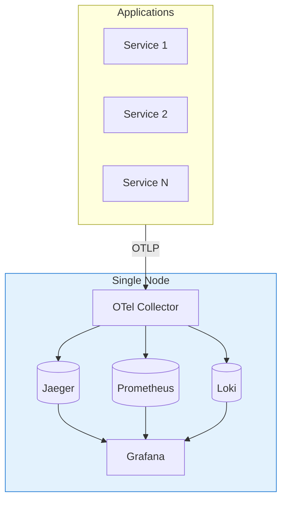
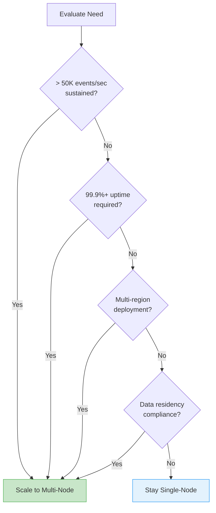
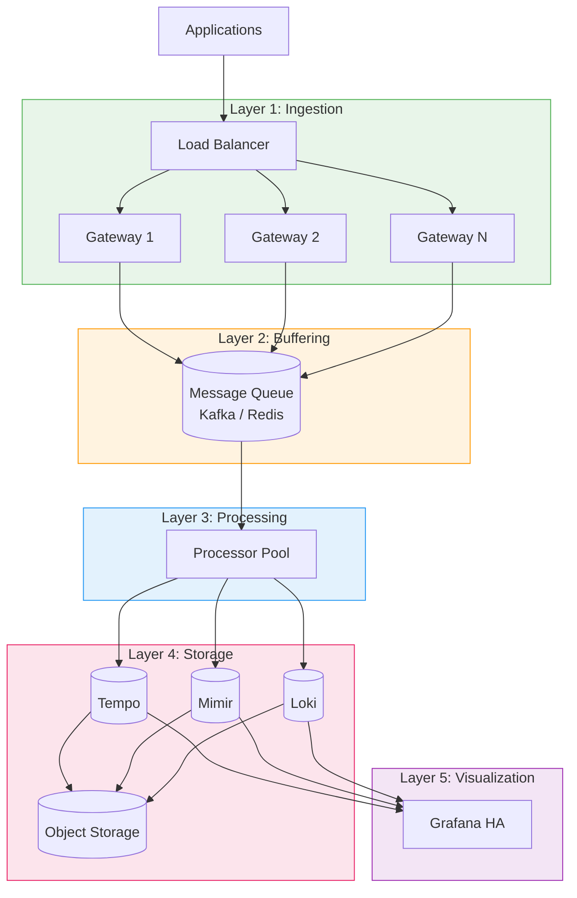
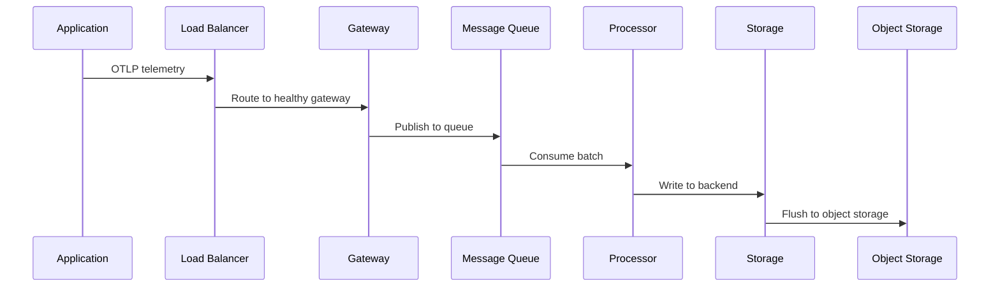
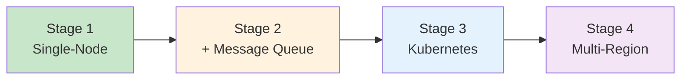
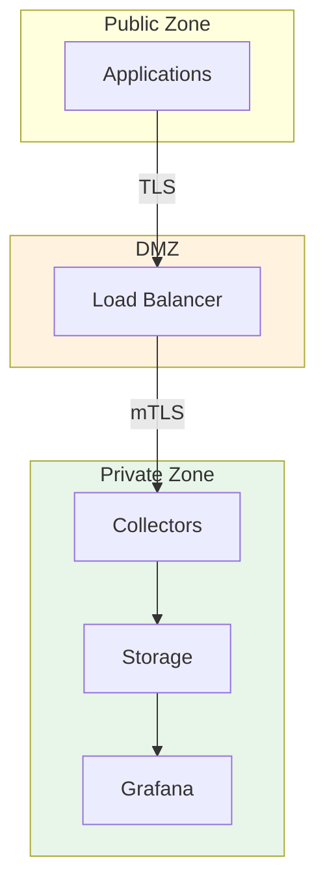

# Scalable OpenTelemetry Observability Stack

## Architecture Overview

**Version:** 1.0  
**Date:** January 2026  
**Status:** Approved

---

## Quick Links

| Document | Description |
|----------|-------------|
| **This Document** | Architecture concepts, design decisions, requirements |
| [Implementation Guide](./implementation-guide.md) | Step-by-step deployment instructions |
| [Config Files](./configs/) | All configuration files referenced in the guide |

---

## Table of Contents

1. [Executive Summary](#executive-summary)
2. [Current State](#current-state)
3. [Why Scale?](#why-scale)
4. [Target Architecture](#target-architecture)
5. [Component Overview](#component-overview)
6. [Infrastructure Requirements](#infrastructure-requirements)
7. [Security Considerations](#security-considerations)
8. [Cost Analysis](#cost-analysis)
9. [Decision Summary](#decision-summary)

---

## Executive Summary

### The Problem

Modern distributed systems generate massive telemetry data—traces, metrics, and logs—essential for reliability and debugging. Commercial solutions (Datadog, New Relic, Splunk) cost **$2,000-$200,000+/month** depending on scale.

### The Solution

A **self-hosted observability platform** built on open-source components:

| Component | Purpose | Technology |
|-----------|---------|------------|
| **Collection** | Unified telemetry ingestion | OpenTelemetry Collector |
| **Tracing** | Distributed trace storage | Jaeger → Tempo |
| **Metrics** | Time-series storage | Prometheus → Mimir |
| **Logs** | Log aggregation | Loki |
| **Visualization** | Dashboards & alerting | Grafana |

### Key Benefits

| Benefit | Impact |
|---------|--------|
| **Cost Savings** | 60-90% reduction vs. commercial solutions |
| **Data Ownership** | Full control over sensitive telemetry |
| **Flexibility** | Customize retention, sampling, processing |
| **No Vendor Lock-in** | OpenTelemetry is vendor-neutral |
| **Scalability** | Single-node to enterprise scale |

---

## Current State

### Single-Node Architecture

The current implementation runs all components on a single server:

### Current Capabilities

| Capability | Capacity | Status |
|------------|----------|--------|
| Traces | ~50K spans/sec | Operational |
| Metrics | ~1M active series | Operational |
| Logs | ~50K lines/sec | Operational |
| Retention | 30 days | Configurable |
| Recovery | Persistent queues | Implemented |

### Strengths

- **Simple**: Single `docker compose up` deploys everything
- **Low Cost**: Runs on $50-150/month VPS
- **Easy Maintenance**: One node to manage
- **Production Ready**: Health checks, auto-restart, backups

### Limitations

| Limitation | Risk | Impact |
|------------|------|--------|
| Single point of failure | High | Complete outage if node fails |
| Vertical scaling only | Medium | Limited by single-node resources |
| No geographic redundancy | Medium | Cannot survive datacenter failure |
| Shared resources | Medium | Components compete for CPU/memory |
| Maintenance downtime | Low | Upgrades require brief interruption |

---

## Why Scale?

### When to Scale

You should consider scaling when ANY of these apply:

### Problems Solved by Scaling

#### 1. Availability

| Single-Node | Scaled |
|-------------|--------|
| Node failure = total outage | Redundant nodes, no single point of failure |
| ~99% uptime realistic | 99.9%+ uptime achievable |

#### 2. Throughput

| Single-Node | Scaled |
|-------------|--------|
| ~50K events/sec max | 500K+ events/sec |
| Aggressive sampling needed | Minimal sampling required |

#### 3. Resource Isolation

| Single-Node | Scaled |
|-------------|--------|
| Components compete for resources | Dedicated resources per component |
| Unpredictable performance | Guaranteed SLAs |

#### 4. Operations

| Single-Node | Scaled |
|-------------|--------|
| Maintenance requires downtime | Rolling updates, zero downtime |
| Single backup strategy | Distributed, redundant storage |

---

## Target Architecture

### Design Principles

| Principle | Description |
|-----------|-------------|
| **Loose Coupling** | Components can be upgraded/scaled independently |
| **Horizontal Scaling** | Add nodes to increase capacity |
| **Graceful Degradation** | Partial failures don't cause complete outages |
| **Data Durability** | No data loss during failures or upgrades |

### Five-Layer Architecture

### Layer Responsibilities

| Layer | Purpose | Scaling Strategy |
|-------|---------|------------------|
| **Ingestion** | Receive telemetry from apps | Add more gateways |
| **Buffering** | Decouple ingestion from processing | Add partitions |
| **Processing** | Transform, sample, enrich | Add more consumers |
| **Storage** | Persist and query data | Horizontal + object storage |
| **Visualization** | Dashboards and alerts | Stateless, scale horizontally |

### Data Flow

### Evolution Path

The architecture evolves through stages:

| Stage | When to Move | Key Addition |
|-------|--------------|--------------|
| **1 → 2** | >50K events/sec or HA needed | Kafka/Redis queue |
| **2 → 3** | >100K events/sec or K8s adoption | Kubernetes orchestration |
| **3 → 4** | Multi-DC or compliance requirements | Geographic distribution |

---

## Component Overview

### Ingestion Layer

**Purpose**: Receive telemetry from all applications with high availability.

| Component | Role | Why |
|-----------|------|-----|
| **Load Balancer** | Distribute traffic | Health-aware routing, no SPOF |
| **Gateway Collectors** | Receive & batch | Stateless, horizontally scalable |

**Technology Options**:
- Load Balancer: HAProxy, NGINX, Cloud LB (ALB/NLB)
- Gateways: OpenTelemetry Collector

### Buffering Layer

**Purpose**: Decouple ingestion from processing, absorb traffic spikes.

| Benefit | Description |
|---------|-------------|
| **Spike Absorption** | Queue buffers sudden traffic increases |
| **Replay Capability** | Re-process data after failures |
| **Back-pressure** | Slow consumers don't drop data |

**Technology Options**:

| Option | Best For | Complexity |
|--------|----------|------------|
| **Kafka** | High volume (>100K/sec) | High |
| **Redis Streams** | Medium volume, simplicity | Medium |
| **Persistent Queue** | Low volume, single-node | Low |

### Processing Layer

**Purpose**: Transform, sample, enrich, and route telemetry.

| Function | Description |
|----------|-------------|
| **Sampling** | Reduce volume while preserving signal |
| **Enrichment** | Add metadata (K8s labels, etc.) |
| **Transformation** | Convert formats, rename attributes |
| **Routing** | Send to appropriate backends |

**Technology**: OpenTelemetry Collector with processing pipelines

### Storage Layer

**Purpose**: Persist telemetry for querying and analysis.

| Signal | Technology | Why |
|--------|------------|-----|
| **Traces** | Tempo | Native object storage, cost-effective |
| **Metrics** | Mimir / VictoriaMetrics | Prometheus-compatible, scalable |
| **Logs** | Loki | Low-cost, Grafana integration |

**Object Storage**: S3, MinIO, GCS for long-term retention

### Visualization Layer

**Purpose**: Dashboards, alerting, and data exploration.

| Component | Role |
|-----------|------|
| **Grafana** | Unified UI for all signals |
| **PostgreSQL** | Shared state for HA Grafana |

---

## Infrastructure Requirements

### Sizing Tiers

| Tier | Events/sec | Applications | Monthly Cost |
|------|------------|--------------|--------------|
| **Small** | <10K | 1-20 | $50-150 |
| **Medium** | 10K-50K | 20-100 | $300-800 |
| **Large** | 50K-200K | 100-500 | $1,500-4,000 |
| **Enterprise** | >200K | 500+ | $5,000-15,000 |

### Small Tier (Single-Node)

| Component | CPU | Memory | Storage |
|-----------|-----|--------|---------|
| OTel Collector | 2 | 2 GB | - |
| Prometheus | 2 | 4 GB | 100 GB SSD |
| Jaeger | 2 | 4 GB | 100 GB SSD |
| Loki | 1 | 2 GB | 100 GB SSD |
| Grafana | 1 | 1 GB | 10 GB |
| **Total** | **8 cores** | **13 GB** | **310 GB** |

### Medium Tier (Multi-Node)

| Component | Instances | CPU/each | Memory/each |
|-----------|-----------|----------|-------------|
| Load Balancer | 2 | 1 | 1 GB |
| OTel Gateway | 3 | 2 | 2 GB |
| Kafka | 3 | 2 | 4 GB |
| OTel Processor | 3 | 2 | 4 GB |
| Tempo | 3 | 2 | 4 GB |
| Mimir | 3 | 4 | 8 GB |
| Loki | 3 | 2 | 4 GB |
| Grafana | 2 | 2 | 2 GB |

### Large Tier (Kubernetes)

| Component | Replicas | CPU Request | Memory Request |
|-----------|----------|-------------|----------------|
| OTel Gateway | 5-10 | 1 | 2 GB |
| OTel Processor | 5-10 | 2 | 4 GB |
| Kafka | 5+ | 4 | 8 GB |
| Tempo | 3+ | 4 | 8 GB |
| Mimir | 3+ | 4 | 16 GB |
| Loki | 3+ | 2 | 8 GB |

### Storage Estimation

**Formula**: `Daily Storage = Events/sec × 86,400 × Avg Size × Compression`

| Signal | Avg Size | Compression | 1K/sec = GB/day |
|--------|----------|-------------|-----------------|
| Traces | 1 KB | 10x | ~8 GB |
| Metrics | 100 B | 15x | ~0.5 GB |
| Logs | 500 B | 10x | ~4 GB |

**Example**: 10K events/sec (mixed) ≈ 50-100 GB/day → 1.5-3 TB/month

---

## Security Considerations

### Authentication

| Layer | Method | Purpose |
|-------|--------|---------|
| **Ingestion** | mTLS, API Keys | Authenticate applications |
| **Internal** | mTLS | Service-to-service auth |
| **UI** | OAuth2/OIDC | User authentication |

### Network Security

### Data Protection

| Concern | Solution |
|---------|----------|
| **Encryption at Rest** | Enable storage encryption |
| **Encryption in Transit** | TLS everywhere |
| **PII in Telemetry** | Use processors to scrub sensitive data |
| **Access Control** | RBAC in Grafana, network segmentation |

### Secrets Management

| Environment | Recommended |
|-------------|-------------|
| **Docker** | Docker Secrets, external secret store |
| **Kubernetes** | External Secrets Operator, Vault |
| **Cloud** | Native secret managers (AWS SM, GCP SM) |

---

## Cost Analysis

### Self-Hosted vs. Commercial

| Scale | Self-Hosted | Datadog | Savings |
|-------|-------------|---------|---------|
| 10K events/sec | $150/mo | $5,000/mo | 97% |
| 50K events/sec | $800/mo | $25,000/mo | 97% |
| 200K events/sec | $4,000/mo | $100,000/mo | 96% |

*Self-hosted includes infrastructure only, not personnel*

### Cost Breakdown

| Category | % of Total | Optimization |
|----------|------------|--------------|
| **Compute** | 40-50% | Right-size, spot instances |
| **Storage** | 30-40% | Retention policies, sampling |
| **Network** | 10-20% | Compress data, reduce cardinality |

### Optimization Strategies

| Strategy | Savings | Effort |
|----------|---------|--------|
| Aggressive sampling | 50-70% | Low |
| Shorter retention | 20-40% | Low |
| Object storage tiering | 30-50% | Medium |
| Spot/preemptible instances | 60-80% | Medium |
| Reduce metric cardinality | 20-50% | High |

### Cloud vs. On-Prem

| Factor | Cloud | On-Premises |
|--------|-------|-------------|
| **Upfront Cost** | Low | High |
| **Monthly Cost** | Higher | Lower |
| **Elasticity** | High | Low |
| **Maintenance** | Managed | Self-managed |
| **Break-even** | N/A | ~18-24 months |

---

## Decision Summary

### Technology Choices

| Decision | Choice | Rationale |
|----------|--------|-----------|
| **Telemetry Standard** | OpenTelemetry | Vendor-neutral, broad SDK support |
| **Message Queue** | Kafka (large), Redis (small) | Durability, replay capability |
| **Trace Storage** | Tempo | Native object storage, cost-effective |
| **Metrics Storage** | Mimir / VictoriaMetrics | Prometheus-compatible, scalable |
| **Log Storage** | Loki | Low-cost, Grafana integration |
| **Object Storage** | S3 / MinIO | Durable, cheap, scalable |

### Trade-offs

| Benefit | Trade-off |
|---------|-----------|
| High availability | More infrastructure to manage |
| Horizontal scale | Increased operational complexity |
| Data durability | Higher storage costs |
| Query performance | More memory/cache needed |
| Self-hosted control | Engineering time for maintenance |

### Recommended Path

| Phase | Trigger | Action |
|-------|---------|--------|
| **Start** | Any new deployment | Single-node Docker Compose |
| **Phase 2** | >50K/sec or HA required | Add Kafka, multi-node |
| **Phase 3** | Kubernetes adoption | Helm deployment |
| **Phase 4** | Multi-region required | Geographic distribution |

---

## Next Steps

Ready to implement? See the [Implementation Guide](./implementation-guide.md) for step-by-step instructions.

| Resource | Description |
|----------|-------------|
| [Implementation Guide](./implementation-guide.md) | Step-by-step deployment |
| [Config Files](./configs/) | All configuration files |
| [Main README](../../README.md) | Project overview |

---

## Appendix: Quick Reference

### Capacity Planning Cheat Sheet

| Events/sec | Recommended Setup | Est. Monthly Cost |
|------------|-------------------|-------------------|
| <10K | Single-node Docker | $50-150 |
| 10K-50K | Multi-node + Kafka | $300-800 |
| 50K-200K | Kubernetes cluster | $1,500-4,000 |
| >200K | Multi-cluster K8s | $5,000+ |

### Component Selection Matrix

| Need | Traces | Metrics | Logs |
|------|--------|---------|------|
| **Simple** | Jaeger | Prometheus | Loki |
| **Scale** | Tempo | Mimir | Loki (microservices) |
| **Enterprise** | Tempo + S3 | Mimir/VM + S3 | Loki + S3 |

### When NOT to Scale

- Events <50K/sec AND uptime SLA <99.9%
- Team lacks Kubernetes expertise
- Budget constraints for infrastructure
- Telemetry is non-critical to business

In these cases, optimize the single-node setup instead.
