# Scalable OpenTelemetry Observability Stack

## Architecture Overview

**Version:** 2.0  
**Date:** January 2026  
**Status:** Approved

---

## Quick Links

| Document | Description |
|----------|-------------|
| **This Document** | Architecture concepts, design decisions, technology deep-dives |
| [Implementation Guide](./implementation-guide.md) | Step-by-step deployment instructions |
| [Config Files](./configs/) | All configuration files referenced in the guide |

---

## Table of Contents

1. [Executive Summary](#executive-summary)
2. [Understanding Observability](#understanding-observability)
3. [Why OpenTelemetry?](#why-opentelemetry)
4. [Current State Analysis](#current-state-analysis)
5. [When and Why to Scale](#when-and-why-to-scale)
6. [Target Architecture](#target-architecture)
7. [Technology Deep Dive](#technology-deep-dive)
8. [Data Flow & Processing](#data-flow--processing)
9. [Infrastructure Requirements](#infrastructure-requirements)
10. [Security Architecture](#security-architecture)
11. [Cost Analysis](#cost-analysis)
12. [Technology Decisions](#technology-decisions)
13. [Appendix](#appendix-quick-reference)

---

# Part I: Foundation

## Executive Summary

### The Business Problem

Modern software systems are distributed, complex, and generate enormous amounts of operational data. When something goes wrong—a slow API, a failed transaction, a service outage—engineers need to quickly answer:

- **What happened?** (the symptom)
- **Where did it happen?** (which service, which instance)
- **Why did it happen?** (root cause)
- **How do we prevent it?** (patterns and trends)

This requires comprehensive **observability**: the ability to understand a system's internal state by examining its outputs (logs, metrics, traces).

### The Cost Problem

Commercial observability platforms provide excellent capabilities but at significant cost:

| Vendor | Pricing Model | Typical Cost (50K events/sec) |
|--------|---------------|-------------------------------|
| **Datadog** | Per host + per GB ingested | $20,000-40,000/month |
| **New Relic** | Per GB ingested | $15,000-30,000/month |
| **Splunk** | Per GB indexed | $25,000-50,000/month |
| **Dynatrace** | Per host | $15,000-25,000/month |

For a mid-size company with 100+ services, costs can reach **$200,000-500,000/year**.

### Our Solution

A **self-hosted observability platform** built entirely on open-source software, providing:

- **97% cost reduction** compared to commercial solutions
- **Full data ownership** (telemetry never leaves your infrastructure)
- **No vendor lock-in** (OpenTelemetry is an open standard)
- **Unlimited scalability** (from single-node to enterprise)
- **Complete customization** (retention, sampling, processing rules)

### Technology Stack Overview

```
┌─────────────────────────────────────────────────────────────────────────┐
│                              APPLICATIONS                                │
│         (Your services instrumented with OpenTelemetry SDKs)            │
└─────────────────────────────────┬───────────────────────────────────────┘
                                  │ OTLP Protocol
                                  ▼
┌─────────────────────────────────────────────────────────────────────────┐
│                         OPENTELEMETRY COLLECTOR                          │
│              (Receives, processes, and routes all telemetry)            │
└───────────┬─────────────────────┬─────────────────────┬─────────────────┘
            │                     │                     │
            ▼                     ▼                     ▼
┌───────────────────┐ ┌───────────────────┐ ┌───────────────────┐
│      TEMPO        │ │  PROMETHEUS/MIMIR │ │       LOKI        │
│    (Traces)       │ │    (Metrics)      │ │      (Logs)       │
└─────────┬─────────┘ └─────────┬─────────┘ └─────────┬─────────┘
          │                     │                     │
          └─────────────────────┼─────────────────────┘
                                │
                                ▼
                    ┌───────────────────┐
                    │      GRAFANA      │
                    │  (Visualization)  │
                    └───────────────────┘
```

---

## Understanding Observability

### The Three Pillars of Observability

Observability is built on three complementary data types, each providing different insights:


### Traces: Understanding Request Flow

**What are traces?**

A trace represents a single request's journey through your distributed system. It consists of **spans**—individual units of work with timing information.

```
Trace: User Login Request (trace_id: abc123)
│
├── Span: API Gateway (50ms)
│   └── Span: Auth Service (30ms)
│       ├── Span: Database Query (15ms)
│       └── Span: Cache Lookup (2ms)
│
└── Span: Session Service (10ms)
    └── Span: Redis Write (5ms)

Total Duration: 60ms
```

**When to use traces:**
- Debugging slow requests ("Why did this take 5 seconds?")
- Understanding service dependencies
- Finding bottlenecks in request flow
- Root cause analysis for errors

**Key trace concepts:**
| Concept | Description |
|---------|-------------|
| **Trace** | Complete journey of a request (collection of spans) |
| **Span** | Single unit of work (has start time, duration, attributes) |
| **Trace ID** | Unique identifier linking all spans in a trace |
| **Span ID** | Unique identifier for each span |
| **Parent Span** | The span that initiated this span |
| **Attributes** | Key-value metadata (user_id, http.status_code, etc.) |

### Metrics: Understanding System Behavior

**What are metrics?**

Metrics are numerical measurements collected over time. They're highly efficient for storage and querying, making them ideal for dashboards and alerts.

**Types of metrics:**

| Type | Description | Example |
|------|-------------|---------|
| **Counter** | Cumulative value that only increases | Total HTTP requests: 1,234,567 |
| **Gauge** | Value that can go up or down | Current memory usage: 2.5 GB |
| **Histogram** | Distribution of values | Request latency buckets (p50, p90, p99) |
| **Summary** | Pre-calculated percentiles | Request duration: p99 = 250ms |

**When to use metrics:**
- Real-time dashboards
- Alerting on thresholds
- Capacity planning
- SLO/SLA monitoring
- Trend analysis

**Example metrics:**
```
# Counter - total requests
http_requests_total{method="GET", status="200", service="api"} 12345

# Gauge - current connections
db_connections_active{pool="primary"} 45

# Histogram - latency distribution
http_request_duration_seconds_bucket{le="0.1"} 8000
http_request_duration_seconds_bucket{le="0.5"} 9500
http_request_duration_seconds_bucket{le="1.0"} 9900
```

### Logs: Understanding Events

**What are logs?**

Logs are discrete events that occurred at a specific time. They contain structured or unstructured text describing what happened.

**Log levels:**
| Level | When to Use |
|-------|-------------|
| **ERROR** | Something failed, requires attention |
| **WARN** | Potential issue, degraded but functioning |
| **INFO** | Normal operations, significant events |
| **DEBUG** | Detailed diagnostic information |
| **TRACE** | Very detailed, usually disabled in production |

**Structured vs. Unstructured logs:**

```
# Unstructured (hard to query)
2024-01-15 10:23:45 ERROR Failed to process payment for user 12345

# Structured (easy to query and correlate)
{
  "timestamp": "2024-01-15T10:23:45Z",
  "level": "ERROR",
  "message": "Failed to process payment",
  "user_id": "12345",
  "payment_id": "pay_abc123",
  "error": "insufficient_funds",
  "trace_id": "abc123def456"  // Links to trace!
}
```

### Correlation: The Power of Connected Data

The real power of observability comes from **correlating** all three signals:

```mermaid
flowchart TD
    Alert["🚨 Alert: High Error Rate"] --> Metrics
    
    subgraph Investigation["Investigation Flow"]
        Metrics["📊 Metrics<br/>Error rate spike at 3:00 PM"] --> Logs
        Logs["📝 Logs<br/>Filter by time + error level<br/>Found: 'Connection refused'"] --> Traces
        Traces["🔍 Traces<br/>Trace ID from log<br/>Shows: DB timeout at 2.5s"]
    end
    
    Traces --> RootCause["✅ Root Cause<br/>Database connection pool exhausted"]
    
    style Alert fill:#ffcdd2,stroke:#c62828
    style RootCause fill:#c8e6c9,stroke:#2e7d32
```



---

## Why OpenTelemetry?

### What is OpenTelemetry?

**OpenTelemetry (OTel)** is an open-source observability framework that provides:

1. **APIs and SDKs** for instrumenting applications (available for all major languages)
2. **A standard protocol (OTLP)** for transmitting telemetry data
3. **The OpenTelemetry Collector** for receiving, processing, and exporting telemetry


### Why Choose OpenTelemetry?

| Benefit | Explanation |
|---------|-------------|
| **Vendor Neutral** | Switch backends without changing application code |
| **Industry Standard** | Backed by CNCF, adopted by all major vendors |
| **Single Instrumentation** | One SDK for traces, metrics, and logs |
| **Rich Ecosystem** | SDKs for 11+ languages, 100+ integrations |
| **Future Proof** | Rapidly becoming the industry standard |
| **Community Support** | Large, active open-source community |

### OpenTelemetry vs. Alternatives

| Feature | OpenTelemetry | Jaeger SDK | Prometheus Client | Vendor SDKs |
|---------|---------------|------------|-------------------|-------------|
| **Traces** | ✅ | ✅ | ❌ | ✅ |
| **Metrics** | ✅ | ❌ | ✅ | ✅ |
| **Logs** | ✅ | ❌ | ❌ | ✅ |
| **Vendor Neutral** | ✅ | ✅ | ✅ | ❌ |
| **Single SDK** | ✅ | ❌ | ❌ | ✅ |
| **Industry Standard** | ✅ | Partial | Partial | ❌ |

### The OpenTelemetry Collector

The **OTel Collector** is the heart of our architecture. It's a vendor-agnostic proxy that can:

```mermaid
flowchart LR
    subgraph Receive["📥 RECEIVE"]
        R1["OTLP"]
        R2["Jaeger"]
        R3["Prometheus"]
        R4["Zipkin"]
        R5["FluentBit"]
    end
    
    subgraph Process["⚙️ PROCESS"]
        P1["Batch"]
        P2["Filter"]
        P3["Transform"]
        P4["Sample"]
        P5["Enrich"]
    end
    
    subgraph Export["📤 EXPORT"]
        E1["Tempo"]
        E2["Mimir"]
        E3["Loki"]
        E4["Kafka"]
        E5["Any Vendor"]
    end
    
    Receive --> Process --> Export
```



**Key Collector capabilities:**

| Capability | What It Does | Why It Matters |
|------------|--------------|----------------|
| **Protocol Translation** | Convert between formats (Jaeger ↔ OTLP) | Accept data from any source |
| **Batching** | Group telemetry into efficient batches | Reduce network overhead |
| **Sampling** | Keep subset of traces intelligently | Control costs and volume |
| **Filtering** | Drop unwanted telemetry | Reduce noise and costs |
| **Enrichment** | Add metadata (K8s labels, etc.) | Better context for debugging |
| **Routing** | Send different data to different backends | Flexibility in storage |
| **Queuing** | Buffer data during backend outages | Prevent data loss |
| **Retry** | Retry failed exports | Reliability |

---

# Part II: Current State & Scaling

## Current State Analysis

### Single-Node Architecture

The current implementation runs all observability components on a single server:

```mermaid
flowchart TB
    subgraph Apps["📱 Applications"]
        A1["Service A"]
        A2["Service B"]
        A3["Service C"]
    end
    
    subgraph SingleNode["🖥️ Single Node (Docker Compose)"]
        OC["OpenTelemetry Collector<br/>━━━━━━━━━━━━━━━━━━━<br/>• Receives OTLP<br/>• Batches data<br/>• Persistent queue"]
        
        subgraph Storage["Storage Layer"]
            J[("Jaeger<br/>━━━━━━━━<br/>Badger DB<br/>~50K spans/s")]
            P[("Prometheus<br/>━━━━━━━━━<br/>TSDB<br/>~1M series")]
            L[("Loki<br/>━━━━━━<br/>BoltDB<br/>~50K lines/s")]
        end
        
        G["Grafana<br/>━━━━━━━━<br/>Dashboards<br/>Alerting"]
    end
    
    Apps -->|"OTLP (gRPC/HTTP)"| OC
    OC -->|Traces| J
    OC -->|Metrics| P
    OC -->|Logs| L
    J & P & L --> G
    
    style SingleNode fill:#e3f2fd,stroke:#1976d2
    style OC fill:#ff9800,stroke:#e65100
```



### What Each Component Does

| Component | Role | Technology | Storage |
|-----------|------|------------|---------|
| **OTel Collector** | Receives, processes, routes telemetry | OTel Collector Contrib | Persistent queue (disk) |
| **Jaeger** | Stores and queries distributed traces | Jaeger All-in-One | Badger (embedded KV store) |
| **Prometheus** | Stores and queries metrics | Prometheus | TSDB (time-series DB) |
| **Loki** | Stores and queries logs | Grafana Loki | BoltDB + chunks on disk |
| **Grafana** | Visualizes all data, alerting | Grafana OSS | SQLite (dashboards) |

### Current Capabilities & Limits

| Metric | Current Capacity | How We Measured |
|--------|------------------|-----------------|
| **Traces** | ~50,000 spans/second | OTel Collector benchmark |
| **Metrics** | ~1,000,000 active series | Prometheus stress test |
| **Logs** | ~50,000 lines/second | Loki ingestion test |
| **Query Latency** | <1s for 1h window | Grafana dashboard load |
| **Data Retention** | 30 days | Configurable per backend |
| **Storage Growth** | ~50 GB/day at moderate load | Actual measurement |

### Reliability Features (Already Implemented)

| Feature | How It Works | Benefit |
|---------|--------------|---------|
| **Persistent Queues** | OTel Collector writes to disk before export | Data survives restarts |
| **Resource Limits** | Docker memory/CPU limits per container | Prevents OOM crashes |
| **Health Checks** | Each container exposes health endpoint | Auto-restart on failure |
| **Auto-Restart** | Docker `restart: unless-stopped` | Self-healing |
| **Graceful Shutdown** | 30s drain period before stop | Zero data loss on deploy |
| **Automated Backups** | Daily cron job backs up volumes | Disaster recovery |

### Strengths of Current Setup

| Strength | Details |
|----------|---------|
| **Simplicity** | One command (`docker compose up`) deploys everything |
| **Low Cost** | Runs on a single $50-150/month VPS or on-prem server |
| **Easy Operations** | One node to monitor, update, backup |
| **Full Featured** | Complete observability for traces, metrics, logs |
| **Production Ready** | Health checks, persistence, alerting included |
| **Quick Recovery** | Simple backup/restore process |

### Limitations (Why You Might Need to Scale)

| Limitation | Impact | Risk Level |
|------------|--------|------------|
| **Single Point of Failure** | Node failure = complete observability blackout | 🔴 High |
| **Vertical Scaling Only** | Can only add resources to one machine | 🟡 Medium |
| **No Geographic Redundancy** | Cannot survive datacenter/region failure | 🟡 Medium |
| **Shared Resources** | Heavy Prometheus query affects Jaeger writes | 🟡 Medium |
| **Maintenance Downtime** | Upgrades require brief interruption | 🟢 Low |
| **Limited Throughput** | Hard ceiling at ~50K events/sec | 🟢 Low* |

*Low risk unless you're approaching this limit

---

## When and Why to Scale

### Decision Framework

Use this flowchart to determine if you need to scale:

```mermaid
flowchart TD
    Start["🤔 Should I Scale?"] --> Q1
    
    Q1{"Is sustained throughput<br/>> 50K events/sec?"}
    Q1 -->|Yes| Scale["✅ Scale to Multi-Node"]
    Q1 -->|No| Q2
    
    Q2{"Do you need<br/>99.9%+ uptime SLA?"}
    Q2 -->|Yes| Scale
    Q2 -->|No| Q3
    
    Q3{"Do you have<br/>multi-region apps?"}
    Q3 -->|Yes| Scale
    Q3 -->|No| Q4
    
    Q4{"Data residency<br/>compliance required?"}
    Q4 -->|Yes| Scale
    Q4 -->|No| Q5
    
    Q5{"Frequent performance<br/>issues?"}
    Q5 -->|Yes| Optimize["⚡ First: Optimize Single-Node"]
    Q5 -->|No| Stay["✅ Stay Single-Node"]
    
    Optimize --> Q6{"Still having<br/>issues?"}
    Q6 -->|Yes| Scale
    Q6 -->|No| Stay
    
    style Scale fill:#c8e6c9,stroke:#4caf50
    style Stay fill:#e3f2fd,stroke:#2196f3
    style Optimize fill:#fff3e0,stroke:#ff9800
```



### Problems That Scaling Solves

#### Problem 1: Single Point of Failure

**The Issue:**
```
Single Node Architecture:
                    
   [Node] ──── If this fails, everything fails
      │
      └── Jaeger, Prometheus, Loki, Grafana
          ALL unavailable during failure
```

**The Solution:**
```
Multi-Node Architecture:

   [Node 1] ──┐
   [Node 2] ──┼── If any node fails, others continue
   [Node 3] ──┘
```

| Scenario | Single-Node | Multi-Node |
|----------|-------------|------------|
| Node crash | 100% outage until restart | 0% outage (others take over) |
| Disk failure | Data loss possible | No data loss (replicated) |
| Network issue | Complete blackout | Partial, graceful degradation |
| Realistic SLA | ~99% (8.7 hours downtime/year) | ~99.9% (8.7 minutes downtime/year) |

#### Problem 2: Throughput Ceiling

**The Issue:**

A single OTel Collector can process ~50K events/second. Beyond that:
- Events queue up
- Memory pressure increases  
- Data gets dropped

**The Solution:**

Multiple collectors behind a load balancer:

```
Single Collector: 50K events/sec max

┌──────────────┐
│  Collector   │ ← Bottleneck
└──────────────┘

Multiple Collectors: 50K × N events/sec

        ┌───────────────┐
        │ Load Balancer │
        └───────┬───────┘
    ┌───────────┼───────────┐
    ▼           ▼           ▼
┌────────┐ ┌────────┐ ┌────────┐
│Coll. 1 │ │Coll. 2 │ │Coll. 3 │  = 150K events/sec
└────────┘ └────────┘ └────────┘
```

#### Problem 3: Resource Contention

**The Issue:**

On a single node, components compete for resources:

```
Limited Resources (16 GB RAM, 8 CPU):

┌─────────────────────────────────────────┐
│ Prometheus │ Jaeger │ Loki │ Collector  │
│   6 GB     │  4 GB  │ 3 GB │    2 GB    │
└─────────────────────────────────────────┘
         ↑
         └── Heavy query starves other components
```

**The Solution:**

Dedicated resources per component:

```
Dedicated Nodes:

┌──────────┐  ┌──────────┐  ┌──────────┐
│Prometheus│  │  Jaeger  │  │   Loki   │
│  16 GB   │  │  16 GB   │  │  16 GB   │
└──────────┘  └──────────┘  └──────────┘
      ↑
      └── Heavy query doesn't affect others
```

#### Problem 4: Maintenance Downtime

**The Issue:**

Upgrading a single-node setup requires downtime:

```
1. Stop services (data collection stops)
2. Pull new images
3. Start services
4. Wait for health checks

Downtime: 1-5 minutes
```

**The Solution:**

Rolling updates with zero downtime:

```
1. Add new node with updated version
2. Drain traffic from old node
3. Remove old node
4. Repeat for each node

Downtime: 0 minutes
```

---

# Part III: Target Architecture

## Target Architecture

### Design Principles

Before diving into components, understand the principles guiding our architecture:

| Principle | What It Means | How We Achieve It |
|-----------|---------------|-------------------|
| **Loose Coupling** | Components don't directly depend on each other | Message queue between ingestion and processing |
| **Horizontal Scaling** | Add more instances to handle more load | Stateless collectors, partitioned queues |
| **Graceful Degradation** | Partial failure doesn't mean total failure | Health checks, circuit breakers, fallbacks |
| **Data Durability** | No data loss during failures or upgrades | Persistent queues, replication, object storage |
| **Operational Simplicity** | Easy to understand, deploy, troubleshoot | Clear separation of concerns, standard tooling |

### The Five-Layer Architecture

```mermaid
flowchart TB
    subgraph L1["LAYER 1: INGESTION"]
        direction LR
        LB["🔄 Load Balancer<br/>━━━━━━━━━━━━━━━━<br/>HAProxy / NGINX<br/>AWS ALB / GCP LB"]
        G1["Gateway 1"] & G2["Gateway 2"] & G3["Gateway N"]
        LB --> G1 & G2 & G3
    end
    
    subgraph L2["LAYER 2: BUFFERING"]
        MQ[("📨 Message Queue<br/>━━━━━━━━━━━━━━━━━━━<br/>Kafka (high volume)<br/>Redis Streams (simple)")]
    end
    
    subgraph L3["LAYER 3: PROCESSING"]
        direction LR
        TP["Trace<br/>Processors"] 
        MP["Metric<br/>Processors"]
        LP["Log<br/>Processors"]
    end
    
    subgraph L4["LAYER 4: STORAGE"]
        direction LR
        T[("🔍 Tempo<br/>Traces")]
        M[("📊 Mimir<br/>Metrics")]
        L[("📝 Loki<br/>Logs")]
        S3[("☁️ Object Storage<br/>S3 / MinIO / GCS")]
    end
    
    subgraph L5["LAYER 5: VISUALIZATION"]
        Graf["📈 Grafana HA<br/>━━━━━━━━━━━━━━<br/>PostgreSQL backend<br/>for shared state"]
    end
    
    Apps["📱 Applications"] --> LB
    G1 & G2 & G3 --> MQ
    MQ --> TP & MP & LP
    TP --> T
    MP --> M
    LP --> L
    T & M & L --> S3
    T & M & L --> Graf
    
    style L1 fill:#e8f5e9,stroke:#4caf50
    style L2 fill:#fff3e0,stroke:#ff9800
    style L3 fill:#e3f2fd,stroke:#2196f3
    style L4 fill:#fce4ec,stroke:#e91e63
    style L5 fill:#f3e5f5,stroke:#9c27b0
```



### Layer-by-Layer Explanation

#### Layer 1: Ingestion

**Purpose:** Receive telemetry from all applications reliably.

**Components:**

| Component | What It Does | Why We Need It |
|-----------|--------------|----------------|
| **Load Balancer** | Distributes traffic across gateways | No single point of failure, health-aware routing |
| **Gateway Collectors** | Receive OTLP, validate, batch | Stateless, can scale horizontally |

**How it works:**

1. Applications send OTLP data to load balancer VIP
2. Load balancer routes to healthy gateway
3. Gateway validates data, batches it
4. Gateway publishes to message queue

**Scaling:** Add more gateway instances behind the load balancer.

#### Layer 2: Buffering

**Purpose:** Decouple ingestion from processing; absorb traffic spikes.

**Why a message queue?**

| Without Queue | With Queue |
|---------------|------------|
| Gateway waits for backend response | Gateway returns immediately |
| Backend slowdown causes data loss | Data queued until backend recovers |
| No replay capability | Can replay from any point |
| Tight coupling | Loose coupling |

**How it works:**

1. Gateways publish to topic partitions
2. Data is replicated across brokers (durability)
3. Processors consume from assigned partitions
4. Consumer offsets track progress

**Queue topic design:**
```
Topics (partitioned for parallelism):
├── otlp-traces    (12 partitions, 24h retention)
├── otlp-metrics   (12 partitions, 24h retention)
└── otlp-logs      (12 partitions, 24h retention)
```

#### Layer 3: Processing

**Purpose:** Transform, sample, enrich, and route telemetry.

**Processing functions:**

| Function | What It Does | Example |
|----------|--------------|---------|
| **Sampling** | Keep subset of data intelligently | Keep all errors, 10% of success |
| **Filtering** | Drop unwanted data | Remove health check traces |
| **Enrichment** | Add metadata | Add Kubernetes pod labels |
| **Transformation** | Modify attributes | Rename fields, convert formats |
| **Routing** | Send to different backends | Errors to one store, debug to another |

**How it works:**

1. Processors consume from Kafka
2. Apply configured processing pipelines
3. Export to appropriate storage backend
4. Commit offset after successful export

**Scaling:** Add more processor instances (Kafka rebalances partitions).

#### Layer 4: Storage

**Purpose:** Persist telemetry for querying and long-term retention.

**Why different backends for each signal?**

Each telemetry type has unique access patterns:

| Signal | Access Pattern | Best Storage Type |
|--------|----------------|-------------------|
| **Traces** | Lookup by trace ID, search by attributes | Document store, columnar |
| **Metrics** | Time-range queries, aggregations | Time-series database |
| **Logs** | Full-text search, time-range | Inverted index, append-only |

**How it works:**

1. Hot data stored locally for fast queries
2. Older data flushed to object storage (cheap)
3. Compaction reduces storage footprint
4. Queries check both hot and cold storage

#### Layer 5: Visualization

**Purpose:** Unified interface for exploring and alerting on all data.

**Components:**

| Component | What It Does |
|-----------|--------------|
| **Grafana** | Dashboards, exploration, alerting |
| **PostgreSQL** | Shared state for HA (dashboards, users, alerts) |

**Why PostgreSQL for Grafana HA?**

Default Grafana uses SQLite (local file). For HA:
- Multiple Grafana instances need shared state
- PostgreSQL provides this shared state
- Any Grafana instance can serve any request

---

## Technology Deep Dive

### OpenTelemetry Collector

**What is it?**

The OTel Collector is a vendor-agnostic telemetry processing pipeline. Think of it as a Swiss Army knife for observability data.

**Architecture:**



```mermaid
flowchart LR
    subgraph Collector["OpenTelemetry Collector"]
        subgraph Receivers["📥 Receivers"]
            R1["OTLP"]
            R2["Prometheus"]
            R3["Jaeger"]
            R4["Kafka"]
        end
        
        subgraph Processors["⚙️ Processors"]
            P1["batch"]
            P2["memory_limiter"]
            P3["filter"]
            P4["attributes"]
            P5["tail_sampling"]
        end
        
        subgraph Exporters["📤 Exporters"]
            E1["OTLP"]
            E2["Prometheus"]
            E3["Kafka"]
            E4["Loki"]
        end
        
        Receivers --> Processors --> Exporters
    end
```

**Key capabilities:**

| Capability | Description | Use Case |
|------------|-------------|----------|
| **Multi-protocol** | Receives OTLP, Jaeger, Zipkin, Prometheus, etc. | Accept data from any source |
| **Pipeline processing** | Chain processors for complex transformations | Filter → Batch → Export |
| **Persistent queue** | Write to disk before export | Survive restarts without data loss |
| **Memory limiting** | Cap memory usage | Prevent OOM in constrained environments |
| **Health checking** | Expose health endpoints | Kubernetes readiness/liveness probes |

**Deployment patterns:**

| Pattern | Description | When to Use |
|---------|-------------|-------------|
| **Agent** | Runs alongside application | Low latency, local buffering |
| **Gateway** | Standalone service receiving from agents | Centralized processing |
| **Sidecar** | Container in same pod as application | Kubernetes deployments |

### Apache Kafka

**What is it?**

Kafka is a distributed event streaming platform. It acts as a durable, high-throughput message queue.

**Why Kafka for observability?**

| Feature | Benefit for Observability |
|---------|---------------------------|
| **Durability** | Data persisted to disk, survives broker restarts |
| **Replication** | Data copied to multiple brokers, survives broker failure |
| **High throughput** | Millions of messages/second |
| **Replay** | Re-process data from any point in time |
| **Partitioning** | Parallel processing across consumers |

**Kafka concepts:**


| Concept | Description |
|---------|-------------|
| **Topic** | Named stream of messages (like a table) |
| **Partition** | Ordered, immutable sequence within a topic |
| **Broker** | Kafka server, stores partitions |
| **Producer** | Writes messages to topics |
| **Consumer** | Reads messages from topics |
| **Consumer Group** | Set of consumers that share work |

**Sizing guidance:**

| Scale | Brokers | Partitions/Topic | Throughput |
|-------|---------|------------------|------------|
| Small | 3 | 6 | ~100K events/sec |
| Medium | 5 | 12 | ~500K events/sec |
| Large | 9+ | 24+ | 1M+ events/sec |

### Grafana Tempo

**What is it?**

Tempo is a distributed tracing backend that stores traces in object storage (S3, GCS, Azure Blob).

**Why Tempo over Jaeger?**

| Feature | Jaeger | Tempo |
|---------|--------|-------|
| **Storage** | Cassandra, Elasticsearch, Badger | Object storage (S3) |
| **Cost** | Higher (compute for queries) | Lower (object storage is cheap) |
| **Scalability** | Complex (requires Cassandra/ES scaling) | Simple (just add storage) |
| **Query** | By trace ID, search by tags | By trace ID, TraceQL |
| **Retention** | Limited by storage cost | Unlimited (object storage is cheap) |

**Architecture:**


**Key features:**

| Feature | Description |
|---------|-------------|
| **TraceQL** | Powerful query language for traces |
| **Search** | Find traces by service, duration, status |
| **Trace to logs** | Link from trace span to related logs |
| **Trace to metrics** | Generate metrics from traces |

### Grafana Mimir

**What is it?**

Mimir is a horizontally scalable, highly available Prometheus-compatible metrics backend.

**Why Mimir over Prometheus?**

| Feature | Prometheus | Mimir |
|---------|------------|-------|
| **Scalability** | Single node | Horizontally scalable |
| **Storage** | Local disk | Object storage |
| **HA** | Federation (complex) | Built-in replication |
| **Retention** | Limited by disk | Unlimited |
| **Query** | PromQL | PromQL (same!) |

**Architecture:**


**Key features:**

| Feature | Description |
|---------|-------------|
| **100% Prometheus compatible** | Same PromQL, same remote write API |
| **Global view** | Query across all data, not federated |
| **Long-term storage** | Years of retention at low cost |
| **Multi-tenancy** | Isolate data by tenant |

### Grafana Loki

**What is it?**

Loki is a log aggregation system designed to be cost-effective and easy to operate.

**Why Loki over Elasticsearch?**

| Feature | Elasticsearch | Loki |
|---------|---------------|------|
| **Indexing** | Full-text index (expensive) | Labels only (cheap) |
| **Storage** | ~10x raw size | ~3x raw size |
| **Query** | Lucene syntax | LogQL |
| **Ops complexity** | High (JVM tuning, sharding) | Low |
| **Cost** | High | Low |

**How Loki works:**

Loki only indexes **labels** (metadata), not log content. This is the key to its efficiency:

```
Traditional (Elasticsearch):
Index every word → Huge index → High cost

Loki approach:
Index only labels → Small index → Low cost
┌─────────────────────────────────────────────────┐
│ Labels (indexed):                               │
│   app=api, env=prod, pod=api-xyz123            │
│                                                 │
│ Content (NOT indexed, just compressed):         │
│   "2024-01-15 10:00:00 User 123 logged in"     │
└─────────────────────────────────────────────────┘
```

**Querying:**
1. First filter by labels (fast, uses index)
2. Then grep through matching chunks (slower, but fewer chunks)

**Architecture:**


### Object Storage (S3/MinIO/GCS)

**Why object storage?**

| Benefit | Description |
|---------|-------------|
| **Cost** | ~$0.02/GB/month (vs. $0.10+ for SSD) |
| **Durability** | 99.999999999% (11 nines) |
| **Scalability** | Unlimited capacity |
| **No management** | No disks to manage, replace, resize |

**How it's used:**

| Component | What It Stores | Access Pattern |
|-----------|----------------|----------------|
| **Tempo** | Trace blocks | Write once, read for queries |
| **Mimir** | Metric blocks | Write once, read for queries |
| **Loki** | Log chunks | Write once, read for queries |

**Options:**

| Option | When to Use |
|--------|-------------|
| **AWS S3** | Running on AWS |
| **GCS** | Running on GCP |
| **Azure Blob** | Running on Azure |
| **MinIO** | On-premises (S3-compatible) |

---

## Data Flow & Processing

### End-to-End Data Flow

Let's trace a request through the entire system:


### Processing Pipeline Example

Here's how a trace flows through the processing pipeline:

```
INPUT: Raw span from application
{
  "trace_id": "abc123",
  "span_id": "def456",
  "name": "HTTP GET /api/users",
  "duration_ms": 150,
  "status": "OK",
  "attributes": {
    "http.method": "GET",
    "http.url": "https://api.example.com/api/users?token=secret123",
    "user.email": "john@example.com"
  }
}

↓ STEP 1: Memory Limiter
(Ensures collector doesn't OOM)

↓ STEP 2: Attribute Processor
(Remove sensitive data)
{
  ...
  "attributes": {
    "http.method": "GET",
    "http.url": "https://api.example.com/api/users?token=REDACTED",
    "user.email": "REDACTED"
  }
}

↓ STEP 3: Resource Processor
(Add infrastructure metadata)
{
  ...
  "resource": {
    "service.name": "api-service",
    "k8s.pod.name": "api-service-xyz123",
    "k8s.namespace": "production"
  }
}

↓ STEP 4: Tail Sampling
(Decision: Keep this span? Yes - it's a user-facing API)

↓ STEP 5: Batch Processor
(Combine with other spans for efficient export)

OUTPUT: Enriched, sanitized span sent to Tempo
```

### Sampling Strategies

**Why sample?**

At high volumes, storing every trace is:
- Expensive (storage costs)
- Unnecessary (most traces are uninteresting)
- Noisy (harder to find important traces)

**Sampling approaches:**

| Strategy | How It Works | Pros | Cons |
|----------|--------------|------|------|
| **Head sampling** | Decide at trace start (random %) | Simple, low overhead | Might miss interesting traces |
| **Tail sampling** | Decide after trace completes | Can keep all errors | Higher memory, latency |
| **Rate limiting** | Keep N traces per second | Predictable volume | Might drop during spikes |

**Recommended tail sampling policy:**

```
Keep these traces (100%):
├── All errors (status = ERROR)
├── Slow traces (duration > 1 second)
├── Traces with specific attributes (user.id = "vip")
└── Random 10% of remaining
```

This gives you:
- **All problems** (errors, slow requests)
- **Representative sample** of normal traffic
- **Predictable storage** costs

---

## Infrastructure Requirements

### Sizing Tiers

| Tier | Events/sec | Applications | Team Size | Recommended Setup |
|------|------------|--------------|-----------|-------------------|
| **Starter** | <5K | 1-10 | 1-5 | Single-node Docker |
| **Small** | 5K-20K | 10-50 | 5-20 | Single-node (optimized) |
| **Medium** | 20K-100K | 50-200 | 20-50 | Multi-node + Kafka |
| **Large** | 100K-500K | 200-1000 | 50-200 | Kubernetes cluster |
| **Enterprise** | >500K | 1000+ | 200+ | Multi-cluster K8s |

### Detailed Resource Requirements

#### Starter/Small Tier (Single Node)

| Component | CPU | Memory | Storage | Notes |
|-----------|-----|--------|---------|-------|
| OTel Collector | 2 cores | 2 GB | 20 GB (queue) | Persistent queue enabled |
| Jaeger | 2 cores | 4 GB | 100 GB SSD | Badger storage |
| Prometheus | 2 cores | 4 GB | 100 GB SSD | 30-day retention |
| Loki | 1 core | 2 GB | 100 GB SSD | Filesystem storage |
| Grafana | 1 core | 512 MB | 5 GB | Dashboards, SQLite |
| **Total** | **8 cores** | **12.5 GB** | **325 GB SSD** | |

**Recommended instance:** 8 vCPU, 16 GB RAM, 500 GB SSD
**Cost estimate:** $100-200/month (cloud) or one-time $500-1000 (on-prem)

#### Medium Tier (Multi-Node)

| Component | Instances | CPU/each | Memory/each | Storage/each |
|-----------|-----------|----------|-------------|--------------|
| HAProxy | 2 | 1 core | 1 GB | 10 GB |
| OTel Gateway | 3 | 2 cores | 2 GB | 20 GB |
| Kafka | 3 | 2 cores | 8 GB | 200 GB SSD |
| OTel Processor | 3 | 2 cores | 4 GB | 20 GB |
| Tempo | 3 | 2 cores | 4 GB | 50 GB + S3 |
| Mimir | 3 | 2 cores | 8 GB | 50 GB + S3 |
| Loki | 3 | 2 cores | 4 GB | 50 GB + S3 |
| Grafana | 2 | 1 core | 1 GB | 10 GB |
| PostgreSQL | 1 | 2 cores | 4 GB | 50 GB SSD |

**Total:** ~50 cores, ~120 GB RAM, ~1.5 TB SSD + object storage
**Cost estimate:** $800-1,500/month (cloud)

#### Large Tier (Kubernetes)

| Component | Min Replicas | Max Replicas | CPU Request | Memory Request |
|-----------|--------------|--------------|-------------|----------------|
| OTel Gateway | 5 | 20 | 1 core | 2 GB |
| OTel Processor | 5 | 20 | 2 cores | 4 GB |
| Kafka | 5 | 9 | 4 cores | 8 GB |
| Tempo (all-in-one) | 3 | 6 | 4 cores | 8 GB |
| Mimir (all-in-one) | 3 | 6 | 4 cores | 16 GB |
| Loki (all-in-one) | 3 | 6 | 2 cores | 8 GB |
| Grafana | 3 | 6 | 1 core | 1 GB |

**Kubernetes cluster:** 20-50 nodes, 4-8 cores each
**Cost estimate:** $3,000-8,000/month (cloud managed K8s)

### Storage Estimation Formula

```
Daily Storage (GB) = (Events/sec × 86,400 × Avg Size in KB) / (1,000,000 × Compression Ratio)
```

| Signal | Avg Event Size | Compression | 1K events/sec = GB/day |
|--------|----------------|-------------|------------------------|
| Traces | 1 KB | 10x | 8.6 GB |
| Metrics | 0.1 KB | 15x | 0.6 GB |
| Logs | 0.5 KB | 10x | 4.3 GB |

**Example calculation:**

```
10K events/sec (50% traces, 30% metrics, 20% logs):

Traces:  5,000/sec × 8.6 GB = 43 GB/day
Metrics: 3,000/sec × 0.6 GB = 1.8 GB/day
Logs:    2,000/sec × 4.3 GB = 8.6 GB/day
─────────────────────────────────────────
Total:                        ~54 GB/day
                              ~1.6 TB/month
                              ~19 TB/year (before sampling)
```

With 10% sampling on traces: ~500 GB/month

---

## Security Architecture

### Authentication Layers


### Authentication Methods by Layer

| Layer | Method | How It Works |
|-------|--------|--------------|
| **App → Collector** | mTLS | Apps present client certificate |
| **App → Collector** | API Key | Apps include key in header |
| **Collector → Kafka** | SASL/SCRAM | Username/password authentication |
| **Collector → Storage** | mTLS | Mutual TLS certificates |
| **User → Grafana** | OAuth2/OIDC | SSO via identity provider |

### Data Protection

| Concern | Solution | Implementation |
|---------|----------|----------------|
| **Encryption in Transit** | TLS everywhere | Configure TLS on all services |
| **Encryption at Rest** | Storage encryption | Enable S3/disk encryption |
| **PII in Telemetry** | Attribute scrubbing | OTel processor removes sensitive fields |
| **Access Control** | RBAC | Grafana roles, K8s RBAC |
| **Audit Logging** | Access logs | Track who queried what |

### Sensitive Data Handling

**Problem:** Applications may accidentally include PII in telemetry:
- Passwords in URLs
- Credit card numbers in logs
- Email addresses in span attributes

**Solution:** OTel Collector processors filter sensitive data:

```yaml
processors:
  attributes:
    actions:
      # Remove sensitive query parameters
      - key: http.url
        action: hash  # or delete
      
      # Redact specific fields
      - key: user.email
        action: delete
      
      # Redact patterns (credit cards, SSNs)
      - key: log.body
        pattern: '\d{4}-\d{4}-\d{4}-\d{4}'
        replacement: '[REDACTED]'
```

### Network Security

**Recommended network zones:**

| Zone | Components | Access |
|------|------------|--------|
| **Public** | None | Internet-facing |
| **DMZ** | Load balancer | Apps can reach |
| **Private** | All observability components | Internal only |
| **Management** | SSH bastion, monitoring | Admins only |

**Firewall rules:**

| From | To | Port | Purpose |
|------|----|----|---------|
| Apps | Load Balancer | 4317, 4318 | OTLP ingestion |
| Load Balancer | Gateways | 4317, 4318 | Internal routing |
| Users | Grafana | 443 | Dashboard access |
| Admins | Bastion | 22 | SSH access |

---

## Cost Analysis

### Self-Hosted vs. Commercial Comparison

| Scale | Self-Hosted Monthly | Datadog Monthly | New Relic Monthly | Savings |
|-------|---------------------|-----------------|-------------------|---------|
| 5K events/sec | $100 | $3,000 | $2,500 | 96-97% |
| 20K events/sec | $300 | $12,000 | $10,000 | 97% |
| 50K events/sec | $800 | $30,000 | $25,000 | 97% |
| 100K events/sec | $2,000 | $60,000 | $50,000 | 96-97% |
| 500K events/sec | $8,000 | $300,000 | $250,000 | 97% |

*Self-hosted costs include infrastructure only. Personnel costs for maintenance should be considered separately.*

### Cost Breakdown

| Category | % of Total | Main Drivers |
|----------|------------|--------------|
| **Compute** | 40-50% | Collector CPU, query processing |
| **Storage** | 30-40% | Object storage, local SSD |
| **Network** | 10-15% | Data transfer between components |
| **Management** | 5-10% | Monitoring the monitoring |

### Cost Optimization Strategies

| Strategy | Potential Savings | Implementation Effort | Risk |
|----------|-------------------|----------------------|------|
| **Tail sampling** | 50-80% | Low | Medium (might miss data) |
| **Shorter retention** | 20-50% | Low | Low |
| **Spot instances** | 60-80% compute | Medium | Medium (interruptions) |
| **Object storage tiering** | 30-50% storage | Medium | Low |
| **Metric cardinality reduction** | 20-50% | High | Medium |
| **Log filtering** | 30-70% | Medium | Medium |

### Total Cost of Ownership

**Hidden costs to consider:**

| Cost Type | Description | Estimate |
|-----------|-------------|----------|
| **Personnel** | Engineers maintaining the system | 0.25-0.5 FTE |
| **Training** | Learning new technologies | One-time, 1-2 weeks |
| **On-call** | Incident response | Part of existing on-call |
| **Upgrades** | Quarterly maintenance | 1-2 days/quarter |

**Break-even analysis:**

| Factor | Commercial | Self-Hosted |
|--------|------------|-------------|
| Monthly cost | $30,000 | $2,000 + $5,000 (0.25 FTE) |
| Setup cost | Low | $10,000 (one-time) |
| Break-even | N/A | ~2 months |

---

## Technology Decisions

### Decision Matrix

| Decision | Options Considered | Choice | Rationale |
|----------|-------------------|--------|-----------|
| **Telemetry Standard** | OTel, Jaeger SDK, Vendor SDKs | OpenTelemetry | Vendor-neutral, future-proof |
| **Message Queue** | Kafka, Redis, RabbitMQ, Pulsar | Kafka | Durability, throughput, ecosystem |
| **Trace Storage** | Jaeger, Tempo, Zipkin | Tempo | Object storage, cost, simplicity |
| **Metrics Storage** | Prometheus, Mimir, VictoriaMetrics, Thanos | Mimir | Scalability, Prometheus-compatible |
| **Log Storage** | Loki, Elasticsearch, ClickHouse | Loki | Cost, simplicity, Grafana integration |
| **Object Storage** | S3, MinIO, GCS | S3/MinIO | Cost, durability, compatibility |
| **Visualization** | Grafana, Kibana, custom | Grafana | Unified view, community, features |

### Trade-offs Acknowledged

| Benefit We Get | Trade-off We Accept |
|----------------|---------------------|
| Cost savings (97%) | Need to maintain infrastructure |
| Full control | Need to handle upgrades |
| Unlimited customization | More decisions to make |
| No vendor lock-in | No vendor support |
| Data privacy | Self-managed security |

### Recommended Evolution Path

| Stage | Trigger | What Changes | Timeline |
|-------|---------|--------------|----------|
| **Start** | New deployment | Single-node Docker Compose | Day 1 |
| **Stage 2** | >50K/sec OR HA needed | Add Kafka, multi-node | When needed |
| **Stage 3** | K8s adoption | Helm deployment | When K8s available |
| **Stage 4** | Multi-region | Geographic distribution | Enterprise scale |

---

## Appendix: Quick Reference

### Capacity Planning Cheat Sheet

| Events/sec | Setup | Compute | Storage/month | Cost/month |
|------------|-------|---------|---------------|------------|
| <5K | Single Docker | 8 CPU, 16 GB | 100 GB | $50-100 |
| 5K-20K | Single (optimized) | 16 CPU, 32 GB | 500 GB | $150-300 |
| 20K-100K | Multi-node | 50 CPU, 120 GB | 2 TB + S3 | $800-1,500 |
| 100K-500K | Kubernetes | 200 CPU, 500 GB | 10 TB S3 | $3,000-8,000 |

### Port Reference

| Service | Port | Protocol | Purpose |
|---------|------|----------|---------|
| OTel Collector | 4317 | gRPC | OTLP ingestion |
| OTel Collector | 4318 | HTTP | OTLP ingestion |
| OTel Collector | 13133 | HTTP | Health check |
| Prometheus | 9090 | HTTP | API and UI |
| Tempo | 3200 | HTTP | API |
| Tempo | 4317 | gRPC | OTLP ingestion |
| Loki | 3100 | HTTP | API |
| Grafana | 3000 | HTTP | UI |
| Kafka | 9092 | TCP | Client connections |

### Component Selection Guide

| Need | Simple | Scalable | Enterprise |
|------|--------|----------|------------|
| **Traces** | Jaeger (all-in-one) | Tempo | Tempo + S3 |
| **Metrics** | Prometheus | Mimir | Mimir + S3 |
| **Logs** | Loki (single) | Loki (simple scalable) | Loki (microservices) |
| **Queue** | OTel persistent queue | Redis Streams | Kafka |
| **Storage** | Local SSD | MinIO | S3/GCS/Azure Blob |

### When NOT to Scale

Stay on single-node if:

- [ ] Throughput is consistently <50K events/sec
- [ ] Uptime SLA is <99.9% (some downtime acceptable)
- [ ] Team lacks Kubernetes expertise (and no plans to adopt)
- [ ] Budget is highly constrained
- [ ] Telemetry is non-critical (nice-to-have, not need-to-have)

In these cases, optimize the single-node setup with persistent queues, resource limits, and backups.

---

## Next Steps

Ready to implement? See the [Implementation Guide](./implementation-guide.md) for step-by-step instructions.

| Resource | Description |
|----------|-------------|
| [Implementation Guide](./implementation-guide.md) | Step-by-step deployment |
| [Config Files](./configs/) | All configuration files |
| [Main README](../../README.md) | Project overview |
