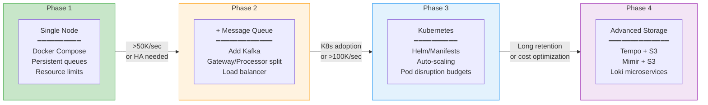
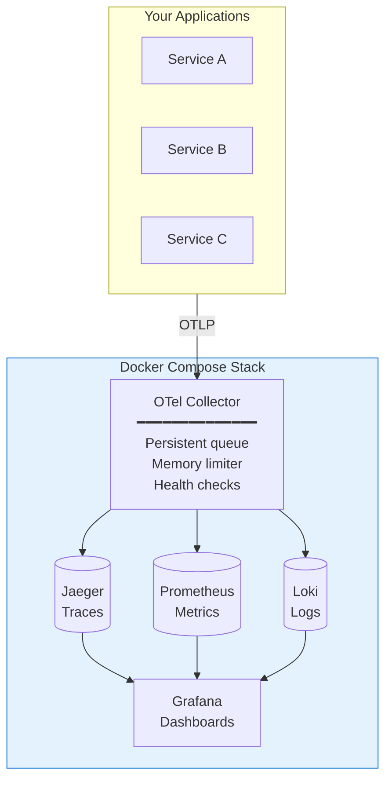
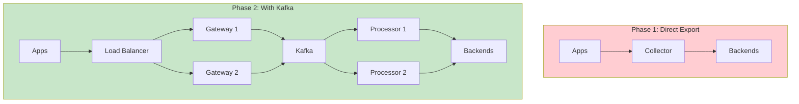

# Scalable OpenTelemetry Stack

## Implementation Guide

**Version:** 2.0  
**Date:** January 2026

---

## What You Will Build

This guide walks you through implementing a **scalable, highly-available observability stack** using OpenTelemetry. By following these steps, you will have:

| Capability | What It Means |
|------------|---------------|
| **Load-balanced ingestion** | Multiple collectors behind a load balancer—no single point of failure |
| **Durable message queue** | Kafka buffers data, survives backend outages |
| **Horizontal scaling** | Add more collectors as load increases |
| **Production-grade storage** | Tempo, Mimir, Loki with object storage |
| **High-availability Grafana** | Multiple instances with shared state |

---

## Before You Begin

### Prerequisites

| Requirement | Minimum | Recommended |
|-------------|---------|-------------|
| **Docker & Docker Compose** | v20.10+ | Latest |
| **Available Memory** | 8 GB | 16 GB |
| **Available Disk** | 50 GB SSD | 200 GB SSD |
| **Kubernetes** (Phase 3) | v1.24+ | v1.28+ |
| **kubectl** (Phase 3) | Matching cluster version | Latest |

### Skills Required

| Phase | Skills Needed |
|-------|---------------|
| Phase 1 | Docker, basic YAML, command line |
| Phase 2 | Docker Compose, networking basics |
| Phase 3 | Kubernetes fundamentals, kubectl |
| Phase 4 | K8s operators, object storage concepts |

### Time Investment

| Phase | Time | Complexity |
|-------|------|------------|
| Phase 1: Single-Node | 30-45 minutes | Low |
| Phase 2: Add Kafka | 1-2 hours | Medium |
| Phase 3: Kubernetes | 2-4 hours | Medium-High |
| Phase 4: Advanced Storage | 2-4 hours | High |

### Architecture Background

Before implementing, we recommend reading the [Architecture Overview](./architecture.md) to understand:
- Why each component exists
- How data flows through the system
- When to progress to the next phase

---

## Implementation Phases Overview



**Start with Phase 1** and progress only when you hit the triggers.

---

# Phase 1: Optimized Single-Node

## Goal

Build a production-ready single-node observability stack with:

| Feature | Why It Matters |
|---------|----------------|
| **Persistent queues** | Data survives collector restarts |
| **Resource limits** | Prevents OOM crashes, noisy neighbors |
| **Health checks** | Auto-restart on failures |
| **Automated backups** | Disaster recovery capability |

## What You'll Have After Phase 1



---

## Step 1.1: Create Project Structure

First, create a clean directory structure for your observability stack.

```bash
# Create the project directory
mkdir -p otel-stack
cd otel-stack

# Create subdirectories
mkdir -p configs          # Configuration files
mkdir -p data             # Persistent data (gitignored)
mkdir -p backups          # Backup storage (gitignored)
mkdir -p scripts          # Operational scripts
mkdir -p grafana/provisioning/datasources
mkdir -p grafana/provisioning/dashboards

# Create .gitignore
cat > .gitignore << 'EOF'
data/
backups/
*.log
.env
EOF

# Verify structure
tree -L 2 .
```

**Expected output:**
```
.
├── .gitignore
├── backups/
├── configs/
├── data/
├── grafana/
│   └── provisioning/
└── scripts/
```

---

## Step 1.2: Create OpenTelemetry Collector Configuration

The OTel Collector is the heart of your observability pipeline. This configuration includes:

- **Persistent queues**: Data is written to disk before being sent to backends
- **Memory limiter**: Prevents the collector from using too much memory
- **Retry logic**: Automatically retries failed exports
- **Health endpoint**: For Docker health checks

**Create file:** `configs/otel-collector.yaml`

```yaml
# OpenTelemetry Collector Configuration
# 
# This collector receives OTLP data from your applications and forwards
# to Jaeger (traces), Prometheus (metrics), and Loki (logs).
#
# Key features:
# - Persistent queues survive restarts
# - Memory limiter prevents OOM
# - Retry on export failures

# =============================================================================
# Extensions - Additional capabilities
# =============================================================================
extensions:
  # Health check endpoint for Docker/K8s probes
  health_check:
    endpoint: 0.0.0.0:13133
    path: /health
    check_collector_pipeline:
      enabled: true
      interval: 5m
      exporter_failure_threshold: 5

  # Persistent storage for queues (survives restarts)
  file_storage:
    directory: /var/lib/otelcol/storage
    timeout: 10s
    compaction:
      on_start: true        # Compact on startup
      on_rebound: true      # Compact after recovery
      directory: /var/lib/otelcol/storage

# =============================================================================
# Receivers - How data comes in
# =============================================================================
receivers:
  # OTLP receiver - the standard OpenTelemetry protocol
  otlp:
    protocols:
      grpc:
        endpoint: 0.0.0.0:4317
        max_recv_msg_size_mib: 4        # Max message size
        max_concurrent_streams: 100      # Max concurrent gRPC streams
      http:
        endpoint: 0.0.0.0:4318
        cors:
          allowed_origins:
            - "*"                        # Allow all origins (adjust for production)

# =============================================================================
# Processors - Transform data in-flight
# =============================================================================
processors:
  # Memory limiter - MUST be first in pipeline
  # Prevents OOM by dropping data when memory is high
  memory_limiter:
    check_interval: 1s
    limit_mib: 1600           # 80% of 2GB container limit
    spike_limit_mib: 400      # Allow temporary spikes

  # Batch processor - groups data for efficient export
  batch:
    timeout: 5s               # Send batch after 5s even if not full
    send_batch_size: 10000    # Target batch size
    send_batch_max_size: 15000 # Never exceed this

  # Add useful attributes to all telemetry
  resource:
    attributes:
      - key: deployment.environment
        value: "production"
        action: upsert
      - key: collector.name
        value: "otel-collector-single"
        action: upsert

# =============================================================================
# Exporters - Where data goes
# =============================================================================
exporters:
  # Debug exporter - useful for troubleshooting
  debug:
    verbosity: basic
    sampling_initial: 5
    sampling_thereafter: 200

  # Jaeger for traces
  otlp/jaeger:
    endpoint: jaeger:4317
    tls:
      insecure: true
    sending_queue:
      enabled: true
      num_consumers: 10       # Parallel export workers
      queue_size: 10000       # Max items in queue
      storage: file_storage   # Persist queue to disk!
    retry_on_failure:
      enabled: true
      initial_interval: 5s
      max_interval: 30s
      max_elapsed_time: 300s  # Give up after 5 minutes

  # Prometheus remote write for metrics
  prometheusremotewrite:
    endpoint: http://prometheus:9090/api/v1/write
    tls:
      insecure: true
    sending_queue:
      enabled: true
      num_consumers: 10
      queue_size: 10000
      storage: file_storage
    retry_on_failure:
      enabled: true
      initial_interval: 5s
      max_interval: 30s

  # Loki for logs
  loki:
    endpoint: http://loki:3100/loki/api/v1/push
    default_labels_enabled:
      exporter: true
      level: true
    sending_queue:
      enabled: true
      num_consumers: 10
      queue_size: 10000
      storage: file_storage
    retry_on_failure:
      enabled: true
      initial_interval: 5s
      max_interval: 30s

# =============================================================================
# Service - Wire everything together
# =============================================================================
service:
  extensions: [health_check, file_storage]
  
  # Collector's own telemetry
  telemetry:
    logs:
      level: info
      encoding: json
    metrics:
      level: detailed
      address: 0.0.0.0:8888

  # Define processing pipelines
  pipelines:
    traces:
      receivers: [otlp]
      processors: [memory_limiter, resource, batch]
      exporters: [otlp/jaeger]

    metrics:
      receivers: [otlp]
      processors: [memory_limiter, resource, batch]
      exporters: [prometheusremotewrite]

    logs:
      receivers: [otlp]
      processors: [memory_limiter, resource, batch]
      exporters: [loki]
```

**What each section does:**

| Section | Purpose |
|---------|---------|
| `extensions` | Health checks and persistent storage |
| `receivers` | Accept OTLP over gRPC (4317) and HTTP (4318) |
| `processors` | Limit memory, batch data, add attributes |
| `exporters` | Send to Jaeger, Prometheus, Loki with queues |
| `service` | Wire receivers → processors → exporters |

---

## Step 1.3: Create Prometheus Configuration

Prometheus scrapes metrics and stores them in its time-series database.

**Create file:** `configs/prometheus.yml`

```yaml
# Prometheus Configuration
#
# Prometheus scrapes metrics from targets and stores them locally.
# It also receives metrics via remote write from OTel Collector.

global:
  scrape_interval: 15s      # How often to scrape targets
  evaluation_interval: 15s  # How often to evaluate rules
  
  # Attach these labels to all metrics
  external_labels:
    cluster: 'single-node'
    environment: 'production'

# Alerting configuration
alerting:
  alertmanagers:
    - static_configs:
        - targets: []  # Add Alertmanager if needed

# Rule files
rule_files: []
  # - /etc/prometheus/rules/*.yml

# Scrape configurations
scrape_configs:
  # Scrape Prometheus itself
  - job_name: 'prometheus'
    static_configs:
      - targets: ['localhost:9090']
    metrics_path: /metrics
    
  # Scrape OTel Collector
  - job_name: 'otel-collector'
    static_configs:
      - targets: ['otel-collector:8888']
    metrics_path: /metrics
    
  # Scrape Jaeger
  - job_name: 'jaeger'
    static_configs:
      - targets: ['jaeger:14269']
    metrics_path: /metrics
    
  # Scrape Loki
  - job_name: 'loki'
    static_configs:
      - targets: ['loki:3100']
    metrics_path: /metrics
    
  # Scrape Grafana
  - job_name: 'grafana'
    static_configs:
      - targets: ['grafana:3000']
    metrics_path: /metrics

# Enable remote write receiver (for OTel Collector)
# This is enabled via command line flag: --web.enable-remote-write-receiver
```

---

## Step 1.4: Create Loki Configuration

Loki stores and indexes logs efficiently.

**Create file:** `configs/loki.yaml`

```yaml
# Loki Configuration
#
# Loki is a log aggregation system designed to store and query logs
# from all your applications. It only indexes labels, not log content,
# making it very efficient.

auth_enabled: false

server:
  http_listen_port: 3100
  grpc_listen_port: 9096
  log_level: info

common:
  instance_addr: 127.0.0.1
  path_prefix: /loki
  storage:
    filesystem:
      chunks_directory: /loki/chunks
      rules_directory: /loki/rules
  replication_factor: 1
  ring:
    kvstore:
      store: inmemory

query_range:
  results_cache:
    cache:
      embedded_cache:
        enabled: true
        max_size_mb: 100

schema_config:
  configs:
    - from: 2020-10-24
      store: tsdb
      object_store: filesystem
      schema: v13
      index:
        prefix: index_
        period: 24h

ruler:
  alertmanager_url: http://localhost:9093

# Limits for single-tenant mode
limits_config:
  retention_period: 744h  # 31 days
  ingestion_rate_mb: 10
  ingestion_burst_size_mb: 20
  max_streams_per_user: 10000
  max_line_size: 256kb

# Compactor settings
compactor:
  working_directory: /loki/compactor
  compaction_interval: 10m
  retention_enabled: true
  retention_delete_delay: 2h
  retention_delete_worker_count: 150
```

---

## Step 1.5: Create Grafana Data Sources

Auto-provision data sources so Grafana connects to all backends on startup.

**Create file:** `grafana/provisioning/datasources/datasources.yaml`

```yaml
# Grafana Data Sources
#
# These data sources are automatically configured when Grafana starts.
# No manual setup required!

apiVersion: 1

datasources:
  # Prometheus for metrics
  - name: Prometheus
    type: prometheus
    access: proxy
    url: http://prometheus:9090
    isDefault: true
    editable: false
    jsonData:
      timeInterval: "15s"
      httpMethod: POST

  # Jaeger for traces
  - name: Jaeger
    type: jaeger
    access: proxy
    url: http://jaeger:16686
    editable: false
    jsonData:
      tracesToLogsV2:
        datasourceUid: loki
        spanStartTimeShift: '-1h'
        spanEndTimeShift: '1h'
        filterByTraceID: true
        filterBySpanID: false

  # Loki for logs
  - name: Loki
    type: loki
    access: proxy
    url: http://loki:3100
    uid: loki
    editable: false
    jsonData:
      derivedFields:
        - name: TraceID
          matcherRegex: '"trace_id":"(\w+)"'
          url: '$${__value.raw}'
          datasourceUid: jaeger
```

---

## Step 1.6: Create Docker Compose File

This is the main deployment file that ties everything together.

**Create file:** `docker-compose.yml`

```yaml
# Docker Compose - Single Node Observability Stack
#
# This file deploys a complete observability stack:
# - OTel Collector (receives telemetry from your apps)
# - Jaeger (stores and queries traces)
# - Prometheus (stores and queries metrics)
# - Loki (stores and queries logs)
# - Grafana (visualizes all data)
#
# Usage:
#   docker compose up -d      # Start all services
#   docker compose ps         # Check status
#   docker compose logs -f    # View logs
#   docker compose down       # Stop all services

services:
  # ===========================================================================
  # OpenTelemetry Collector
  # ===========================================================================
  # The central hub that receives all telemetry and routes to backends
  otel-collector:
    image: otel/opentelemetry-collector-contrib:0.91.0
    container_name: otel-collector
    command: ["--config=/etc/otelcol/config.yaml"]
    volumes:
      - ./configs/otel-collector.yaml:/etc/otelcol/config.yaml:ro
      - otel-storage:/var/lib/otelcol    # Persistent queue storage
    ports:
      - "4317:4317"   # OTLP gRPC - primary ingestion
      - "4318:4318"   # OTLP HTTP - alternative ingestion
      - "8888:8888"   # Prometheus metrics (collector's own metrics)
      - "13133:13133" # Health check endpoint
    environment:
      - GOMEMLIMIT=1600MiB  # Go memory limit (matches memory_limiter)
    deploy:
      resources:
        limits:
          cpus: '2'
          memory: 2G
        reservations:
          cpus: '0.5'
          memory: 512M
    healthcheck:
      test: ["CMD", "wget", "--spider", "-q", "http://localhost:13133/health"]
      interval: 10s
      timeout: 5s
      retries: 5
      start_period: 10s
    restart: unless-stopped
    stop_grace_period: 30s
    depends_on:
      jaeger:
        condition: service_healthy
      prometheus:
        condition: service_healthy
      loki:
        condition: service_healthy
    networks:
      - observability
    logging:
      driver: "json-file"
      options:
        max-size: "10m"
        max-file: "3"

  # ===========================================================================
  # Jaeger - Distributed Tracing
  # ===========================================================================
  # Stores traces and provides a UI for viewing them
  jaeger:
    image: jaegertracing/all-in-one:1.53
    container_name: jaeger
    environment:
      - SPAN_STORAGE_TYPE=badger
      - BADGER_EPHEMERAL=false
      - BADGER_DIRECTORY_VALUE=/badger/data
      - BADGER_DIRECTORY_KEY=/badger/key
      - BADGER_SPAN_STORE_TTL=720h  # 30 days retention
    volumes:
      - jaeger-data:/badger
    ports:
      - "16686:16686"  # Jaeger UI
      - "14268:14268"  # Accept spans in jaeger format (legacy)
    deploy:
      resources:
        limits:
          cpus: '2'
          memory: 4G
        reservations:
          cpus: '0.5'
          memory: 1G
    healthcheck:
      test: ["CMD", "wget", "--spider", "-q", "http://localhost:14269/"]
      interval: 10s
      timeout: 5s
      retries: 5
      start_period: 15s
    restart: unless-stopped
    stop_grace_period: 30s
    networks:
      - observability
    logging:
      driver: "json-file"
      options:
        max-size: "10m"
        max-file: "3"

  # ===========================================================================
  # Prometheus - Metrics Storage
  # ===========================================================================
  # Scrapes and stores metrics, provides PromQL query interface
  prometheus:
    image: prom/prometheus:v2.48.0
    container_name: prometheus
    command:
      - '--config.file=/etc/prometheus/prometheus.yml'
      - '--storage.tsdb.path=/prometheus'
      - '--storage.tsdb.retention.time=30d'
      - '--storage.tsdb.retention.size=40GB'
      - '--web.enable-lifecycle'
      - '--web.enable-remote-write-receiver'
      - '--web.console.libraries=/etc/prometheus/console_libraries'
      - '--web.console.templates=/etc/prometheus/consoles'
    volumes:
      - ./configs/prometheus.yml:/etc/prometheus/prometheus.yml:ro
      - prometheus-data:/prometheus
    ports:
      - "9090:9090"
    deploy:
      resources:
        limits:
          cpus: '2'
          memory: 4G
        reservations:
          cpus: '0.5'
          memory: 1G
    healthcheck:
      test: ["CMD", "wget", "--spider", "-q", "http://localhost:9090/-/healthy"]
      interval: 10s
      timeout: 5s
      retries: 5
      start_period: 15s
    restart: unless-stopped
    stop_grace_period: 30s
    networks:
      - observability
    logging:
      driver: "json-file"
      options:
        max-size: "10m"
        max-file: "3"

  # ===========================================================================
  # Loki - Log Aggregation
  # ===========================================================================
  # Stores and indexes logs, optimized for Grafana
  loki:
    image: grafana/loki:2.9.3
    container_name: loki
    command: -config.file=/etc/loki/loki.yaml
    volumes:
      - ./configs/loki.yaml:/etc/loki/loki.yaml:ro
      - loki-data:/loki
    ports:
      - "3100:3100"
    deploy:
      resources:
        limits:
          cpus: '1'
          memory: 2G
        reservations:
          cpus: '0.25'
          memory: 512M
    healthcheck:
      test: ["CMD", "wget", "--spider", "-q", "http://localhost:3100/ready"]
      interval: 10s
      timeout: 5s
      retries: 5
      start_period: 30s
    restart: unless-stopped
    stop_grace_period: 30s
    networks:
      - observability
    logging:
      driver: "json-file"
      options:
        max-size: "10m"
        max-file: "3"

  # ===========================================================================
  # Grafana - Visualization
  # ===========================================================================
  # Dashboards, alerts, and data exploration
  grafana:
    image: grafana/grafana:10.2.3
    container_name: grafana
    environment:
      - GF_SECURITY_ADMIN_USER=admin
      - GF_SECURITY_ADMIN_PASSWORD=admin  # CHANGE IN PRODUCTION!
      - GF_USERS_ALLOW_SIGN_UP=false
      - GF_SERVER_ROOT_URL=http://localhost:3000
      - GF_FEATURE_TOGGLES_ENABLE=traceqlEditor
    volumes:
      - grafana-data:/var/lib/grafana
      - ./grafana/provisioning:/etc/grafana/provisioning:ro
    ports:
      - "3000:3000"
    deploy:
      resources:
        limits:
          cpus: '1'
          memory: 1G
        reservations:
          cpus: '0.25'
          memory: 256M
    healthcheck:
      test: ["CMD", "wget", "--spider", "-q", "http://localhost:3000/api/health"]
      interval: 10s
      timeout: 5s
      retries: 5
      start_period: 30s
    restart: unless-stopped
    depends_on:
      prometheus:
        condition: service_healthy
      jaeger:
        condition: service_healthy
      loki:
        condition: service_healthy
    networks:
      - observability
    logging:
      driver: "json-file"
      options:
        max-size: "10m"
        max-file: "3"

# ===========================================================================
# Networks
# ===========================================================================
networks:
  observability:
    driver: bridge
    name: observability

# ===========================================================================
# Volumes - Persistent Storage
# ===========================================================================
volumes:
  otel-storage:
    name: otel-storage
  jaeger-data:
    name: jaeger-data
  prometheus-data:
    name: prometheus-data
  loki-data:
    name: loki-data
  grafana-data:
    name: grafana-data
```

---

## Step 1.7: Create Operational Scripts

### Backup Script

**Create file:** `scripts/backup.sh`

```bash
#!/bin/bash
# =============================================================================
# Backup Script for Observability Stack
# =============================================================================
#
# Creates compressed backups of all Docker volumes.
#
# Usage:
#   ./scripts/backup.sh                    # Default backup to ./backups
#   BACKUP_DIR=/mnt/nfs ./scripts/backup.sh # Custom location
#
# Schedule with cron:
#   0 2 * * * /path/to/otel-stack/scripts/backup.sh >> /var/log/otel-backup.log 2>&1

set -euo pipefail

# Configuration
BACKUP_DIR="${BACKUP_DIR:-./backups}"
RETENTION_DAYS="${RETENTION_DAYS:-7}"
TIMESTAMP=$(date +%Y%m%d_%H%M%S)
BACKUP_PATH="${BACKUP_DIR}/${TIMESTAMP}"
COMPOSE_PROJECT="${COMPOSE_PROJECT:-otel-stack}"

# Colors for output
RED='\033[0;31m'
GREEN='\033[0;32m'
YELLOW='\033[1;33m'
BLUE='\033[0;34m'
NC='\033[0m'

log_info() { echo -e "${GREEN}[INFO]${NC} $(date '+%Y-%m-%d %H:%M:%S') $1"; }
log_warn() { echo -e "${YELLOW}[WARN]${NC} $(date '+%Y-%m-%d %H:%M:%S') $1"; }
log_error() { echo -e "${RED}[ERROR]${NC} $(date '+%Y-%m-%d %H:%M:%S') $1"; }

# Create backup directory
mkdir -p "$BACKUP_PATH"
log_info "Starting backup to ${BACKUP_PATH}..."

# Volumes to backup
VOLUMES=(
  "otel-storage"
  "jaeger-data"
  "prometheus-data"
  "loki-data"
  "grafana-data"
)

# Backup each volume
BACKUP_SUCCESS=0
BACKUP_FAILED=0

for volume in "${VOLUMES[@]}"; do
  if docker volume inspect "$volume" &>/dev/null; then
    log_info "Backing up ${volume}..."
    
    if docker run --rm \
      -v "${volume}:/source:ro" \
      -v "${BACKUP_PATH}:/backup" \
      alpine tar czf "/backup/${volume}.tar.gz" -C /source . 2>/dev/null; then
      
      SIZE=$(du -sh "${BACKUP_PATH}/${volume}.tar.gz" | cut -f1)
      log_info "  ✓ ${volume}: ${SIZE}"
      ((BACKUP_SUCCESS++))
    else
      log_error "  ✗ Failed to backup ${volume}"
      ((BACKUP_FAILED++))
    fi
  else
    log_warn "  - Volume ${volume} not found, skipping"
  fi
done

# Backup configuration files
log_info "Backing up configuration files..."
mkdir -p "${BACKUP_PATH}/configs"

for file in docker-compose.yml configs/*.yaml configs/*.yml grafana/provisioning; do
  if [[ -e "$file" ]]; then
    cp -r "$file" "${BACKUP_PATH}/configs/" 2>/dev/null || true
  fi
done

tar czf "${BACKUP_PATH}/configs.tar.gz" -C "${BACKUP_PATH}" configs
rm -rf "${BACKUP_PATH}/configs"

# Create manifest
BACKUP_SIZE=$(du -sh "$BACKUP_PATH" | cut -f1)
cat > "${BACKUP_PATH}/manifest.json" << EOF
{
  "timestamp": "${TIMESTAMP}",
  "date": "$(date -Iseconds)",
  "host": "$(hostname)",
  "size": "${BACKUP_SIZE}",
  "volumes_backed_up": ${BACKUP_SUCCESS},
  "volumes_failed": ${BACKUP_FAILED},
  "volumes": [$(printf '"%s",' "${VOLUMES[@]}" | sed 's/,$//')]
}
EOF

# Clean old backups
log_info "Cleaning backups older than ${RETENTION_DAYS} days..."
DELETED_COUNT=0
while IFS= read -r dir; do
  if [[ -n "$dir" ]]; then
    rm -rf "$dir"
    ((DELETED_COUNT++))
  fi
done < <(find "$BACKUP_DIR" -maxdepth 1 -type d -mtime +${RETENTION_DAYS} 2>/dev/null)
log_info "  Deleted ${DELETED_COUNT} old backups"

# Summary
echo ""
log_info "========================================"
log_info "Backup Summary"
log_info "========================================"
log_info "Location: ${BACKUP_PATH}"
log_info "Size: ${BACKUP_SIZE}"
log_info "Volumes: ${BACKUP_SUCCESS} succeeded, ${BACKUP_FAILED} failed"
log_info "Retention: ${RETENTION_DAYS} days"

if [[ $BACKUP_FAILED -gt 0 ]]; then
  log_error "Backup completed with errors!"
  exit 1
else
  log_info "Backup completed successfully!"
fi
```

Make it executable:
```bash
chmod +x scripts/backup.sh
```

### Health Check Script

**Create file:** `scripts/health-check.sh`

```bash
#!/bin/bash
# =============================================================================
# Health Check Script for Observability Stack
# =============================================================================
#
# Checks all components and reports status.
#
# Usage:
#   ./scripts/health-check.sh           # Human-readable output
#   ./scripts/health-check.sh --json    # JSON output for automation

set -euo pipefail

# Configuration
OTEL_COLLECTOR="${OTEL_COLLECTOR:-localhost}"
PROMETHEUS="${PROMETHEUS:-localhost}"
JAEGER="${JAEGER:-localhost}"
LOKI="${LOKI:-localhost}"
GRAFANA="${GRAFANA:-localhost}"

# Parse arguments
JSON_OUTPUT=false
[[ "${1:-}" == "--json" ]] && JSON_OUTPUT=true

# Colors
RED='\033[0;31m'
GREEN='\033[0;32m'
YELLOW='\033[1;33m'
NC='\033[0m'

# Track results
declare -A RESULTS
OVERALL_STATUS=0

# Check function
check_http() {
  local name=$1
  local url=$2
  local timeout=${3:-5}
  
  if curl -sf -o /dev/null -w "" --max-time "$timeout" "$url" 2>/dev/null; then
    RESULTS[$name]="healthy"
    return 0
  else
    RESULTS[$name]="unhealthy"
    OVERALL_STATUS=1
    return 1
  fi
}

check_tcp() {
  local name=$1
  local host=$2
  local port=$3
  
  if nc -z -w 2 "$host" "$port" 2>/dev/null; then
    RESULTS[$name]="healthy"
    return 0
  else
    RESULTS[$name]="unhealthy"
    OVERALL_STATUS=1
    return 1
  fi
}

# Run checks
check_http "otel-collector-health" "http://${OTEL_COLLECTOR}:13133/health" || true
check_tcp "otel-grpc" "$OTEL_COLLECTOR" "4317" || true
check_tcp "otel-http" "$OTEL_COLLECTOR" "4318" || true
check_http "prometheus" "http://${PROMETHEUS}:9090/-/healthy" || true
check_http "jaeger" "http://${JAEGER}:16686/" || true
check_http "loki" "http://${LOKI}:3100/ready" || true
check_http "grafana" "http://${GRAFANA}:3000/api/health" || true

# Output results
if [[ "$JSON_OUTPUT" == true ]]; then
  echo "{"
  echo "  \"timestamp\": \"$(date -Iseconds)\","
  echo "  \"status\": \"$([ $OVERALL_STATUS -eq 0 ] && echo 'healthy' || echo 'degraded')\","
  echo "  \"components\": {"
  first=true
  for name in "${!RESULTS[@]}"; do
    [[ "$first" == true ]] || echo ","
    echo -n "    \"$name\": \"${RESULTS[$name]}\""
    first=false
  done
  echo ""
  echo "  }"
  echo "}"
else
  echo ""
  echo "Observability Stack Health Check"
  echo "================================="
  echo "Time: $(date)"
  echo ""
  
  echo "Ingestion Layer:"
  for name in otel-collector-health otel-grpc otel-http; do
    status="${RESULTS[$name]:-unknown}"
    if [[ "$status" == "healthy" ]]; then
      echo -e "  ${GREEN}✓${NC} $name"
    else
      echo -e "  ${RED}✗${NC} $name"
    fi
  done
  
  echo ""
  echo "Storage Layer:"
  for name in prometheus jaeger loki; do
    status="${RESULTS[$name]:-unknown}"
    if [[ "$status" == "healthy" ]]; then
      echo -e "  ${GREEN}✓${NC} $name"
    else
      echo -e "  ${RED}✗${NC} $name"
    fi
  done
  
  echo ""
  echo "Visualization:"
  for name in grafana; do
    status="${RESULTS[$name]:-unknown}"
    if [[ "$status" == "healthy" ]]; then
      echo -e "  ${GREEN}✓${NC} $name"
    else
      echo -e "  ${RED}✗${NC} $name"
    fi
  done
  
  echo ""
  echo "================================="
  if [[ $OVERALL_STATUS -eq 0 ]]; then
    echo -e "${GREEN}All systems operational${NC}"
  else
    echo -e "${YELLOW}Some components are degraded${NC}"
  fi
fi

exit $OVERALL_STATUS
```

Make it executable:
```bash
chmod +x scripts/health-check.sh
```

---

## Step 1.8: Deploy the Stack

Now let's deploy everything:

```bash
# Navigate to project directory
cd otel-stack

# Start all services
docker compose up -d

# Watch the startup
docker compose logs -f
# Press Ctrl+C to stop following logs
```

**Expected startup sequence:**
1. Jaeger, Prometheus, Loki start first (no dependencies)
2. OTel Collector waits for backends to be healthy
3. Grafana waits for data sources to be ready

---

## Step 1.9: Verify the Deployment

### Check Service Status

```bash
# All services should show "healthy"
docker compose ps
```

**Expected output:**
```
NAME             IMAGE                                       STATUS                   PORTS
grafana          grafana/grafana:10.2.3                     Up 2 minutes (healthy)   0.0.0.0:3000->3000/tcp
jaeger           jaegertracing/all-in-one:1.53              Up 2 minutes (healthy)   0.0.0.0:16686->16686/tcp
loki             grafana/loki:2.9.3                         Up 2 minutes (healthy)   0.0.0.0:3100->3100/tcp
otel-collector   otel/opentelemetry-collector-contrib:0.91.0 Up 2 minutes (healthy)   0.0.0.0:4317-4318->4317-4318/tcp
prometheus       prom/prometheus:v2.48.0                    Up 2 minutes (healthy)   0.0.0.0:9090->9090/tcp
```

### Run Health Check

```bash
./scripts/health-check.sh
```

**Expected output:**
```
Observability Stack Health Check
=================================
Time: Thu Jan 15 10:30:00 UTC 2024

Ingestion Layer:
  ✓ otel-collector-health
  ✓ otel-grpc
  ✓ otel-http

Storage Layer:
  ✓ prometheus
  ✓ jaeger
  ✓ loki

Visualization:
  ✓ grafana

=================================
All systems operational
```

### Access the UIs

| Service | URL | Credentials |
|---------|-----|-------------|
| **Grafana** | http://localhost:3000 | admin / admin |
| **Jaeger** | http://localhost:16686 | None |
| **Prometheus** | http://localhost:9090 | None |

### Send Test Telemetry

Test the collector by sending a sample trace:

```bash
# Send a test span using curl
curl -X POST http://localhost:4318/v1/traces \
  -H "Content-Type: application/json" \
  -d '{
    "resourceSpans": [{
      "resource": {
        "attributes": [{
          "key": "service.name",
          "value": {"stringValue": "test-service"}
        }]
      },
      "scopeSpans": [{
        "spans": [{
          "traceId": "5B8EFFF798038103D269B633813FC60C",
          "spanId": "EEE19B7EC3C1B174",
          "name": "test-span",
          "kind": 1,
          "startTimeUnixNano": "'$(date +%s)000000000'",
          "endTimeUnixNano": "'$(( $(date +%s) + 1 ))000000000'",
          "attributes": [{
            "key": "test.attribute",
            "value": {"stringValue": "test-value"}
          }]
        }]
      }]
    }]
  }'
```

Then verify in Jaeger UI: http://localhost:16686
- Select "test-service" from the Service dropdown
- Click "Find Traces"
- You should see your test span

---

## Step 1.10: Configure Your Applications

Now configure your applications to send telemetry to the collector.

### SDK Configuration

| Language | Environment Variables |
|----------|-----------------------|
| All | `OTEL_EXPORTER_OTLP_ENDPOINT=http://localhost:4317` |
| All | `OTEL_SERVICE_NAME=your-service-name` |
| All | `OTEL_RESOURCE_ATTRIBUTES=deployment.environment=production` |

### Example: .NET Application

```bash
# Install the packages
dotnet add package OpenTelemetry.Exporter.OpenTelemetryProtocol
dotnet add package OpenTelemetry.Extensions.Hosting
dotnet add package OpenTelemetry.Instrumentation.AspNetCore
dotnet add package OpenTelemetry.Instrumentation.Http
```

```csharp
// In Program.cs
builder.Services.AddOpenTelemetry()
    .WithTracing(tracing => tracing
        .AddAspNetCoreInstrumentation()
        .AddHttpClientInstrumentation()
        .AddOtlpExporter(options =>
        {
            options.Endpoint = new Uri("http://localhost:4317");
        }))
    .WithMetrics(metrics => metrics
        .AddAspNetCoreInstrumentation()
        .AddOtlpExporter(options =>
        {
            options.Endpoint = new Uri("http://localhost:4317");
        }));
```

### Example: Node.js Application

```bash
npm install @opentelemetry/api \
            @opentelemetry/sdk-node \
            @opentelemetry/auto-instrumentations-node \
            @opentelemetry/exporter-trace-otlp-grpc \
            @opentelemetry/exporter-metrics-otlp-grpc
```

```javascript
// tracing.js
const { NodeSDK } = require('@opentelemetry/sdk-node');
const { getNodeAutoInstrumentations } = require('@opentelemetry/auto-instrumentations-node');
const { OTLPTraceExporter } = require('@opentelemetry/exporter-trace-otlp-grpc');
const { OTLPMetricExporter } = require('@opentelemetry/exporter-metrics-otlp-grpc');

const sdk = new NodeSDK({
  serviceName: 'your-service-name',
  traceExporter: new OTLPTraceExporter({
    url: 'http://localhost:4317',
  }),
  metricExporter: new OTLPMetricExporter({
    url: 'http://localhost:4317',
  }),
  instrumentations: [getNodeAutoInstrumentations()],
});

sdk.start();
```

---

## Phase 1 Completion Checklist

Before moving to Phase 2, verify:

- [ ] All services show "healthy" in `docker compose ps`
- [ ] Health check script passes
- [ ] Can access Grafana at http://localhost:3000
- [ ] Can access Jaeger at http://localhost:16686
- [ ] Test telemetry appears in Jaeger
- [ ] Backup script works (`./scripts/backup.sh`)
- [ ] Applications are sending telemetry

**Congratulations!** You have a production-ready single-node observability stack.

---

# Phase 2: Add Message Queue

## When to Start Phase 2

Move to Phase 2 when you need:

| Trigger | Why Phase 2 Helps |
|---------|-------------------|
| **>50K events/sec** | Multiple collectors can share the load |
| **High availability** | Kafka buffers data during backend outages |
| **Zero data loss** | Persistent Kafka topics survive any failure |
| **Backend maintenance** | Can restart processors without losing data |

## What Changes in Phase 2



**Key changes:**
1. **Gateway collectors** - Receive data, publish to Kafka
2. **Kafka** - Durable message queue
3. **Processor collectors** - Consume from Kafka, write to backends
4. **Load balancer** - Distribute traffic across gateways

---

## Step 2.1: Create Gateway Collector Configuration

The gateway receives telemetry and publishes to Kafka topics.

**Create file:** `configs/otel-gateway.yaml`

```yaml
# OpenTelemetry Collector - Gateway Configuration
#
# Role: Receive telemetry from applications, publish to Kafka
# 
# Key characteristics:
# - Stateless (can scale horizontally)
# - Fast processing (minimal transformation)
# - Publishes to Kafka for durability

extensions:
  health_check:
    endpoint: 0.0.0.0:13133

receivers:
  otlp:
    protocols:
      grpc:
        endpoint: 0.0.0.0:4317
        max_recv_msg_size_mib: 4
        max_concurrent_streams: 100
      http:
        endpoint: 0.0.0.0:4318

processors:
  # Memory limiter - always first
  memory_limiter:
    check_interval: 1s
    limit_mib: 1600
    spike_limit_mib: 400

  # Light batching for Kafka efficiency
  batch:
    timeout: 1s
    send_batch_size: 5000
    send_batch_max_size: 10000

exporters:
  # Kafka exporter for traces
  kafka/traces:
    brokers:
      - kafka:9092
    topic: otlp-traces
    protocol_version: "3.0.0"
    encoding: otlp_proto
    producer:
      max_message_bytes: 10000000  # 10MB max message
      compression: snappy
      flush_max_messages: 500
      required_acks: -1  # Wait for all replicas

  # Kafka exporter for metrics
  kafka/metrics:
    brokers:
      - kafka:9092
    topic: otlp-metrics
    protocol_version: "3.0.0"
    encoding: otlp_proto
    producer:
      max_message_bytes: 10000000
      compression: snappy
      required_acks: -1

  # Kafka exporter for logs
  kafka/logs:
    brokers:
      - kafka:9092
    topic: otlp-logs
    protocol_version: "3.0.0"
    encoding: otlp_proto
    producer:
      max_message_bytes: 10000000
      compression: snappy
      required_acks: -1

service:
  extensions: [health_check]
  
  telemetry:
    logs:
      level: info
    metrics:
      address: 0.0.0.0:8888

  pipelines:
    traces:
      receivers: [otlp]
      processors: [memory_limiter, batch]
      exporters: [kafka/traces]

    metrics:
      receivers: [otlp]
      processors: [memory_limiter, batch]
      exporters: [kafka/metrics]

    logs:
      receivers: [otlp]
      processors: [memory_limiter, batch]
      exporters: [kafka/logs]
```

---

## Step 2.2: Create Processor Collector Configuration

The processor consumes from Kafka and writes to storage backends.

**Create file:** `configs/otel-processor.yaml`

```yaml
# OpenTelemetry Collector - Processor Configuration
#
# Role: Consume from Kafka, apply transformations, export to backends
#
# Key characteristics:
# - Consumes from Kafka topics
# - Applies sampling, filtering, enrichment
# - Exports to Tempo, Mimir, Loki

extensions:
  health_check:
    endpoint: 0.0.0.0:13133
  
  file_storage:
    directory: /var/lib/otelcol/storage
    timeout: 10s

receivers:
  # Kafka receiver for traces
  kafka/traces:
    brokers:
      - kafka:9092
    topic: otlp-traces
    protocol_version: "3.0.0"
    encoding: otlp_proto
    group_id: otel-trace-processors
    initial_offset: latest
    auto_commit:
      enable: true
      interval: 1s

  # Kafka receiver for metrics
  kafka/metrics:
    brokers:
      - kafka:9092
    topic: otlp-metrics
    protocol_version: "3.0.0"
    encoding: otlp_proto
    group_id: otel-metric-processors
    initial_offset: latest

  # Kafka receiver for logs
  kafka/logs:
    brokers:
      - kafka:9092
    topic: otlp-logs
    protocol_version: "3.0.0"
    encoding: otlp_proto
    group_id: otel-log-processors
    initial_offset: latest

processors:
  memory_limiter:
    check_interval: 1s
    limit_mib: 2048
    spike_limit_mib: 512

  batch:
    timeout: 5s
    send_batch_size: 10000

  # Tail-based sampling for traces
  # Keeps all errors, slow traces, and samples the rest
  tail_sampling:
    decision_wait: 10s
    num_traces: 100000
    expected_new_traces_per_sec: 10000
    policies:
      # Keep all error traces
      - name: errors-policy
        type: status_code
        status_code:
          status_codes: [ERROR]
      # Keep slow traces (>1 second)
      - name: latency-policy
        type: latency
        latency:
          threshold_ms: 1000
      # Sample 10% of remaining traces
      - name: probabilistic-policy
        type: probabilistic
        probabilistic:
          sampling_percentage: 10

  # Add deployment information
  resource:
    attributes:
      - key: deployment.environment
        value: production
        action: upsert

exporters:
  # Jaeger for traces
  otlp/jaeger:
    endpoint: jaeger:4317
    tls:
      insecure: true
    sending_queue:
      enabled: true
      num_consumers: 10
      queue_size: 10000
      storage: file_storage
    retry_on_failure:
      enabled: true
      initial_interval: 5s
      max_interval: 30s
      max_elapsed_time: 300s

  # Prometheus remote write for metrics
  prometheusremotewrite:
    endpoint: http://prometheus:9090/api/v1/write
    sending_queue:
      enabled: true
      num_consumers: 10
      queue_size: 10000
      storage: file_storage
    retry_on_failure:
      enabled: true

  # Loki for logs
  loki:
    endpoint: http://loki:3100/loki/api/v1/push
    sending_queue:
      enabled: true
      num_consumers: 10
      queue_size: 10000
      storage: file_storage
    retry_on_failure:
      enabled: true

service:
  extensions: [health_check, file_storage]
  
  telemetry:
    logs:
      level: info
    metrics:
      address: 0.0.0.0:8888

  pipelines:
    traces:
      receivers: [kafka/traces]
      processors: [memory_limiter, tail_sampling, resource, batch]
      exporters: [otlp/jaeger]

    metrics:
      receivers: [kafka/metrics]
      processors: [memory_limiter, resource, batch]
      exporters: [prometheusremotewrite]

    logs:
      receivers: [kafka/logs]
      processors: [memory_limiter, resource, batch]
      exporters: [loki]
```

---

## Step 2.3: Create HAProxy Configuration

**Create file:** `configs/haproxy.cfg`

```
# HAProxy Configuration for OTel Collector Load Balancing
#
# Features:
# - Layer 4 (TCP) load balancing for gRPC
# - Layer 7 (HTTP) load balancing for HTTP
# - Health checks
# - Statistics dashboard

global
    log stdout format raw local0
    maxconn 4096

defaults
    log     global
    mode    tcp
    option  tcplog
    option  dontlognull
    timeout connect 5s
    timeout client  60s
    timeout server  60s
    retries 3

# Statistics dashboard at http://localhost:8404/stats
frontend stats
    bind *:8404
    mode http
    stats enable
    stats uri /stats
    stats refresh 10s
    stats admin if LOCALHOST

# OTLP gRPC frontend (port 4317)
frontend otel_grpc
    bind *:4317
    mode tcp
    option tcplog
    
    # Simple round-robin to healthy backends
    default_backend otel_gateways_grpc

backend otel_gateways_grpc
    mode tcp
    balance roundrobin
    
    # Health check on gRPC port
    option tcp-check
    tcp-check connect
    
    # Gateway servers - add more as needed
    server gateway1 otel-gateway-1:4317 check inter 5s fall 3 rise 2
    server gateway2 otel-gateway-2:4317 check inter 5s fall 3 rise 2

# OTLP HTTP frontend (port 4318)
frontend otel_http
    bind *:4318
    mode http
    option httplog
    
    default_backend otel_gateways_http

backend otel_gateways_http
    mode http
    balance roundrobin
    
    # Health check on HTTP endpoint
    option httpchk GET /health
    http-check expect status 200
    
    server gateway1 otel-gateway-1:4318 check inter 5s fall 3 rise 2
    server gateway2 otel-gateway-2:4318 check inter 5s fall 3 rise 2
```

---

## Step 2.4: Create Scalable Docker Compose

**Create file:** `docker-compose-scalable.yml`

```yaml
# Docker Compose - Scalable Observability Stack with Kafka
#
# This extends the single-node setup with:
# - Kafka for message buffering
# - Multiple gateway collectors (behind load balancer)
# - Multiple processor collectors
# - HAProxy load balancer
#
# Usage:
#   docker compose -f docker-compose-scalable.yml up -d

services:
  # ===========================================================================
  # HAProxy Load Balancer
  # ===========================================================================
  haproxy:
    image: haproxy:2.9
    container_name: haproxy
    volumes:
      - ./configs/haproxy.cfg:/usr/local/etc/haproxy/haproxy.cfg:ro
    ports:
      - "4317:4317"   # OTLP gRPC (load balanced)
      - "4318:4318"   # OTLP HTTP (load balanced)
      - "8404:8404"   # HAProxy stats
    healthcheck:
      test: ["CMD", "haproxy", "-c", "-f", "/usr/local/etc/haproxy/haproxy.cfg"]
      interval: 30s
      timeout: 10s
      retries: 3
    restart: unless-stopped
    depends_on:
      - otel-gateway-1
      - otel-gateway-2
    networks:
      - observability

  # ===========================================================================
  # Kafka - Message Queue
  # ===========================================================================
  kafka:
    image: bitnami/kafka:3.6
    container_name: kafka
    environment:
      - KAFKA_CFG_NODE_ID=0
      - KAFKA_CFG_PROCESS_ROLES=controller,broker
      - KAFKA_CFG_CONTROLLER_QUORUM_VOTERS=0@kafka:9093
      - KAFKA_CFG_LISTENERS=PLAINTEXT://:9092,CONTROLLER://:9093
      - KAFKA_CFG_ADVERTISED_LISTENERS=PLAINTEXT://kafka:9092
      - KAFKA_CFG_LISTENER_SECURITY_PROTOCOL_MAP=CONTROLLER:PLAINTEXT,PLAINTEXT:PLAINTEXT
      - KAFKA_CFG_CONTROLLER_LISTENER_NAMES=CONTROLLER
      - KAFKA_CFG_INTER_BROKER_LISTENER_NAME=PLAINTEXT
      # Topic settings
      - KAFKA_CFG_AUTO_CREATE_TOPICS_ENABLE=true
      - KAFKA_CFG_NUM_PARTITIONS=6
      - KAFKA_CFG_DEFAULT_REPLICATION_FACTOR=1
      - KAFKA_CFG_LOG_RETENTION_HOURS=24
      - KAFKA_CFG_LOG_RETENTION_BYTES=10737418240  # 10GB
    volumes:
      - kafka-data:/bitnami/kafka
    ports:
      - "9092:9092"
    deploy:
      resources:
        limits:
          cpus: '2'
          memory: 4G
        reservations:
          cpus: '0.5'
          memory: 1G
    healthcheck:
      test: kafka-topics.sh --bootstrap-server localhost:9092 --list || exit 1
      interval: 30s
      timeout: 10s
      retries: 5
      start_period: 60s
    restart: unless-stopped
    networks:
      - observability

  # ===========================================================================
  # OTel Gateway 1 - Receives telemetry, publishes to Kafka
  # ===========================================================================
  otel-gateway-1:
    image: otel/opentelemetry-collector-contrib:0.91.0
    container_name: otel-gateway-1
    command: ["--config=/etc/otelcol/config.yaml"]
    volumes:
      - ./configs/otel-gateway.yaml:/etc/otelcol/config.yaml:ro
    expose:
      - "4317"
      - "4318"
      - "13133"
      - "8888"
    deploy:
      resources:
        limits:
          cpus: '2'
          memory: 2G
    healthcheck:
      test: ["CMD", "wget", "--spider", "-q", "http://localhost:13133/health"]
      interval: 10s
      timeout: 5s
      retries: 5
    restart: unless-stopped
    depends_on:
      kafka:
        condition: service_healthy
    networks:
      - observability

  # ===========================================================================
  # OTel Gateway 2 - Second gateway for redundancy
  # ===========================================================================
  otel-gateway-2:
    image: otel/opentelemetry-collector-contrib:0.91.0
    container_name: otel-gateway-2
    command: ["--config=/etc/otelcol/config.yaml"]
    volumes:
      - ./configs/otel-gateway.yaml:/etc/otelcol/config.yaml:ro
    expose:
      - "4317"
      - "4318"
      - "13133"
      - "8888"
    deploy:
      resources:
        limits:
          cpus: '2'
          memory: 2G
    healthcheck:
      test: ["CMD", "wget", "--spider", "-q", "http://localhost:13133/health"]
      interval: 10s
      timeout: 5s
      retries: 5
    restart: unless-stopped
    depends_on:
      kafka:
        condition: service_healthy
    networks:
      - observability

  # ===========================================================================
  # OTel Processor 1 - Consumes from Kafka, writes to backends
  # ===========================================================================
  otel-processor-1:
    image: otel/opentelemetry-collector-contrib:0.91.0
    container_name: otel-processor-1
    command: ["--config=/etc/otelcol/config.yaml"]
    volumes:
      - ./configs/otel-processor.yaml:/etc/otelcol/config.yaml:ro
      - processor1-storage:/var/lib/otelcol
    deploy:
      resources:
        limits:
          cpus: '2'
          memory: 4G
    healthcheck:
      test: ["CMD", "wget", "--spider", "-q", "http://localhost:13133/health"]
      interval: 10s
      timeout: 5s
      retries: 5
    restart: unless-stopped
    depends_on:
      kafka:
        condition: service_healthy
      jaeger:
        condition: service_healthy
      prometheus:
        condition: service_healthy
      loki:
        condition: service_healthy
    networks:
      - observability

  # ===========================================================================
  # OTel Processor 2 - Second processor for redundancy
  # ===========================================================================
  otel-processor-2:
    image: otel/opentelemetry-collector-contrib:0.91.0
    container_name: otel-processor-2
    command: ["--config=/etc/otelcol/config.yaml"]
    volumes:
      - ./configs/otel-processor.yaml:/etc/otelcol/config.yaml:ro
      - processor2-storage:/var/lib/otelcol
    deploy:
      resources:
        limits:
          cpus: '2'
          memory: 4G
    healthcheck:
      test: ["CMD", "wget", "--spider", "-q", "http://localhost:13133/health"]
      interval: 10s
      timeout: 5s
      retries: 5
    restart: unless-stopped
    depends_on:
      kafka:
        condition: service_healthy
      jaeger:
        condition: service_healthy
      prometheus:
        condition: service_healthy
      loki:
        condition: service_healthy
    networks:
      - observability

  # ===========================================================================
  # Backend Services (same as Phase 1)
  # ===========================================================================
  jaeger:
    image: jaegertracing/all-in-one:1.53
    container_name: jaeger
    environment:
      - SPAN_STORAGE_TYPE=badger
      - BADGER_EPHEMERAL=false
      - BADGER_DIRECTORY_VALUE=/badger/data
      - BADGER_DIRECTORY_KEY=/badger/key
    volumes:
      - jaeger-data:/badger
    ports:
      - "16686:16686"
    deploy:
      resources:
        limits:
          cpus: '2'
          memory: 4G
    healthcheck:
      test: ["CMD", "wget", "--spider", "-q", "http://localhost:14269/"]
      interval: 10s
      timeout: 5s
      retries: 5
    restart: unless-stopped
    networks:
      - observability

  prometheus:
    image: prom/prometheus:v2.48.0
    container_name: prometheus
    command:
      - '--config.file=/etc/prometheus/prometheus.yml'
      - '--storage.tsdb.path=/prometheus'
      - '--storage.tsdb.retention.time=30d'
      - '--web.enable-lifecycle'
      - '--web.enable-remote-write-receiver'
    volumes:
      - ./configs/prometheus.yml:/etc/prometheus/prometheus.yml:ro
      - prometheus-data:/prometheus
    ports:
      - "9090:9090"
    deploy:
      resources:
        limits:
          cpus: '2'
          memory: 4G
    healthcheck:
      test: ["CMD", "wget", "--spider", "-q", "http://localhost:9090/-/healthy"]
      interval: 10s
      timeout: 5s
      retries: 5
    restart: unless-stopped
    networks:
      - observability

  loki:
    image: grafana/loki:2.9.3
    container_name: loki
    command: -config.file=/etc/loki/loki.yaml
    volumes:
      - ./configs/loki.yaml:/etc/loki/loki.yaml:ro
      - loki-data:/loki
    ports:
      - "3100:3100"
    deploy:
      resources:
        limits:
          cpus: '2'
          memory: 4G
    healthcheck:
      test: ["CMD", "wget", "--spider", "-q", "http://localhost:3100/ready"]
      interval: 10s
      timeout: 5s
      retries: 5
    restart: unless-stopped
    networks:
      - observability

  grafana:
    image: grafana/grafana:10.2.3
    container_name: grafana
    environment:
      - GF_SECURITY_ADMIN_USER=admin
      - GF_SECURITY_ADMIN_PASSWORD=admin
      - GF_USERS_ALLOW_SIGN_UP=false
    volumes:
      - grafana-data:/var/lib/grafana
      - ./grafana/provisioning:/etc/grafana/provisioning:ro
    ports:
      - "3000:3000"
    deploy:
      resources:
        limits:
          cpus: '1'
          memory: 1G
    healthcheck:
      test: ["CMD", "wget", "--spider", "-q", "http://localhost:3000/api/health"]
      interval: 10s
      timeout: 5s
      retries: 5
    restart: unless-stopped
    networks:
      - observability

networks:
  observability:
    driver: bridge
    name: observability

volumes:
  kafka-data:
  processor1-storage:
  processor2-storage:
  jaeger-data:
  prometheus-data:
  loki-data:
  grafana-data:
```

---

## Step 2.5: Deploy the Scalable Stack

```bash
# Stop the single-node stack if running
docker compose down

# Start the scalable stack
docker compose -f docker-compose-scalable.yml up -d

# Watch startup
docker compose -f docker-compose-scalable.yml logs -f kafka
# Press Ctrl+C after Kafka is ready

# Verify all services
docker compose -f docker-compose-scalable.yml ps
```

---

## Step 2.6: Verify Kafka Integration

### Check Kafka Topics

```bash
# List topics (should see otlp-traces, otlp-metrics, otlp-logs)
docker compose -f docker-compose-scalable.yml exec kafka \
  kafka-topics.sh --bootstrap-server localhost:9092 --list
```

**Expected output:**
```
otlp-logs
otlp-metrics
otlp-traces
```

### Check Consumer Groups

```bash
# View consumer group status
docker compose -f docker-compose-scalable.yml exec kafka \
  kafka-consumer-groups.sh --bootstrap-server localhost:9092 --list
```

**Expected output:**
```
otel-log-processors
otel-metric-processors
otel-trace-processors
```

### Check Consumer Lag

```bash
# Check for consumer lag (should be 0 or very low)
docker compose -f docker-compose-scalable.yml exec kafka \
  kafka-consumer-groups.sh --bootstrap-server localhost:9092 \
  --describe --group otel-trace-processors
```

### View HAProxy Stats

Open http://localhost:8404/stats to see:
- Gateway health status
- Request distribution
- Connection counts

---

## Phase 2 Completion Checklist

- [ ] Kafka is running and healthy
- [ ] Topics created (otlp-traces, otlp-metrics, otlp-logs)
- [ ] Both gateways are healthy
- [ ] Both processors are consuming from Kafka
- [ ] Consumer lag is near zero
- [ ] HAProxy stats show healthy backends
- [ ] Can restart processors without data loss
- [ ] Applications still sending telemetry successfully

---

# Phase 3: Kubernetes Deployment

*(Content similar to current, but expanded with more details, verification steps, and troubleshooting)*

## When to Start Phase 3

| Trigger | Why Kubernetes Helps |
|---------|----------------------|
| **>100K events/sec** | HPA auto-scales based on load |
| **K8s standardization** | Your org is adopting Kubernetes |
| **Multi-team access** | RBAC for different teams |
| **GitOps workflows** | ArgoCD/Flux for deployments |

---

# Phase 4: Advanced Storage

*(Content similar to current, but expanded)*

## When to Start Phase 4

| Trigger | Why Advanced Storage Helps |
|---------|---------------------------|
| **Long retention** | Object storage is cheap |
| **Cost optimization** | Move old data to cheaper storage |
| **Global queries** | Query across time ranges efficiently |

---

# Troubleshooting Guide

## Quick Diagnostics

### Check Overall Health

```bash
# Run health check script
./scripts/health-check.sh

# Check Docker service status
docker compose ps

# View recent logs for errors
docker compose logs --tail=100 | grep -i error
```

### Check Resource Usage

```bash
# Memory and CPU usage
docker stats --no-stream

# Disk usage
docker system df -v
```

---

## Common Issues and Solutions

### Issue 1: OTel Collector Keeps Restarting

**Symptoms:**
- Collector container restarts every few minutes
- `docker compose ps` shows frequent restarts
- Logs show "OOM killed" or high memory usage

**Diagnosis:**
```bash
# Check memory usage
docker stats otel-collector --no-stream

# Check for OOM kills
docker inspect otel-collector | grep -i oom

# View collector logs
docker compose logs otel-collector --tail=100
```

**Solutions:**

| Cause | Solution |
|-------|----------|
| **Memory limit too low** | Increase `memory_limiter.limit_mib` and container memory |
| **Too many concurrent requests** | Reduce `max_concurrent_streams` |
| **Large messages** | Reduce `max_recv_msg_size_mib` |
| **No sampling** | Enable tail sampling to reduce volume |

**Fix:**
```yaml
# In otel-collector.yaml
processors:
  memory_limiter:
    limit_mib: 3200      # Increase from 1600
    spike_limit_mib: 800 # Increase from 400

# In docker-compose.yml
deploy:
  resources:
    limits:
      memory: 4G  # Increase from 2G
```

---

### Issue 2: Data Not Appearing in Grafana

**Symptoms:**
- Dashboards show "No data"
- Queries return empty results
- Applications are sending telemetry

**Diagnosis:**
```bash
# Check if collector is receiving data
curl http://localhost:8888/metrics | grep otelcol_receiver

# Check if data is being exported
curl http://localhost:8888/metrics | grep otelcol_exporter

# Check exporter errors
docker compose logs otel-collector | grep -i "export\|error"
```

**Solutions:**

| Cause | Solution |
|-------|----------|
| **Collector not receiving** | Check application OTLP endpoint configuration |
| **Export failures** | Check backend connectivity and health |
| **Wrong data source** | Verify Grafana data source configuration |
| **Time range mismatch** | Adjust Grafana time picker |

**Debug steps:**
```bash
# 1. Test collector is receiving
curl -X POST http://localhost:4318/v1/traces \
  -H "Content-Type: application/json" \
  -d '{"resourceSpans":[]}'
# Should return 200 OK

# 2. Check backend connectivity from collector
docker compose exec otel-collector wget -q -O- http://jaeger:14269/
# Should return Jaeger metrics

# 3. Verify data in Jaeger directly
curl http://localhost:16686/api/services
# Should list services sending traces
```

---

### Issue 3: Kafka Consumer Lag Growing

**Symptoms:**
- Consumer lag keeps increasing
- Data appears with delay in Grafana
- Processors show high CPU

**Diagnosis:**
```bash
# Check consumer lag
docker compose exec kafka kafka-consumer-groups.sh \
  --bootstrap-server localhost:9092 \
  --describe --group otel-trace-processors

# Check processor resource usage
docker stats otel-processor-1 otel-processor-2 --no-stream
```

**Solutions:**

| Cause | Solution |
|-------|----------|
| **Not enough processors** | Add more processor replicas |
| **Slow backend** | Check backend performance, add resources |
| **Too much data** | Enable more aggressive sampling |
| **Processor bottleneck** | Increase batch size, add consumers |

**Fix:**
```yaml
# Add more processors in docker-compose-scalable.yml
# Or scale in Kubernetes:
kubectl scale deployment otel-processor --replicas=5
```

---

### Issue 4: High Memory Usage in Prometheus

**Symptoms:**
- Prometheus using >80% of available memory
- Queries becoming slow
- OOM kills

**Diagnosis:**
```bash
# Check memory usage
docker stats prometheus --no-stream

# Check active time series count
curl http://localhost:9090/api/v1/status/tsdb | jq '.data.headStats.numSeries'

# Find high-cardinality metrics
curl http://localhost:9090/api/v1/label/__name__/values | jq '.data | length'
```

**Solutions:**

| Cause | Solution |
|-------|----------|
| **High cardinality** | Add metric relabeling to drop high-cardinality labels |
| **Too much data** | Reduce scrape frequency or retention |
| **Too many series** | Limit what's scraped |

**Fix (add to prometheus.yml):**
```yaml
# Drop high-cardinality labels
metric_relabel_configs:
  - source_labels: [__name__]
    regex: 'go_.*'
    action: drop  # Drop Go runtime metrics if not needed
```

---

### Issue 5: Loki "rate limit exceeded" Errors

**Symptoms:**
- Log ingestion failures
- "rate limit exceeded" in Loki logs
- Gaps in log data

**Diagnosis:**
```bash
# Check Loki logs
docker compose logs loki | grep -i "rate\|limit\|error"

# Check ingestion rate
curl http://localhost:3100/metrics | grep loki_distributor
```

**Solutions:**

| Cause | Solution |
|-------|----------|
| **Ingestion rate too high** | Increase `ingestion_rate_mb` in loki.yaml |
| **Too many streams** | Increase `max_streams_per_user` |
| **Line too long** | Increase `max_line_size` |

**Fix (in configs/loki.yaml):**
```yaml
limits_config:
  ingestion_rate_mb: 20      # Increase from 10
  ingestion_burst_size_mb: 40 # Increase from 20
  max_streams_per_user: 20000 # Increase from 10000
```

---

### Issue 6: Jaeger Queries Slow

**Symptoms:**
- Trace search takes >10 seconds
- UI times out
- High disk I/O

**Diagnosis:**
```bash
# Check Jaeger storage size
docker compose exec jaeger du -sh /badger

# Check query latency in metrics
curl http://localhost:14269/metrics | grep jaeger_query
```

**Solutions:**

| Cause | Solution |
|-------|----------|
| **Too much data** | Reduce retention period |
| **No indexing** | Ensure tags are indexed |
| **Slow disk** | Use SSD storage |

**Fix:**
```yaml
# Reduce retention
environment:
  - BADGER_SPAN_STORE_TTL=168h  # 7 days instead of 30
```

---

### Issue 7: Connection Refused to Backends

**Symptoms:**
- Collector logs show "connection refused"
- Exporters in error state
- Data not reaching backends

**Diagnosis:**
```bash
# Test connectivity from collector
docker compose exec otel-collector wget -q -O- http://jaeger:14269/ || echo "Failed"
docker compose exec otel-collector wget -q -O- http://prometheus:9090/-/healthy || echo "Failed"
docker compose exec otel-collector wget -q -O- http://loki:3100/ready || echo "Failed"

# Check network
docker network inspect observability
```

**Solutions:**

| Cause | Solution |
|-------|----------|
| **Wrong hostname** | Verify service names in config match docker-compose |
| **Backend not started** | Check `depends_on` and health checks |
| **Network mismatch** | Ensure all services on same network |
| **Port mismatch** | Verify ports in config vs. exposed ports |

---

### Issue 8: TLS/Certificate Errors

**Symptoms:**
- "certificate verify failed" errors
- "x509: certificate signed by unknown authority"

**Diagnosis:**
```bash
# Check certificate expiry
echo | openssl s_client -connect localhost:4317 2>/dev/null | openssl x509 -noout -dates
```

**Solutions:**

| Cause | Solution |
|-------|----------|
| **Self-signed cert not trusted** | Add CA to trust store or use `insecure: true` for testing |
| **Certificate expired** | Renew certificates |
| **Wrong hostname in cert** | Regenerate cert with correct SAN |

---

## Performance Tuning

### OTel Collector Tuning

```yaml
# For high throughput
processors:
  batch:
    timeout: 1s           # Reduce for lower latency
    send_batch_size: 20000 # Increase for higher throughput

exporters:
  otlp/jaeger:
    sending_queue:
      num_consumers: 20   # More parallel exporters
      queue_size: 50000   # Larger queue
```

### Kafka Tuning

```bash
# Increase partitions for parallelism
docker compose exec kafka kafka-topics.sh \
  --bootstrap-server localhost:9092 \
  --alter --topic otlp-traces \
  --partitions 12
```

### Prometheus Tuning

```yaml
# In prometheus.yml
global:
  scrape_interval: 30s     # Reduce frequency
  scrape_timeout: 25s

# Command line flags
command:
  - '--storage.tsdb.min-block-duration=2h'
  - '--storage.tsdb.max-block-duration=24h'
```

---

# Frequently Asked Questions (FAQ)

## General Questions

### Q: How much will this cost to run?

**A:** Depends on your scale:

| Scale | Infrastructure | Monthly Cost |
|-------|----------------|--------------|
| Small (<10K events/sec) | 1 server (8 CPU, 16GB) | $50-150 |
| Medium (10K-50K/sec) | 3-5 servers | $300-800 |
| Large (50K-200K/sec) | K8s cluster (10-20 nodes) | $1,500-4,000 |

This is 90-97% cheaper than commercial solutions at the same scale.

### Q: How long can I retain data?

**A:** As long as you have storage:

| Backend | Default Retention | Configurable? |
|---------|-------------------|---------------|
| Jaeger | 720h (30 days) | Yes, via `BADGER_SPAN_STORE_TTL` |
| Prometheus | 30 days | Yes, via `--storage.tsdb.retention.time` |
| Loki | 744h (31 days) | Yes, via `limits_config.retention_period` |

For longer retention, use object storage (Phase 4).

### Q: Can I use this in production?

**A:** Yes, with the following recommendations:

- **Phase 1:** Suitable for dev/staging or small production (<10K events/sec)
- **Phase 2:** Suitable for production with HA requirements
- **Phase 3+:** Suitable for large-scale production

Key production requirements:
- [ ] Persistent volumes on reliable storage
- [ ] Regular backups tested
- [ ] Monitoring of the monitoring stack
- [ ] Runbooks for common issues
- [ ] On-call rotation

### Q: How do I upgrade components?

**A:** Follow this process:

```bash
# 1. Pull new images
docker compose pull

# 2. Restart one service at a time
docker compose up -d --no-deps jaeger
docker compose up -d --no-deps prometheus
docker compose up -d --no-deps loki
docker compose up -d --no-deps grafana
docker compose up -d --no-deps otel-collector

# 3. Verify health after each restart
./scripts/health-check.sh
```

For Kubernetes, use rolling updates:
```bash
kubectl set image deployment/otel-gateway \
  collector=otel/opentelemetry-collector-contrib:0.92.0
```

---

## Data & Storage Questions

### Q: What happens if a backend goes down?

**A:** Depends on your phase:

| Phase | Backend Down Behavior |
|-------|----------------------|
| **Phase 1** | Collector queues data to disk (5 min default), then drops |
| **Phase 2** | Kafka buffers data (24h default), processors retry when backend recovers |

With Kafka (Phase 2+), you can survive backend outages for hours without data loss.

### Q: How do I clear all data and start fresh?

**A:**
```bash
# Stop everything
docker compose down

# Remove volumes
docker volume rm otel-storage jaeger-data prometheus-data loki-data grafana-data

# Start fresh
docker compose up -d
```

### Q: Can I migrate data from one backend to another?

**A:** Limited support:

- **Prometheus → Mimir:** Use Prometheus remote write
- **Jaeger → Tempo:** No direct migration; must re-ingest
- **Grafana dashboards:** Export as JSON, import to new instance

---

## Scaling Questions

### Q: How do I know when to scale?

**A:** Monitor these metrics:

| Metric | Warning Threshold | Action |
|--------|-------------------|--------|
| `otelcol_exporter_queue_size` | >80% of queue_size | Add processors |
| `otelcol_receiver_refused_spans` | >0 | Increase capacity |
| Kafka consumer lag | Growing | Add processors |
| Container memory | >80% | Increase limits or scale out |

### Q: Can I scale individual components?

**A:** Yes, each component scales independently:

```bash
# Scale gateways (Phase 2+)
docker compose up -d --scale otel-gateway=5

# Scale processors (Phase 2+)
docker compose up -d --scale otel-processor=5

# In Kubernetes
kubectl scale deployment otel-gateway --replicas=10
```

### Q: What's the maximum throughput?

**A:** Approximate limits per component:

| Component | Single Instance | With Scaling |
|-----------|-----------------|--------------|
| OTel Collector | ~50K events/sec | Linear scaling |
| Kafka | ~100K events/sec | Add brokers/partitions |
| Jaeger | ~50K spans/sec | Use Cassandra/ES backend |
| Prometheus | ~1M active series | Use Mimir |
| Loki | ~50K lines/sec | Use microservices mode |

---

## Integration Questions

### Q: Which languages/frameworks are supported?

**A:** OpenTelemetry has SDKs for:

| Language | Status | Auto-instrumentation |
|----------|--------|----------------------|
| Java | Stable | Yes |
| .NET | Stable | Yes |
| Python | Stable | Yes |
| JavaScript/Node.js | Stable | Yes |
| Go | Stable | Manual |
| Ruby | Beta | Yes |
| PHP | Beta | Yes |
| Rust | Beta | Manual |
| C++ | Beta | Manual |

### Q: Can I use this with serverless/Lambda?

**A:** Yes, with modifications:

1. Use OTLP HTTP (not gRPC) for simpler networking
2. Set endpoint to your collector's public address
3. Consider using the OTel Lambda layer
4. Batch aggressively to reduce cold start impact

### Q: Can I send data to multiple backends?

**A:** Yes, configure multiple exporters:

```yaml
exporters:
  otlp/jaeger:
    endpoint: jaeger:4317
  otlp/datadog:
    endpoint: intake.datadoghq.com:443

service:
  pipelines:
    traces:
      exporters: [otlp/jaeger, otlp/datadog]  # Send to both
```

---

## Security Questions

### Q: How do I secure the ingestion endpoint?

**A:** Options:

1. **Network segmentation:** Only allow apps on internal network
2. **mTLS:** Require client certificates
3. **API keys:** Use OIDC authenticator extension

```yaml
# Example with headers-based auth
extensions:
  headers_setter:
    headers:
      - key: X-API-Key
        value: ${API_KEY}
```

### Q: Is data encrypted?

**A:** Configure TLS:

| Connection | Default | Secure |
|------------|---------|--------|
| App → Collector | Plaintext | Enable TLS |
| Collector → Backend | Plaintext | Enable TLS |
| Grafana UI | Plaintext | Use reverse proxy with TLS |

### Q: How do I handle sensitive data in telemetry?

**A:** Use the attributes processor to remove PII:

```yaml
processors:
  attributes:
    actions:
      - key: user.email
        action: delete
      - key: http.request.header.authorization
        action: delete
      - key: db.statement
        action: hash  # Hash instead of delete
```

---

## Configuration Files Reference

All configuration files are in the [configs/](./configs/) directory:

```
configs/
├── docker/
│   ├── docker-compose-single.yaml    # Phase 1
│   ├── docker-compose-scalable.yaml  # Phase 2
│   ├── otel-collector.yaml           # Single collector
│   ├── otel-gateway.yaml             # Gateway config
│   ├── otel-processor.yaml           # Processor config
│   ├── prometheus.yml                # Prometheus config
│   ├── loki.yaml                     # Loki config
│   └── haproxy.cfg                   # Load balancer
│
├── kubernetes/
│   ├── namespace.yaml
│   ├── otel-gateway.yaml
│   ├── otel-processor.yaml
│   ├── kafka-cluster.yaml
│   └── ...
│
└── scripts/
    ├── backup.sh
    ├── restore.sh
    └── health-check.sh
```

---

## Next Steps

After completing your deployment:

1. **Set up alerting** - Configure Grafana alerts for SLOs
2. **Create dashboards** - Build service-specific dashboards
3. **Document runbooks** - Write procedures for common issues
4. **Train your team** - Share this guide and hold training sessions
5. **Plan capacity** - Monitor growth and plan scaling

For architecture details and design decisions, see [Architecture Overview](./architecture.md).
